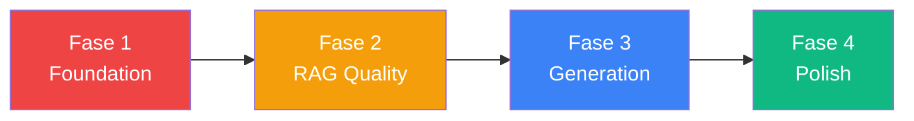

# 🏗️ Analisi Architetturale — Da POC a Professionale

Analisi del progetto **Functional Integration Mate** con raccomandazioni su tre assi: **Frontend**, **RAG Flow**, e **Generazione/Flusso Agente**.

> [!NOTE]
> Questo documento è **solo consultivo** — nessuna implementazione. Per ogni area identifico il problema attuale, la soluzione raccomandata, e il livello di priorità (🔴 alta, 🟡 media, 🟢 bassa).

---

## 1. Frontend — Da POC React a Applicazione Professionale

### Stato attuale

Il frontend è stato migrato a React+Vite+Tailwind, ma conserva pattern tipici di un POC:
- **Nessun routing**: la navigazione usa `useState('requirements')` in [App.jsx](file:///c:/Project/Agentic/my-functional-integration-mate-poc/services/web-dashboard/src/App.jsx) con un `switch/case` manuale
- **Nessun state management**: ogni pagina gestisce il proprio state isolato (fetch indipendenti, nessun caching)
- **API layer naïf**: [api.js](file:///c:/Project/Agentic/my-functional-integration-mate-poc/services/web-dashboard/src/api.js) è un oggetto di funzioni [fetch()](file:///c:/Project/Agentic/my-functional-integration-mate-poc/services/integration-agent/main.py#670-703) senza gestione errori centralizzata, retry, o interceptor per autenticazione
- **Componenti monolitici**: [KnowledgeBasePage.jsx](file:///c:/Project/Agentic/my-functional-integration-mate-poc/services/web-dashboard/src/components/pages/KnowledgeBasePage.jsx) è **819 righe** con 6 sotto-componenti inline
- **Mix IT/EN**: label miste ("Tutti i Documenti KB", "Cerca per nome o tag…" vs "Search", "Upload File")

### Raccomandazioni

#### 🔴 R1 — Introdurre React Router
| Aspetto | Dettaglio |
|---------|-----------|
| **Problema** | Lo `switch/case` in [App.jsx](file:///c:/Project/Agentic/my-functional-integration-mate-poc/services/web-dashboard/src/App.jsx) impedisce deep-linking, back/forward del browser, e bookmarking delle pagine. |
| **Soluzione** | `react-router-dom` v6 con route dichiarative. Layout condiviso via `<Outlet />`. |
| **Struttura** | `/requirements` → `/kb` → `/agent` → `/approvals` → `/catalog` → `/documents` → `/settings/*` |

#### 🔴 R2 — State management con React Query (TanStack Query)
| Aspetto | Dettaglio |
|---------|-----------|
| **Problema** | Ogni pagina fa [fetch](file:///c:/Project/Agentic/my-functional-integration-mate-poc/services/integration-agent/main.py#670-703) indipendenti; navigando avanti/indietro si refetchano gli stessi dati; nessun caching, nessuna invalidazione. |
| **Soluzione** | **TanStack Query** (`@tanstack/react-query`). Un fit naturale perché l'app è read-heavy con mutazioni occasionali. |
| **Benefici** | Cache automatica, deduplicazione richieste, refetch su window focus, optimistic updates per approve/reject, stale-while-revalidate. |

#### 🔴 R3 — API Client centralizzato con error handling
| Aspetto | Dettaglio |
|---------|-----------|
| **Problema** | [api.js](file:///c:/Project/Agentic/my-functional-integration-mate-poc/services/web-dashboard/src/api.js) non gestisce errori, non aggiunge token auth, non ha retry. Ogni componente duplica il pattern `res.json().catch(() => ({}))`. |
| **Soluzione** | Wrappare in un singolo `apiClient` basato su [fetch](file:///c:/Project/Agentic/my-functional-integration-mate-poc/services/integration-agent/main.py#670-703) (o `ky`/`axios`) che: (1) inietta automaticamente `Authorization: Bearer`, (2) deserializza JSON con pattern uniforme, (3) gestisce 401/403 globalmente, (4) retry automatico su 5xx con exponential backoff. |

#### 🟡 R4 — Decomposizione componenti
| Aspetto | Dettaglio |
|---------|-----------|
| **Problema** | [KnowledgeBasePage.jsx](file:///c:/Project/Agentic/my-functional-integration-mate-poc/services/web-dashboard/src/components/pages/KnowledgeBasePage.jsx) (819 righe) e [RequirementsPage.jsx](file:///c:/Project/Agentic/my-functional-integration-mate-poc/services/web-dashboard/src/components/pages/RequirementsPage.jsx) (399 righe) contengono troppi sotto-componenti inline. |
| **Soluzione** | Estrarre in file separati: [TagEditModal](file:///c:/Project/Agentic/my-functional-integration-mate-poc/services/web-dashboard/src/components/pages/KnowledgeBasePage.jsx#94-203), [PreviewModal](file:///c:/Project/Agentic/my-functional-integration-mate-poc/services/web-dashboard/src/components/pages/KnowledgeBasePage.jsx#207-235), [SearchPanel](file:///c:/Project/Agentic/my-functional-integration-mate-poc/services/web-dashboard/src/components/pages/KnowledgeBasePage.jsx#239-319), [UnifiedDocumentsPanel](file:///c:/Project/Agentic/my-functional-integration-mate-poc/services/web-dashboard/src/components/pages/KnowledgeBasePage.jsx#323-495), [AddUrlForm](file:///c:/Project/Agentic/my-functional-integration-mate-poc/services/web-dashboard/src/components/pages/KnowledgeBasePage.jsx#499-585), [TagConfirmPanel](file:///c:/Project/Agentic/my-functional-integration-mate-poc/services/web-dashboard/src/components/pages/RequirementsPage.jsx#32-175). Creare una cartella `components/kb/` e `components/requirements/`. |

#### 🟡 R5 — Custom hooks per logica di business
| Aspetto | Dettaglio |
|---------|-----------|
| **Problema** | Logica fetch+state mescolata nei componenti ([loadData()](file:///c:/Project/Agentic/my-functional-integration-mate-poc/services/web-dashboard/src/components/pages/KnowledgeBasePage.jsx#604-632) in ogni pagina). |
| **Soluzione** | Custom hooks: `useRequirements()`, `useCatalog()`, `useApprovals()`, `useKnowledgeBase()`, `useAgentLogs()`. Combinati con TanStack Query, eliminano boilerplate. |

#### 🟡 R6 — Toast/notification system globale
| Aspetto | Dettaglio |
|---------|-----------|
| **Problema** | Errori e successi gestiti con `useState` locale — scompaiono navigando, si sovrappongono, non hanno timeout. |
| **Soluzione** | Libreria leggera come `react-hot-toast` o `sonner`. Toast di tipo success/error/info con auto-dismiss. |

#### 🟢 R7 — Localizzazione coerente
| Aspetto | Dettaglio |
|---------|-----------|
| **Problema** | Mix IT/EN nelle label UI. |
| **Soluzione** | Decidere una lingua (IT per contesto Accenture Italia, o EN per repository open). Eventualmente `react-i18next` per supporto bilingue. |

---

## 2. RAG Flow — Da Query Naïve a Pipeline Strutturata

### Stato attuale

Il RAG attuale è funzionale ma semplice:
- **Single-query**: una sola interrogazione per integration, senza query expansion
- **Tag filtering basico**: cerca solo sul primo tag con `$contains`, fallback a similarity pura
- **Nessun relevance scoring**: non filtra per distanza minima — tutti i risultati sono usati
- **Truncation brutale**: contesto troncato a N caratteri senza rispettare confini semantici
- **Due collection separate** (`approved_integrations` + `knowledge_base`) interrogate in sequenza senza fusione intelligente

### Raccomandazioni

#### 🔴 R8 — Multi-query RAG con query expansion
| Aspetto | Dettaglio |
|---------|-----------|
| **Problema** | Una singola query (`" ".join(r.description for r in reqs)`) cattura male la semantica di requirement complessi. |
| **Soluzione** | Generare 2-3 varianti della query (riformulazione LLM o template-based) e fare query parallele. Unire i risultati con deduplicazione per `document_id`. Questo è il pattern "Multi-Query Retriever" di LangChain. |

#### 🔴 R9 — Relevance threshold & re-ranking
| Aspetto | Dettaglio |
|---------|-----------|
| **Problema** | ChromaDB ritorna `n_results` senza filtrare per score minimo — chunk irrilevanti inquinano il contesto. |
| **Soluzione** | (1) Chiedere `include=["distances"]` e filtrare per soglia (es. `distance < 0.8`). (2) Implementare un re-ranker leggero: ordinare i chunk recuperati per rilevanza rispetto alla query originale usando un cross-encoder (o, in ambiente CPU, un semplice TF-IDF cosine). |

#### 🟡 R10 — Context fusion unificata
| Aspetto | Dettaglio |
|---------|-----------|
| **Problema** | [_query_rag_with_tags()](file:///c:/Project/Agentic/my-functional-integration-mate-poc/services/integration-agent/main.py#585-623) e [_query_kb_context()](file:///c:/Project/Agentic/my-functional-integration-mate-poc/services/integration-agent/main.py#625-661) sono pipeline parallele ma il loro output è concatenato naïvely nel prompt. |
| **Soluzione** | Creare un `ContextAssembler` che: (1) raccoglie chunk da tutte le sorgenti (approved docs, KB files, KB URLs), (2) li ordina per relevance score, (3) seleziona i top-K chunk rispettando un budget di token, (4) formatta con metadata di provenienza per il LLM. |

#### 🟡 R11 — Chunking intelligente
| Aspetto | Dettaglio |
|---------|-----------|
| **Problema** | `chunk_text()` taglia a dimensione fissa (1000 char, 200 overlap) senza rispettare confini di paragrafo/sezione. |
| **Soluzione** | Implementare chunking semantico: (1) split per heading/paragrafo, (2) merge chunk sotto-soglia, (3) overlap basato su frasi complete. LangChain `RecursiveCharacterTextSplitter` con separatori `["\n\n", "\n", ". "]` è un buon punto di partenza. |

#### 🟡 R12 — Tag multi-dimensionale
| Aspetto | Dettaglio |
|---------|-----------|
| **Problema** | Filtraggio solo sul primo tag con `$contains` su una stringa CSV — fragile e limitato. |
| **Soluzione** | Usare ChromaDB metadata con array di tag e filtrare con `{"$or": [{"tag": t} for t in tags]}`. Oppure passare a un sistema di embedding per i tag stessi. |

---

## 3. Generazione & Flusso Agente — Robustezza e Qualità

### Stato attuale

Il flusso di generazione in [run_agentic_rag_flow()](file:///c:/Project/Agentic/my-functional-integration-mate-poc/services/integration-agent/main.py#L740-L855) è lineare e senza retry:
- **Nessun retry**: un singolo timeout/errore LLM produce `[LLM_UNAVAILABLE]` e si passa avanti
- **Nessuna valutazione qualità**: l'output guard è solo strutturale (heading check + bleach) — non valuta la completezza
- **Monolito da 2065 righe**: tutta la logica (parsing, RAG, LLM, HITL, KB, admin, projects) è in [main.py](file:///c:/Project/Agentic/my-functional-integration-mate-poc/services/catalog-generator/main.py)
- **In-memory state**: `parsed_requirements`, [catalog](file:///c:/Project/Agentic/my-functional-integration-mate-poc/services/integration-agent/main.py#1239-1286), [documents](file:///c:/Project/Agentic/my-functional-integration-mate-poc/services/integration-agent/main.py#1160-1169) — fragile, non thread-safe per multi-worker
- **Feedback loop inesistente**: il reject salva `feedback` ma non viene usato per rigenerazione automatica

### Raccomandazioni

#### 🔴 R13 — Retry con backoff esponenziale per LLM
| Aspetto | Dettaglio |
|---------|-----------|
| **Problema** | Un singolo fallimento LLM (timeout, 5xx, connect error) produce un placeholder inutile. |
| **Soluzione** | Implementare retry con: max 3 tentativi, backoff esponenziale (5s, 15s, 45s), circuit breaker se 3+ entries falliscono consecutivamente. Per timeout, raddoppiare `num_predict` al secondo tentativo e dimezzare la complessità del prompt al terzo. |

```python
# Pattern suggerito per generate_with_retry()
async def generate_with_retry(prompt: str, max_retries: int = 3) -> str:
    for attempt in range(1, max_retries + 1):
        try:
            return await generate_with_ollama(prompt, ...)
        except httpx.TimeoutException:
            if attempt == max_retries:
                raise
            delay = 5 * (2 ** (attempt - 1))
            log_agent(f"[LLM] Timeout — retry {attempt}/{max_retries} in {delay}s")
            await asyncio.sleep(delay)
```

#### 🔴 R14 — Output quality checker
| Aspetto | Dettaglio |
|---------|-----------|
| **Problema** | Il guard attuale controlla solo che l'output inizi con `# Integration Functional Design` — non valuta completezza. |
| **Soluzione** | Aggiungere un quality score basato su: (1) presenza delle sezioni obbligatorie del template (contare heading "##"), (2) rapporto `n/a` vs contenuto reale, (3) lunghezza minima per sezione. Se il quality score è sotto soglia, rigenerare automaticamente con un prompt arricchito ("La risposta precedente era incompleta, assicurati di completare tutte le sezioni"). |

#### 🔴 R15 — Decomposizione del monolito backend
| Aspetto | Dettaglio |
|---------|-----------|
| **Problema** | [main.py](file:///c:/Project/Agentic/my-functional-integration-mate-poc/services/catalog-generator/main.py) è 2065 righe — testing, manutenzione e code review sono proibitivi. |
| **Soluzione proposta** | Separare in moduli FastAPI con `APIRouter`: |

```
services/integration-agent/
├── main.py              # solo app factory, lifespan, middleware (~100 righe)
├── routers/
│   ├── requirements.py  # upload, finalize, list
│   ├── projects.py      # CRUD projects
│   ├── catalog.py       # list, suggest-tags, confirm-tags
│   ├── agent.py         # trigger, cancel, logs
│   ├── approvals.py     # pending, approve, reject
│   ├── documents.py     # list, promote-to-kb
│   ├── kb.py            # upload, list, delete, tags, search, stats, add-url
│   └── admin.py         # reset, llm-settings, docs
├── services/
│   ├── rag_service.py   # _query_rag_with_tags, _query_kb_context, context assembly
│   ├── llm_service.py   # generate_with_ollama, retry logic
│   ├── agent_service.py # run_agentic_rag_flow (orchestrazione)
│   └── tag_service.py   # tag suggestion, extraction
├── state.py             # in-memory state management (preparatory to Redis/session)
├── config.py            # (invariato)
├── schemas.py           # (invariato)
├── db.py                # (invariato)
├── prompt_builder.py    # (invariato)
└── output_guard.py      # + quality checker
```

#### 🟡 R16 — Feedback loop: rigenerazione da rejection
| Aspetto | Dettaglio |
|---------|-----------|
| **Problema** | Quando un reviewer rifiuta un documento, il `feedback` è salvato ma mai usato. Non esiste un "regenerate with feedback". |
| **Soluzione** | Aggiungere un endpoint `POST /api/v1/approvals/{id}/regenerate` che: (1) prende il feedback dal rejection, (2) lo inietta nel prompt come "REVIEWER FEEDBACK: fix these issues: …", (3) rigenera il documento per quella specifica integration, (4) crea una nuova Approval PENDING. |

#### 🟡 R17 — Incorporare KB nel prompt in modo strutturato
| Aspetto | Dettaglio |
|---------|-----------|
| **Problema** | Il contesto KB è concatenato come testo grezzo nel prompt — il LLM non sa distinguere tra "pattern da seguire" e "contesto informativo". |
| **Soluzione** | Formattare il KB context con markup esplicito nel prompt: |

```markdown
## BEST PRACTICE PATTERNS (follow these patterns in your output):
### Source: API_Integration_Guide.pdf (tag: Data Sync)
[chunk content here]

### Source: Error_Handling_Patterns.md (tag: Error Handling)  
[chunk content here]

## PAST APPROVED EXAMPLES (use as style reference):
[existing RAG context]
```

#### 🟡 R18 — Progress tracking granulare
| Aspetto | Dettaglio |
|---------|-----------|
| **Problema** | La progress bar nel frontend è un timer fittizio (linear da 0 a 99%), non riflette il progresso reale. |
| **Soluzione** | Il backend conosce `total` e `idx` in [run_agentic_rag_flow()](file:///c:/Project/Agentic/my-functional-integration-mate-poc/services/integration-agent/main.py#740-856). Aggiungere `progress` al log endpoint: `{"logs": [...], "progress": {"current": 2, "total": 5, "phase": "llm_generation"}}`. Il frontend usa questo per una progress bar reale. |

#### 🟢 R19 — Event sourcing per state
| Aspetto | Dettaglio |
|---------|-----------|
| **Problema** | Lo state in-memory con write-through MongoDB è fragile: se il container crasha durante una write, lo state diverge. |
| **Soluzione** | A medio termine, sostituire il pattern write-through con event sourcing: ogni mutazione scrive un evento su MongoDB, lo state si ricostruisce dagli eventi al restart. Questo abilita anche audit trail e undo. |

---

## Matrice Priorità / Impatto

| # | Area | Raccomandazione | Priorità | Impatto | Effort |
|---|------|----------------|-----------|---------|--------|
| R1 | FE | React Router | 🔴 | Alto | Basso |
| R2 | FE | TanStack Query | 🔴 | Alto | Medio |
| R3 | FE | API Client centralizzato | 🔴 | Alto | Basso |
| R4 | FE | Decomposizione componenti | 🟡 | Medio | Medio |
| R5 | FE | Custom hooks | 🟡 | Medio | Medio |
| R6 | FE | Toast system | 🟡 | Medio | Basso |
| R7 | FE | Localizzazione | 🟢 | Basso | Basso |
| R8 | RAG | Multi-query expansion | 🔴 | Alto | Medio |
| R9 | RAG | Relevance threshold | 🔴 | Alto | Basso |
| R10 | RAG | Context fusion | 🟡 | Alto | Medio |
| R11 | RAG | Chunking semantico | 🟡 | Medio | Medio |
| R12 | RAG | Tag multi-dimensionale | 🟡 | Medio | Basso |
| R13 | GEN | Retry LLM | 🔴 | Alto | Basso |
| R14 | GEN | Quality checker | 🔴 | Alto | Medio |
| R15 | GEN | Decomposizione backend | 🔴 | Alto | Alto |
| R16 | GEN | Feedback loop | 🟡 | Alto | Medio |
| R17 | GEN | KB strutturata nel prompt | 🟡 | Medio | Basso |
| R18 | GEN | Progress tracking reale | 🟡 | Medio | Basso |
| R19 | GEN | Event sourcing | 🟢 | Alto | Alto |

---

## Ordine di Implementazione Suggerito



| Fase | Items | Razionale |
|------|-------|-----------|
| **Fase 1 — Foundation** | R15, R3, R1, R13 | Decomposizione backend + infrastruttura frontend. Abilita tutto il resto. |
| **Fase 2 — RAG Quality** | R8, R9, R10, R11, R12 | Migliora la qualità del contesto prima che raggiunga il LLM. |
| **Fase 3 — Generation** | R14, R16, R17, R2, R5 | Quality gate, feedback loop, state management React. |
| **Fase 4 — Polish** | R4, R6, R7, R18, R19 | UX polish, progress tracking, event sourcing. |
