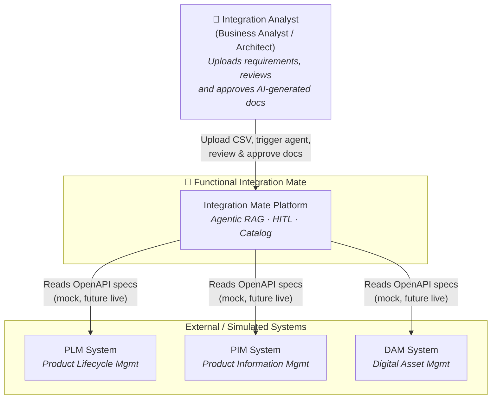
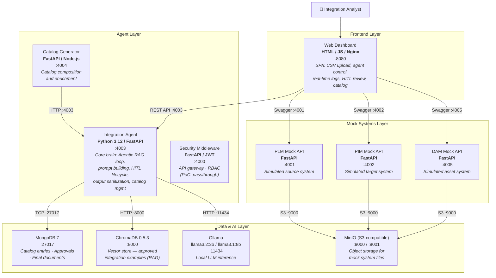
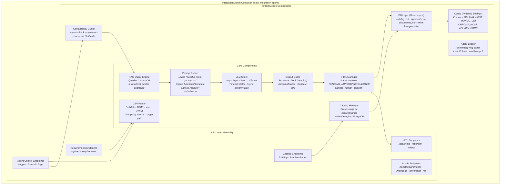
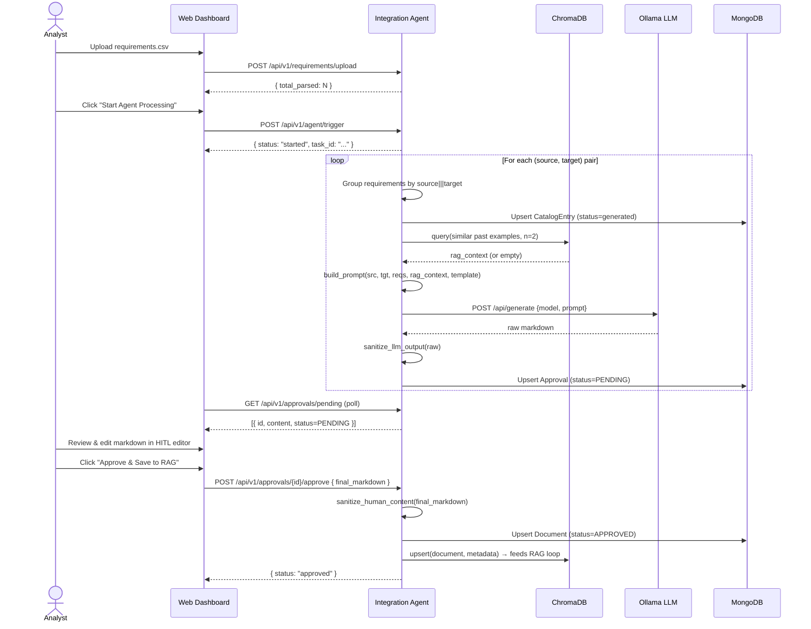
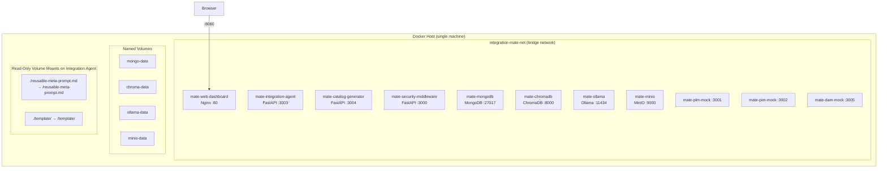

# Functional Integration Mate — Architecture Specification

> **Version:** 2.0 — Updated to reflect current codebase state (11 services, template injection, HITL lifecycle, full security model)
> **Governance:** Accenture Responsible AI — Human-in-the-Loop required for all AI-generated artifacts.

---

## 1. System Context

### 1.1 Purpose

The **Functional Integration Mate** is an AI-powered PoC platform designed to automate the initial documentation phases of enterprise integration design. Instead of manually authoring Functional and Technical Specifications from Jira/Excel requirements, Integration Mate ingests raw requirements (CSV), applies an **Agentic RAG** approach to generate high-quality structured Markdown specifications, and enforces a mandatory **Human-in-the-Loop (HITL)** approval gate before any document is persisted.

The platform focuses strictly on the **Documentation and Cataloging** layer of the integration lifecycle — not on runtime execution (ESB, iPaaS, or middleware role).

### 1.2 Primary Use Case

```
Business Analyst or Integration Architect
  → uploads CSV of integration requirements
  → triggers AI agent
  → reviews AI-generated Functional Design document
  → approves or rejects with feedback
  → approved document is stored and feeds the RAG learning loop
```

---

## 2. C4 Model — Level 1: System Context



**System boundaries:**
- The platform is a **PoC** running entirely on a single host via Docker Compose.
- All external systems (PLM, PIM, DAM) are currently simulated by mock FastAPI services.
- The LLM runs **locally** (Ollama) — no data leaves the host.

---

## 3. C4 Model — Level 2: Container Diagram

The platform is composed of **11 Docker containers** grouped in three logical tiers.



### Container Details

| Container | Image / Stack | Port (ext → int) | Key Responsibility |
|-----------|--------------|-------------------|--------------------|
| `mate-web-dashboard` | Nginx + Vanilla JS | `8080 → 80` | SPA: upload, agent control, logs, HITL, catalog |
| `mate-integration-agent` | Python 3.12 / FastAPI + Motor | `4003 → 3003` | Agentic RAG loop, all business logic, 15 REST endpoints |
| `mate-catalog-generator` | FastAPI | `4004 → 3004` | Catalog composition from agent output |
| `mate-security-middleware` | FastAPI + JWT | `4000 → 3000` | Auth gateway (passthrough in PoC dev mode) |
| `mate-mongodb` | MongoDB 7 | `27017 → 27017` | Persistent store: catalog, approvals, documents |
| `mate-chromadb` | ChromaDB 0.5.3 | `8000 → 8000` | Vector store: RAG retrieval of approved examples |
| `mate-ollama` | Ollama | `11434 → 11434` | Local LLM inference (llama3.2:3b or llama3.1:8b) |
| `mate-minio` | MinIO | `9000/9001` | S3-compatible object storage for mock systems |
| `mate-plm-mock` | FastAPI | `4001 → 3001` | Simulated PLM system with OpenAPI spec |
| `mate-pim-mock` | FastAPI | `4002 → 3002` | Simulated PIM system with OpenAPI spec |
| `mate-dam-mock` | FastAPI | `4005 → 3005` | Simulated DAM system with OpenAPI spec |

---

## 4. C4 Model — Level 2 (zoom): Integration Agent Components

The Integration Agent is the core service. Its internal components are:



### Component Responsibilities

| Component | File | Key Behaviour |
|-----------|------|---------------|
| **CSV Parser** | `main.py` | MIME/size/encoding guards; groups rows by `source|||target` key |
| **RAG Query Engine** | `main.py` | `collection.query(n_results=2)` against `approved_integrations` collection |
| **Prompt Builder** | `prompt_builder.py` | Loads meta-prompt + functional template from mounted volumes; `str.replace()` injection |
| **LLM Client** | `main.py` | `httpx.AsyncClient.post()` to Ollama `/api/generate`; logs token metrics |
| **Output Guard** | `output_guard.py` | Checks `# Integration Functional Design` heading; bleach strip; 50k truncation |
| **HITL Manager** | `main.py` | Status state machine (`PENDING → APPROVED/REJECTED`); sanitizes reviewer edits |
| **Catalog Manager** | `main.py` | Write-through: in-memory dict + MongoDB upsert on every mutation |
| **Config** | `config.py` | `pydantic-settings` — fails fast on startup if required env vars absent |
| **DB Layer** | `db.py` | `motor.AsyncIOMotorClient`; init with retry (10×3s); seeds in-memory on startup |
| **Concurrency Guard** | `main.py` | `asyncio.Lock` — one LLM flow at a time; task cancellable via `/agent/cancel` |
| **Agent Logger** | `main.py` | Module-level `list[str]`; last 50 entries; polled by dashboard every 2s |

---

## 5. Agentic RAG Workflow — Detailed Flow

The end-to-end flow from CSV upload to approved document:



### Workflow Steps Summary

| Step | Actor | Action | Guard / Security |
|------|-------|--------|-----------------|
| 1. Upload | Analyst | POST CSV file | MIME check, 1 MB limit, UTF-8 guard |
| 2. Trigger | Analyst | POST /agent/trigger | `asyncio.Lock` prevents concurrent runs |
| 3. Group | Agent | Cluster reqs by source+target | `|||` separator (not hyphen — avoids system name collision) |
| 4. RAG Query | Agent | Semantic search ChromaDB | n_results=2; falls back to zero-shot if no match |
| 5. Build Prompt | Agent | Inject meta-prompt + template + RAG | `str.replace()` — no `format()` (prevents KeyError) |
| 6. LLM Call | Agent | POST to Ollama | 600s timeout; async; error caught → log + skip |
| 7. Output Guard | Agent | Structural + XSS check | Must start with `# Integration Functional Design` |
| 8. HITL Queue | Agent | Store as PENDING | No automatic write to final store without human |
| 9. Human Review | Analyst | Edit + Approve/Reject in UI | `sanitize_human_content()` on submit |
| 10. RAG Learn | Agent | Upsert approved doc → ChromaDB | Feeds future generations with approved patterns |

---

## 6. Data Architecture

### 6.1 MongoDB Collections

```
mongodb://mate-mongodb:27017/integration_mate
  ├── catalog_entries       { id, name, type, source, target, status, requirements[] }
  ├── approvals             { id, integration_id, doc_type, content, status, generated_at, feedback? }
  └── documents             { id, integration_id, doc_type, content, generated_at }
```

**Indexing strategy:**
- `catalog_entries`: unique index on `id`
- `approvals`: unique index on `id` + secondary index on `status` (fast PENDING filter)
- `documents`: unique index on `id`

**Persistence pattern — Write-Through Cache:**
Every mutation writes simultaneously to the in-memory Python dict AND to MongoDB. On container startup, `lifespan()` seeds all three dicts from MongoDB — surviving container restarts without data loss.

### 6.2 ChromaDB Collection

```
approved_integrations collection
  documents: [approved markdown content]
  metadatas: [{ integration_id, type: "functional" }]
  ids:        ["{integration_id}-functional"]
```

Used exclusively for **RAG retrieval**: when a new integration requires documentation, past approved examples are retrieved via semantic similarity search and injected into the LLM prompt as few-shot examples.

### 6.3 In-Memory State

| Variable | Type | Purpose | Persisted? |
|----------|------|---------|------------|
| `parsed_requirements` | `list[Requirement]` | Current CSV upload | No (transient) |
| `catalog` | `dict[str, CatalogEntry]` | Integration entries | Yes (MongoDB) |
| `documents` | `dict[str, Document]` | Approved final docs | Yes (MongoDB + ChromaDB) |
| `approvals` | `dict[str, Approval]` | HITL queue items | Yes (MongoDB) |
| `agent_logs` | `list[str]` | Real-time execution log | No (last 50 entries) |
| `_agent_lock` | `asyncio.Lock` | Concurrency guard | No |
| `_running_tasks` | `dict[str, asyncio.Task]` | Cancellable tasks | No |

---

## 7. API Surface — Integration Agent

All endpoints are served by `mate-integration-agent` on port `4003`.

| Endpoint | Method | Auth | Description |
|----------|--------|------|-------------|
| `/health` | GET | — | Service + ChromaDB + MongoDB health |
| `/api/v1/requirements/upload` | POST | — | Parse CSV; validate MIME/size/encoding |
| `/api/v1/requirements` | GET | — | List all parsed requirements |
| `/api/v1/agent/trigger` | POST | Token | Start agentic RAG flow (async) |
| `/api/v1/agent/cancel` | POST | Token | Cancel running agent task |
| `/api/v1/agent/logs` | GET | — | Stream last 50 log lines |
| `/api/v1/catalog/integrations` | GET | — | List all catalog entries |
| `/api/v1/catalog/integrations/{id}/functional-spec` | GET | — | Get approved functional spec |
| `/api/v1/catalog/integrations/{id}/technical-spec` | GET | — | *Not yet implemented* |
| `/api/v1/approvals/pending` | GET | — | List PENDING approvals |
| `/api/v1/approvals/{id}/approve` | POST | Token | Approve + persist + feed RAG |
| `/api/v1/approvals/{id}/reject` | POST | Token | Reject with feedback |
| `/api/v1/admin/reset/requirements` | DELETE | Token | Clear parsed reqs + logs |
| `/api/v1/admin/reset/mongodb` | DELETE | Token | Wipe all MongoDB collections |
| `/api/v1/admin/reset/chromadb` | DELETE | Token | Wipe ChromaDB RAG collection |
| `/api/v1/admin/reset/all` | DELETE | Token | Full system reset |

**Auth model:** Optional Bearer token. If `API_KEY` env var is set, mutating endpoints (`trigger`, `cancel`, `approve`, `reject`, `reset/*`) require `Authorization: Bearer <key>`. If unset, endpoints log a warning and allow through (dev/PoC mode).

---

## 8. Security Architecture

Security controls applied at each layer (OWASP ASVS aligned):

| Layer | Control | Implementation | OWASP |
|-------|---------|----------------|-------|
| API Auth | Bearer token (optional) | `hmac.compare_digest()` — constant-time | A07 |
| CORS | Allowlist from env var | No `*` with credentials | A05 |
| Input | CSV guards | MIME type, 1 MB size, UTF-8 encoding | A03 |
| Input | Request bodies | Pydantic `Field(min_length, max_length)` | A03 |
| LLM Output | Structural guard | Must start `# Integration Functional Design` | A03 |
| LLM Output | HTML sanitization | `bleach.clean(strip=True, tags=allowlist)` | A03 |
| LLM Output | Truncation | Max 50,000 characters | A03 |
| Frontend | XSS prevention | `escapeHtml()` on all server-sourced innerHTML | A03 |
| Frontend | Textarea injection | Content set via `.value`, not `innerHTML` | A03 |
| Secrets | No hardcoded values | `pydantic-settings` from env vars / `.env` | A02 |
| Prompt | Injection prevention | `str.replace()` — not `str.format()` | A03 |

**Responsible AI controls (Accenture standard):**
- Human-in-the-Loop gate: no AI-generated document reaches the final store without human approval.
- LLM output is always treated as untrusted input (structural guard + bleach).
- All AI usage is transparent and logged (agent_logs).

---

## 9. Deployment Architecture



**Port mapping (host → container):**

| Host Port | Container | Service |
|-----------|-----------|---------|
| 8080 | 80 | Web Dashboard |
| 4000 | 3000 | Security Middleware |
| 4001 | 3001 | PLM Mock |
| 4002 | 3002 | PIM Mock |
| 4003 | 3003 | Integration Agent |
| 4004 | 3004 | Catalog Generator |
| 4005 | 3005 | DAM Mock |
| 8000 | 8000 | ChromaDB |
| 9000/9001 | 9000/9001 | MinIO |
| 11434 | 11434 | Ollama |
| 27017 | 27017 | MongoDB |

**Notable deployment detail:** `reusable-meta-prompt.md` and `template/` live at the project root, outside the Docker build context of the integration-agent service. They are exposed inside the container via read-only volume mounts at `/reusable-meta-prompt.md` and `/template/` respectively — matching the path resolution of `Path(__file__).parent.parent.parent` from within `/app/`.

---

## 10. ADR Index

| ADR | Decision | Status |
|-----|----------|--------|
| ADR-001–011 | Early foundational decisions (tooling, patterns) | Accepted |
| ADR-012 | Async LLM client via `httpx.AsyncClient` | Accepted |
| ADR-013 | MongoDB persistence + Motor async driver | Accepted |
| ADR-014 | External prompt template (`reusable-meta-prompt.md`) | Accepted |
| ADR-015 | LLM output guard (structural + bleach) | Accepted |
| ADR-016 | Secret management via Pydantic Settings | Accepted |
| ADR-017 | Frontend XSS mitigation (`escapeHtml()`) | Accepted |
| ADR-018 | CORS standardization (env-var allowlist) | Accepted |

---

## 11. Known Limitations & Future Work

| Item | Current State | Planned |
|------|--------------|---------|
| Technical spec generation | Endpoint returns 501 stub | Implement `template/technical/` flow |
| Security middleware | Passthrough in PoC | Full JWT/RBAC integration |
| OpenAPI spec reading | Mock Swaggers only | Live spec ingestion for data mapping |
| Model quality | llama3.2:3b (fast, PoC) | Configurable via `OLLAMA_MODEL` env var |
| RAG grading | Basic similarity (n=2) | Re-ranking and relevance scoring |
| Embedding model | Default ChromaDB embeddings | Switch to `nomic-embed-text` for richer semantics |
