# Architecture Specification
## Functional Integration Mate — PoC

| Metadata | |
|---|---|
| **Project** | Functional Integration Mate |
| **Version** | 1.0.0 (PoC) |
| **Date** | 2026-03-04 |
| **Classification** | Internal — Confidential |
| **Authors** | Solution Architecture Team |

---

## Table of Contents

1. [Executive Summary](#1-executive-summary)
2. [System Context](#2-system-context)
3. [Solution Architecture](#3-solution-architecture)
4. [Component Specification](#4-component-specification)
5. [Data Architecture](#5-data-architecture)
6. [Integration Patterns](#6-integration-patterns)
7. [Agentic Integration Framework](#7-agentic-integration-framework)
8. [Security Architecture](#8-security-architecture)
9. [Asset Management & Storage](#9-asset-management--storage)
10. [Observability & Monitoring](#10-observability--monitoring)
11. [Deployment Architecture](#11-deployment-architecture)
12. [API Contracts](#12-api-contracts)
13. [Non-Functional Requirements](#13-non-functional-requirements)
14. [Production Roadmap](#14-production-roadmap)
15. [Error Management & Resilience](#15-error-management--resilience)

---

## 1. Executive Summary

### 1.1 Purpose

The **Functional Integration Mate** is an AI-powered platform that automates the analysis, cataloging, and documentation of enterprise system integrations. Given source API specifications (PLM), functional/non-functional requirements (JIRA-style CSV), and target systems (PIM, DAM), it produces:

1. **Integration Catalog** — Structured inventory of all required integrations
2. **Functional Specifications** — LLM-generated business-level documents
3. **Technical Design Documents** — LLM-generated implementation-level blueprints
4. **Agentic Execution Engine** — AI agent that autonomously executes integrations

### 1.2 Key Differentiators

| Capability | Description |
|---|---|
| **Agentic Integrations** | Self-planning, self-correcting agents (not static ETL) |
| **LLM-Powered Documentation** | Context-aware docs generated from API specs + requirements |
| **Human-in-the-Loop** | Guardrails with real-time approval workflows |
| **Full Observability** | Structured "thought process" logging for every agent decision |
| **S3 Asset Pipeline** | Binary asset transfer via object storage with renditions |

### 1.3 Scope — PoC Boundaries

| In Scope | Out of Scope |
|---|---|
| Mocked PLM, PIM, DAM APIs | Real enterprise system connections |
| Local LLM (Ollama) | Cloud LLM APIs (OpenAI, Anthropic) |
| MinIO S3 | AWS S3 / Azure Blob / GCS |
| Docker Compose | Kubernetes / ECS / Cloud Run |
| JWT auth (PoC secret) | OAuth2 / SAML / OIDC provider |
| Single-user HITL | Multi-tenant approval workflows |

---

## 2. System Context

### 2.1 Context Diagram (C4 Level 1)

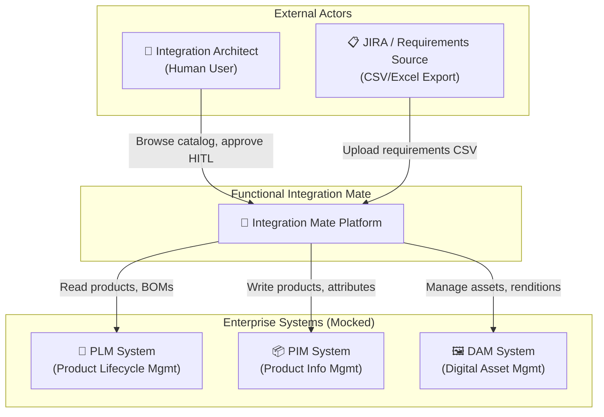
```mermaid
graph TB
    subgraph "External Actors"
        USER["👤 Integration Architect<br/>(Human User)"]
        JIRA["📋 JIRA / Requirements Source<br/>(CSV/Excel Export)"]
    end

    subgraph "Functional Integration Mate"
        SYSTEM["🧠 Integration Mate Platform"]
    end

    subgraph "Enterprise Systems (Mocked)"
        PLM_EXT["🔧 PLM System<br/>(Product Lifecycle Mgmt)"]
        PIM_EXT["📦 PIM System<br/>(Product Info Mgmt)"]
        DAM_EXT["🖼️ DAM System<br/>(Digital Asset Mgmt)"]
    end

    USER -->|Browse catalog, approve HITL| SYSTEM
    JIRA -->|Upload requirements CSV| SYSTEM
    SYSTEM -->|Read products, BOMs| PLM_EXT
    SYSTEM -->|Write products, attributes| PIM_EXT
    SYSTEM -->|Manage assets, renditions| DAM_EXT
```

### 2.2 Stakeholders

| Stakeholder | Role | Interaction |
|---|---|---|
| Integration Architect | Primary user | Uploads requirements, reviews catalog, approves HITL |
| Solution Architect | Reviewer | Reviews generated specifications |
| Developer | Consumer | Implements integrations based on generated technical specs |
| Security Officer | Auditor | Reviews audit trails and thought logs |
| Product Owner | Decision maker | Prioritizes which integrations to implement |

---

## 3. Solution Architecture

### 3.1 Container Diagram (C4 Level 2)

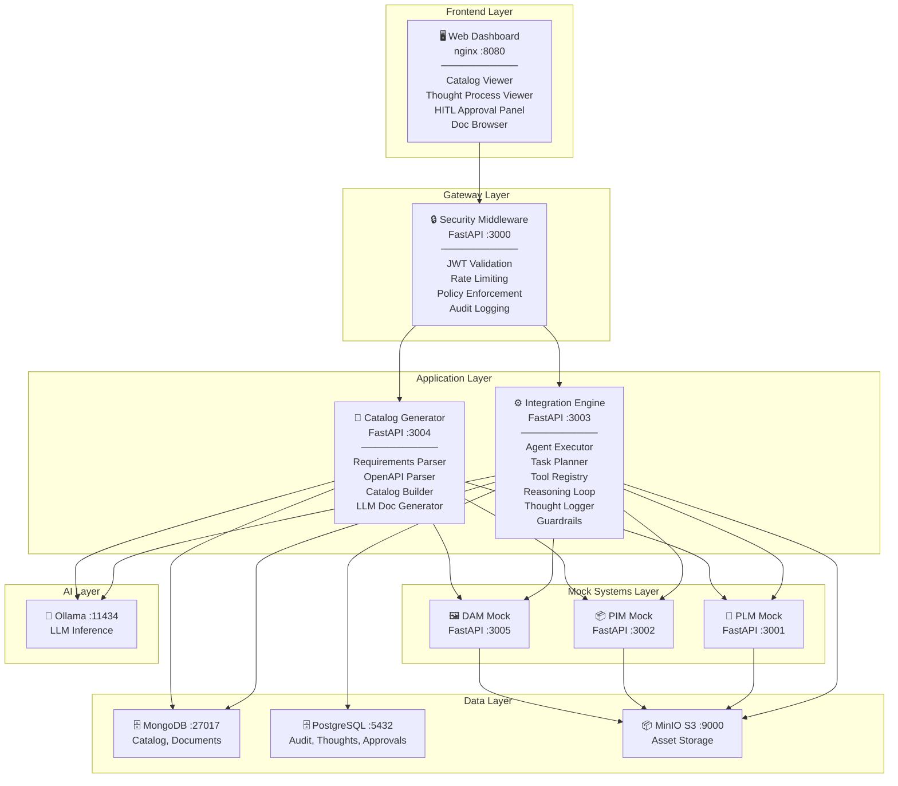
```mermaid
graph TB
    subgraph "Frontend Layer"
        DASH["🖥️ Web Dashboard<br/>nginx :8080<br/>───────────<br/>Catalog Viewer<br/>Thought Process Viewer<br/>HITL Approval Panel<br/>Doc Browser"]
    end

    subgraph "Gateway Layer"
        GW["🔒 Security Middleware<br/>FastAPI :3000<br/>───────────<br/>JWT Validation<br/>Rate Limiting<br/>Policy Enforcement<br/>Audit Logging"]
    end

    subgraph "Application Layer"
        ENGINE["⚙️ Integration Engine<br/>FastAPI :3003<br/>───────────<br/>Agent Executor<br/>Task Planner<br/>Tool Registry<br/>Reasoning Loop<br/>Thought Logger<br/>Guardrails"]
        
        CATGEN["📄 Catalog Generator<br/>FastAPI :3004<br/>───────────<br/>Requirements Parser<br/>OpenAPI Parser<br/>Catalog Builder<br/>LLM Doc Generator"]
    end

    subgraph "Mock Systems Layer"
        PLM["🔧 PLM Mock<br/>FastAPI :3001"]
        PIM["📦 PIM Mock<br/>FastAPI :3002"]
        DAM["🖼️ DAM Mock<br/>FastAPI :3005"]
    end

    subgraph "Data Layer"
        MONGO["🗄️ MongoDB :27017<br/>Catalog, Documents"]
        PG["🗄️ PostgreSQL :5432<br/>Audit, Thoughts, Approvals"]
        MINIO["📦 MinIO S3 :9000<br/>Asset Storage"]
    end

    subgraph "AI Layer"
        OLLAMA["🤖 Ollama :11434<br/>LLM Inference"]
    end

    DASH --> GW
    GW --> ENGINE
    GW --> CATGEN
    ENGINE --> PLM & PIM & DAM
    ENGINE --> MONGO & PG & MINIO
    ENGINE --> OLLAMA
    CATGEN --> PLM & PIM & DAM
    CATGEN --> MONGO & OLLAMA
    PLM & PIM & DAM --> MINIO
```

### 3.2 Service Registry

| Service | Port | Technology | Responsibility |
|---|---|---|---|
| Web Dashboard | 8080 | HTML/CSS/JS + nginx | User interface |
| Security Middleware | 3000 | Python/FastAPI | Authentication, authorization, audit |
| PLM Mock API | 3001 | Python/FastAPI | Source system simulation |
| PIM Mock API | 3002 | Python/FastAPI | Target PIM simulation (Akeneo) |
| Integration Engine | 3003 | Python/FastAPI | Agentic execution engine |
| Catalog Generator | 3004 | Python/FastAPI | Requirements → catalog → docs |
| DAM Mock API | 3005 | Python/FastAPI | Target DAM simulation (Adobe) |
| MinIO S3 | 9000/9001 | MinIO | Object storage for binary assets |
| MongoDB | 27017 | MongoDB 7 | Document store |
| PostgreSQL | 5432 | PostgreSQL 16 | Relational store |
| Ollama | 11434 | Ollama | Local LLM inference |

---

## 4. Component Specification

### 4.1 PLM Mock API (Source System)

**Purpose**: Simulates a Product Lifecycle Management system exposing engineering data.

**Data Model**:
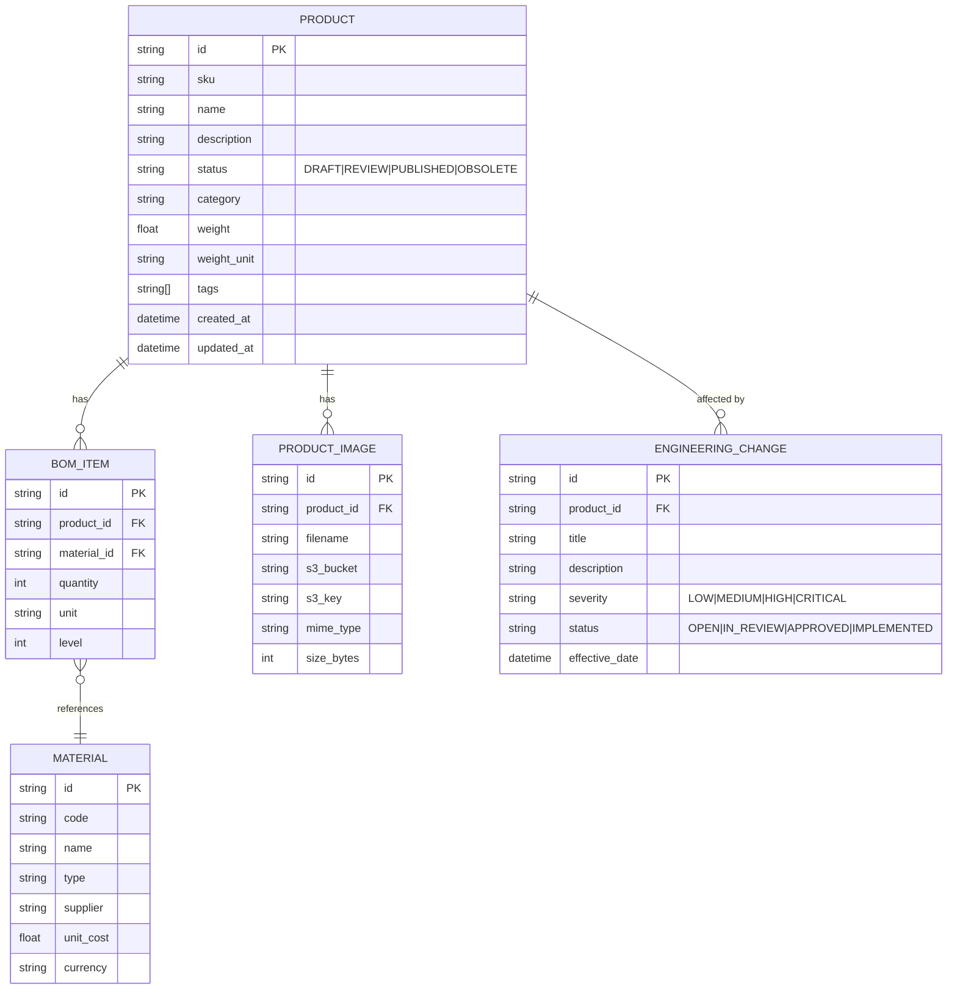
```mermaid
erDiagram
    PRODUCT ||--o{ BOM_ITEM : "has"
    PRODUCT ||--o{ PRODUCT_IMAGE : "has"
    BOM_ITEM }o--|| MATERIAL : "references"
    PRODUCT ||--o{ ENGINEERING_CHANGE : "affected by"

    PRODUCT {
        string id PK
        string sku
        string name
        string description
        string status "DRAFT|REVIEW|PUBLISHED|OBSOLETE"
        string category
        float weight
        string weight_unit
        string[] tags
        datetime created_at
        datetime updated_at
    }
    BOM_ITEM {
        string id PK
        string product_id FK
        string material_id FK
        int quantity
        string unit
        int level
    }
    MATERIAL {
        string id PK
        string code
        string name
        string type
        string supplier
        float unit_cost
        string currency
    }
    ENGINEERING_CHANGE {
        string id PK
        string product_id FK
        string title
        string description
        string severity "LOW|MEDIUM|HIGH|CRITICAL"
        string status "OPEN|IN_REVIEW|APPROVED|IMPLEMENTED"
        datetime effective_date
    }
    PRODUCT_IMAGE {
        string id PK
        string product_id FK
        string filename
        string s3_bucket
        string s3_key
        string mime_type
        int size_bytes
    }
```

**API Endpoints**:

| Method | Path | Description |
|---|---|---|
| GET | `/api/v1/products` | List products (paginated, filterable) |
| GET | `/api/v1/products/{id}` | Get product detail |
| POST | `/api/v1/products` | Create product |
| PATCH | `/api/v1/products/{id}` | Update product |
| GET | `/api/v1/products/{id}/bom` | Get product BOM |
| GET | `/api/v1/products/{id}/images` | Get product images |
| POST | `/api/v1/products/{id}/images` | Upload product image → S3 |
| GET | `/api/v1/materials` | List materials |
| GET | `/api/v1/engineering-changes` | List engineering changes |
| GET | `/health` | Health check |

---

### 4.2 PIM Mock API (Target — Akeneo-style)

**Purpose**: Simulates an Akeneo-compatible Product Information Management system.

**Data Model**:
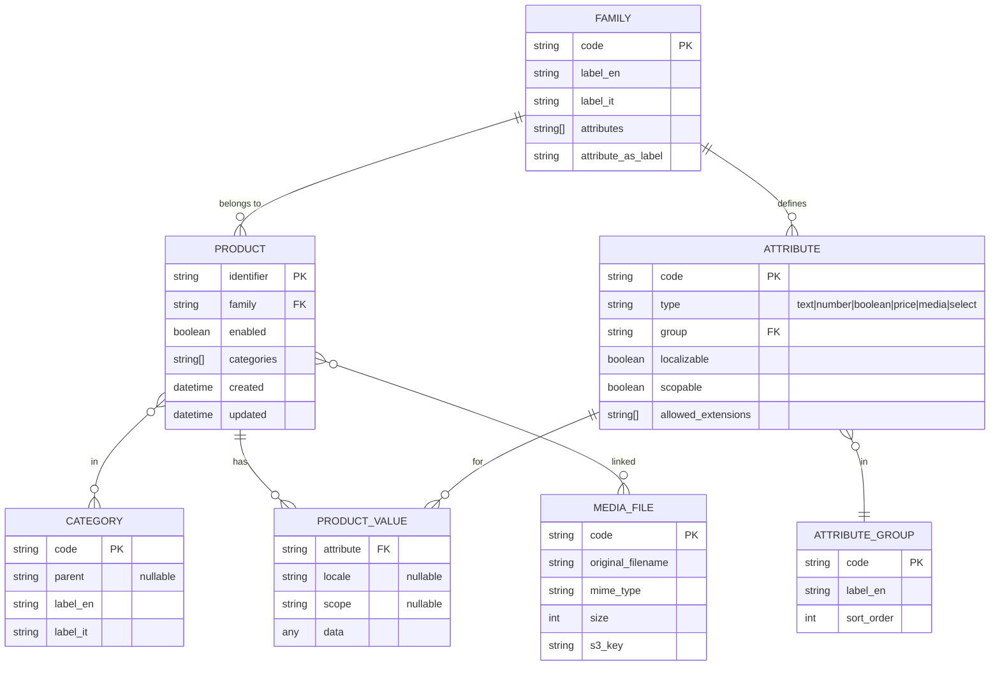
```mermaid
erDiagram
    FAMILY ||--o{ PRODUCT : "belongs to"
    FAMILY ||--o{ ATTRIBUTE : "defines"
    PRODUCT }o--o{ CATEGORY : "in"
    PRODUCT ||--o{ PRODUCT_VALUE : "has"
    ATTRIBUTE ||--o{ PRODUCT_VALUE : "for"
    ATTRIBUTE }o--|| ATTRIBUTE_GROUP : "in"
    PRODUCT }o--o{ MEDIA_FILE : "linked"

    FAMILY {
        string code PK
        string label_en
        string label_it
        string[] attributes
        string attribute_as_label
    }
    PRODUCT {
        string identifier PK
        string family FK
        boolean enabled
        string[] categories
        datetime created
        datetime updated
    }
    PRODUCT_VALUE {
        string attribute FK
        string locale "nullable"
        string scope "nullable"
        any data
    }
    ATTRIBUTE {
        string code PK
        string type "text|number|boolean|price|media|select"
        string group FK
        boolean localizable
        boolean scopable
        string[] allowed_extensions
    }
    ATTRIBUTE_GROUP {
        string code PK
        string label_en
        int sort_order
    }
    CATEGORY {
        string code PK
        string parent "nullable"
        string label_en
        string label_it
    }
    MEDIA_FILE {
        string code PK
        string original_filename
        string mime_type
        int size
        string s3_key
    }
```

**API Endpoints**:

| Method | Path | Description |
|---|---|---|
| GET | `/api/v1/products` | List products (paginated) |
| POST | `/api/v1/products` | Create product |
| GET | `/api/v1/products/{identifier}` | Get product |
| PATCH | `/api/v1/products/{identifier}` | Partial update |
| DELETE | `/api/v1/products/{identifier}` | Delete product |
| GET | `/api/v1/families` | List families |
| POST | `/api/v1/families` | Create family |
| GET | `/api/v1/attributes` | List attributes |
| POST | `/api/v1/attributes` | Create attribute |
| GET | `/api/v1/attribute-groups` | List attribute groups |
| GET | `/api/v1/categories` | List categories (tree) |
| POST | `/api/v1/categories` | Create category |
| GET | `/api/v1/channels` | List channels |
| GET | `/api/v1/locales` | List locales |
| GET | `/api/v1/media-files` | List media |
| POST | `/api/v1/media-files` | Upload media → S3 |
| GET | `/health` | Health check |

---

### 4.3 DAM Mock API (Target — Adobe AEM-style)

**Purpose**: Simulates an Adobe AEM Assets-compatible Digital Asset Management system.

**Data Model**:
```mermaid
erDiagram
    FOLDER ||--o{ ASSET : "contains"
    ASSET ||--o{ RENDITION : "has"
    ASSET ||--|| METADATA : "has"
    COLLECTION }o--o{ ASSET : "includes"

    ASSET {
        string id PK
        string name
        string folder_id FK
        string mime_type
        int size_bytes
        json dimensions "width, height"
        string s3_bucket
        string s3_key
        string status "PROCESSING|ACTIVE|ARCHIVED"
        datetime created_at
        datetime modified_at
    }
    RENDITION {
        string id PK
        string asset_id FK
        string type "thumbnail|web|print|custom"
        int width
        int height
        string format "jpeg|png|webp"
        string s3_bucket
        string s3_key
        int size_bytes
    }
    METADATA {
        string asset_id PK_FK
        string title
        string description
        string[] keywords
        string copyright
        string color_space
        int dpi
        json exif
        json iptc
        json xmp
    }
    FOLDER {
        string id PK
        string name
        string parent_id "nullable"
        string path
        datetime created_at
    }
    COLLECTION {
        string id PK
        string name
        string description
        string[] asset_ids
        datetime created_at
    }
```

**API Endpoints**:

| Method | Path | Description |
|---|---|---|
| GET | `/api/v1/assets` | List assets (paginated, searchable) |
| POST | `/api/v1/assets` | Upload asset → S3 + auto-renditions |
| GET | `/api/v1/assets/{id}` | Get asset detail |
| PUT | `/api/v1/assets/{id}` | Update asset |
| DELETE | `/api/v1/assets/{id}` | Delete asset + renditions |
| GET | `/api/v1/assets/{id}/renditions` | List renditions |
| POST | `/api/v1/assets/{id}/renditions` | Generate custom rendition |
| GET | `/api/v1/assets/{id}/download` | Get presigned S3 URL |
| GET | `/api/v1/folders` | List folders |
| POST | `/api/v1/folders` | Create folder |
| GET | `/api/v1/metadata/{asset_id}` | Get metadata |
| PUT | `/api/v1/metadata/{asset_id}` | Update metadata |
| GET | `/api/v1/collections` | List collections |
| POST | `/api/v1/collections` | Create collection |
| GET | `/api/v1/search` | Full-text + metadata search |
| GET | `/health` | Health check |

**Rendition Pipeline**:
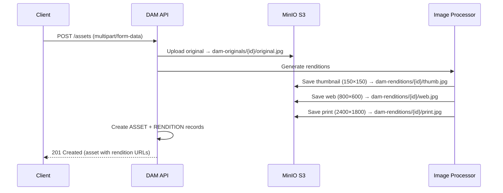
```mermaid
sequenceDiagram
    participant Client
    participant DAM API
    participant S3 as MinIO S3
    participant Pillow as Image Processor

    Client->>DAM API: POST /assets (multipart/form-data)
    DAM API->>S3: Upload original → dam-originals/{id}/original.jpg
    DAM API->>Pillow: Generate renditions
    Pillow->>S3: Save thumbnail (150×150) → dam-renditions/{id}/thumb.jpg
    Pillow->>S3: Save web (800×600) → dam-renditions/{id}/web.jpg
    Pillow->>S3: Save print (2400×1800) → dam-renditions/{id}/print.jpg
    DAM API->>DAM API: Create ASSET + RENDITION records
    DAM API-->>Client: 201 Created (asset with rendition URLs)
```

---

### 4.4 Security Middleware

**Purpose**: API Gateway providing centralized authentication, authorization, rate limiting, and audit logging.

**Component Diagram**:
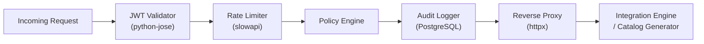
```mermaid
graph LR
    REQ["Incoming Request"] --> AUTH["JWT Validator<br/>(python-jose)"]
    AUTH --> RATE["Rate Limiter<br/>(slowapi)"]
    RATE --> POLICY["Policy Engine"]
    POLICY --> AUDIT["Audit Logger<br/>(PostgreSQL)"]
    AUDIT --> PROXY["Reverse Proxy<br/>(httpx)"]
    PROXY --> BACKEND["Integration Engine<br/>/ Catalog Generator"]
```

**JWT Token Claims Structure**:
```json
{
  "sub": "user-001",
  "name": "Mario Rossi",
  "email": "mario.rossi@company.com",
  "roles": ["integration_admin", "pii_reader"],
  "systems_access": ["PLM", "PIM", "DAM"],
  "data_classification": {
    "pii": true,
    "financial": false,
    "confidential": true
  },
  "budget": {
    "max_api_calls_per_execution": 100,
    "max_records_per_query": 5000
  },
  "iat": 1709553600,
  "exp": 1709640000,
  "iss": "integration-mate-poc"
}
```

**Routing Table**:

| Path Prefix | Target Service |
|---|---|
| `/api/v1/integrations/*` | Integration Engine :3003 |
| `/api/v1/execute/*` | Integration Engine :3003 |
| `/api/v1/thoughts/*` | Integration Engine :3003 |
| `/api/v1/approvals/*` | Integration Engine :3003 |
| `/api/v1/catalog/*` | Catalog Generator :3004 |
| `/api/v1/generate/*` | Catalog Generator :3004 |
| `/auth/token` | Self (generate JWT) |
| `/health` | Self |

---

### 4.5 Integration Engine (Agentic)

**Purpose**: AI-powered autonomous agent that plans, executes, self-corrects, and logs integration workflows.

**Component Diagram**:
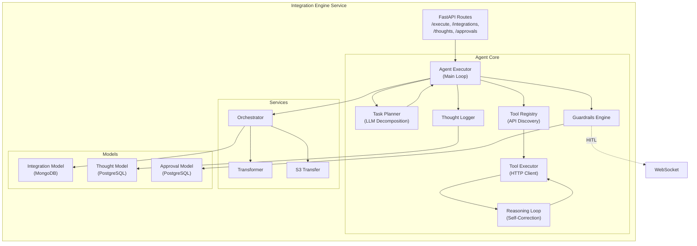
```mermaid
graph TB
    subgraph "Integration Engine Service"
        ROUTES["FastAPI Routes<br/>/execute, /integrations,<br/>/thoughts, /approvals"]
        
        subgraph "Agent Core"
            EXEC["Agent Executor<br/>(Main Loop)"]
            PLAN["Task Planner<br/>(LLM Decomposition)"]
            TOOLS["Tool Registry<br/>(API Discovery)"]
            TEXEC["Tool Executor<br/>(HTTP Client)"]
            REASON["Reasoning Loop<br/>(Self-Correction)"]
            TLOG["Thought Logger"]
            GUARD["Guardrails Engine"]
        end

        subgraph "Services"
            ORCH["Orchestrator"]
            TRANS["Transformer"]
            S3T["S3 Transfer"]
        end

        subgraph "Models"
            INT_MODEL["Integration Model<br/>(MongoDB)"]
            THOUGHT_MODEL["Thought Model<br/>(PostgreSQL)"]
            APPR_MODEL["Approval Model<br/>(PostgreSQL)"]
        end
    end

    ROUTES --> EXEC
    EXEC --> PLAN --> EXEC
    EXEC --> TOOLS --> TEXEC
    TEXEC --> REASON --> TEXEC
    EXEC --> TLOG
    EXEC --> GUARD
    GUARD -.->|HITL| WS["WebSocket"]
    EXEC --> ORCH --> TRANS & S3T
    ORCH --> INT_MODEL
    TLOG --> THOUGHT_MODEL
    GUARD --> APPR_MODEL
```

Detailed agentic framework is covered in [Section 7](#7-agentic-integration-framework).

---

### 4.6 Catalog Generator

**Purpose**: Parses requirements and API specs, builds integration catalog, generates documents via LLM.

**Pipeline**:
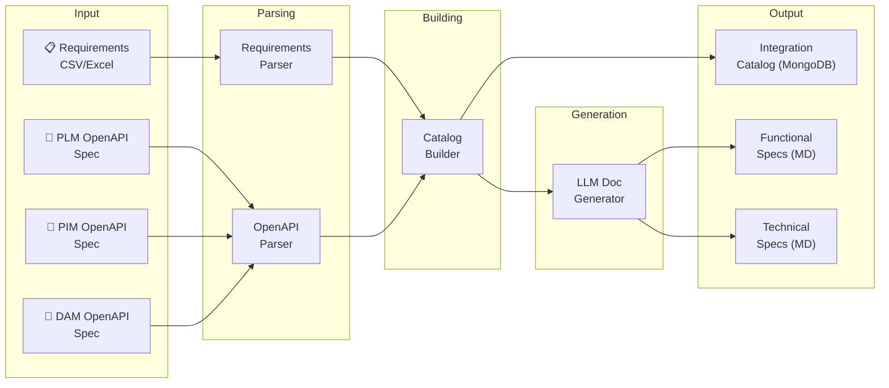
```mermaid
graph LR
    subgraph "Input"
        CSV["📋 Requirements<br/>CSV/Excel"]
        SPEC1["📄 PLM OpenAPI<br/>Spec"]
        SPEC2["📄 PIM OpenAPI<br/>Spec"]
        SPEC3["📄 DAM OpenAPI<br/>Spec"]
    end

    subgraph "Parsing"
        RP["Requirements<br/>Parser"]
        OP["OpenAPI<br/>Parser"]
    end

    subgraph "Building"
        CB["Catalog<br/>Builder"]
    end

    subgraph "Generation"
        LLM["LLM Doc<br/>Generator"]
    end

    subgraph "Output"
        CAT["Integration<br/>Catalog (MongoDB)"]
        FDOC["Functional<br/>Specs (MD)"]
        TDOC["Technical<br/>Specs (MD)"]
    end

    CSV --> RP
    SPEC1 & SPEC2 & SPEC3 --> OP
    RP & OP --> CB
    CB --> CAT
    CB --> LLM
    LLM --> FDOC & TDOC
```

**API Endpoints**:

| Method | Path | Description |
|---|---|---|
| POST | `/api/v1/catalog/generate` | Upload CSV + trigger full pipeline |
| GET | `/api/v1/catalog/integrations` | List all cataloged integrations |
| GET | `/api/v1/catalog/integrations/{id}` | Get integration detail |
| GET | `/api/v1/catalog/integrations/{id}/functional-spec` | Get functional doc |
| GET | `/api/v1/catalog/integrations/{id}/technical-spec` | Get technical doc |
| POST | `/api/v1/catalog/regenerate/{id}` | Regenerate docs for one integration |
| GET | `/health` | Health check |

---

### 4.7 Web Dashboard

**Purpose**: Single-page application for browsing the integration catalog, viewing agent thought processes, and managing HITL approvals.

**Layout**:
```
┌──────────────────────────────────────────────────────┐
│  🧠 Functional Integration Mate          [user] [⚙️] │
├──────────┬───────────────────────────────────────────┤
│          │                                           │
│  📋 Nav  │         Main Content Area                 │
│          │                                           │
│ Catalog  │  ┌─────────────────────────────────────┐  │
│ Execut.  │  │  Integration Cards / Detail View    │  │
│ Thoughts │  │  Thought Process Timeline           │  │
│ Approvals│  │  Document Viewer                    │  │
│ Docs     │  │  HITL Approval Panel                │  │
│          │  └─────────────────────────────────────┘  │
│          │                                           │
├──────────┴───────────────────────────────────────────┤
│  Status Bar: [connected] [11 services] [3 pending]   │
└──────────────────────────────────────────────────────┘
```

**Pages**:

| Page | Features |
|---|---|
| **Catalog** | Grid/list of integrations, filter by status/system, click for detail |
| **Integration Detail** | Field mappings, requirements, agentic config, linked documents |
| **Executions** | History of agent executions, real-time status |
| **Thought Viewer** | Timeline of agent thoughts per execution, expandable steps |
| **Approvals** | Pending HITL approvals with approve/reject buttons |
| **Documents** | Browse generated functional + technical specs, download as MD |

---

## 5. Data Architecture

### 5.1 Data Flow Diagram

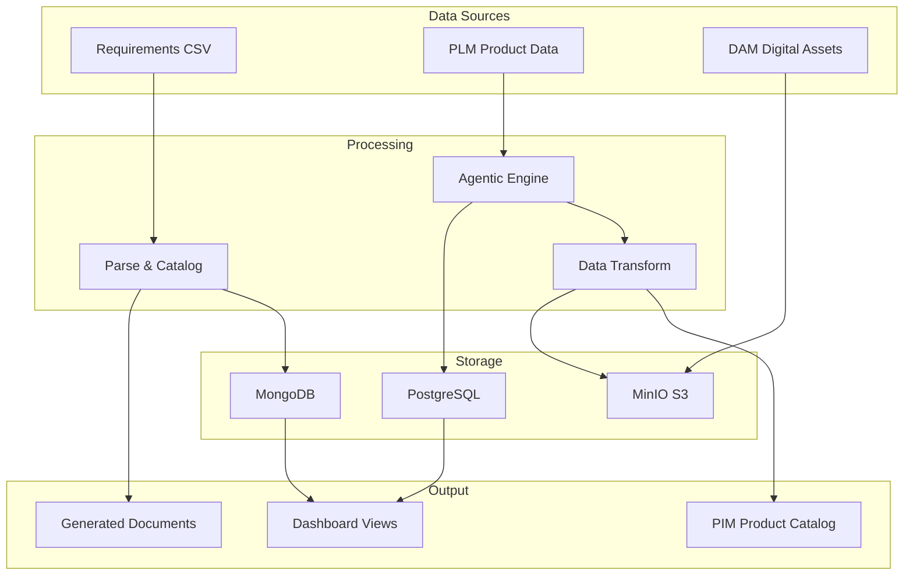
```mermaid
graph TB
    subgraph "Data Sources"
        REQ_CSV["Requirements CSV"]
        PLM_DATA["PLM Product Data"]
        DAM_ASSETS["DAM Digital Assets"]
    end

    subgraph "Processing"
        PARSE["Parse & Catalog"]
        AGENT["Agentic Engine"]
        TRANSFORM["Data Transform"]
    end

    subgraph "Storage"
        MONGO_DB["MongoDB"]
        PG_DB["PostgreSQL"]
        S3_STORE["MinIO S3"]
    end

    subgraph "Output"
        PIM_DATA["PIM Product Catalog"]
        DOCS["Generated Documents"]
        DASH["Dashboard Views"]
    end

    REQ_CSV --> PARSE --> MONGO_DB
    PLM_DATA --> AGENT --> TRANSFORM
    DAM_ASSETS --> S3_STORE
    TRANSFORM --> PIM_DATA
    TRANSFORM --> S3_STORE
    AGENT --> PG_DB
    PARSE --> DOCS
    MONGO_DB & PG_DB --> DASH
```

### 5.2 Data Ownership Matrix

| Data Entity | Owner Service | Storage | Retention |
|---|---|---|---|
| Integration Catalog | Catalog Generator | MongoDB | Permanent |
| Generated Documents | Catalog Generator | MongoDB + Filesystem | Permanent |
| Audit Logs | Security Middleware | PostgreSQL | 90 days (PoC) |
| Agent Thoughts | Integration Engine | PostgreSQL | 30 days (PoC) |
| HITL Approvals | Integration Engine | PostgreSQL | Permanent |
| PLM Products (mock) | PLM Mock | In-memory | Session |
| PIM Products (mock) | PIM Mock | In-memory | Session |
| DAM Assets (mock) | DAM Mock | In-memory + S3 | Session |
| Binary Assets | All systems | MinIO S3 | Permanent |

---

## 6. Integration Patterns

### 6.1 Pattern Catalog

| Pattern | Use Case | Implementation |
|---|---|---|
| **Data Sync** | PLM product → PIM product | Agent fetches, transforms, pushes |
| **Media Sync** | PLM images → DAM → PIM | S3 copy + rendition pipeline |
| **Enrichment** | PIM product ← DAM metadata | Agent fetches metadata, enriches product |
| **Validation** | Check product completeness | Agent queries all systems, validates rules |
| **Bidirectional Sync** | Keep PIM ↔ DAM in sync | Agent detects changes, syncs both ways |

### 6.2 Field Mapping Specification

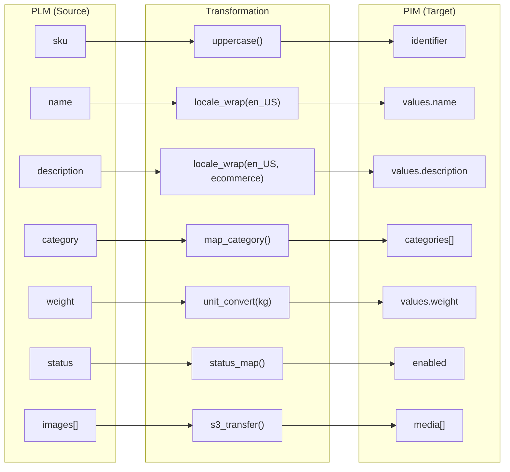
```mermaid
graph LR
    subgraph "PLM (Source)"
        P_SKU["sku"]
        P_NAME["name"]
        P_DESC["description"]
        P_CAT["category"]
        P_WEIGHT["weight"]
        P_STATUS["status"]
        P_IMAGES["images[]"]
    end

    subgraph "Transformation"
        T1["uppercase()"]
        T2["locale_wrap(en_US)"]
        T3["locale_wrap(en_US, ecommerce)"]
        T4["map_category()"]
        T5["unit_convert(kg)"]
        T6["status_map()"]
        T7["s3_transfer()"]
    end

    subgraph "PIM (Target)"
        PI_ID["identifier"]
        PI_NAME["values.name"]
        PI_DESC["values.description"]
        PI_CAT["categories[]"]
        PI_WEIGHT["values.weight"]
        PI_ENABLED["enabled"]
        PI_MEDIA["media[]"]
    end

    P_SKU --> T1 --> PI_ID
    P_NAME --> T2 --> PI_NAME
    P_DESC --> T3 --> PI_DESC
    P_CAT --> T4 --> PI_CAT
    P_WEIGHT --> T5 --> PI_WEIGHT
    P_STATUS --> T6 --> PI_ENABLED
    P_IMAGES --> T7 --> PI_MEDIA
```

### 6.3 Transformation Functions

| Function | Input | Output | Description |
|---|---|---|---|
| `uppercase` | `"abc-123"` | `"ABC-123"` | Convert to uppercase |
| `locale_wrap` | `"text"` | `{"locale":"en_US","data":"text"}` | Wrap in Akeneo locale format |
| `map_category` | `"Electronics/TV"` | `["electronics","television"]` | PLM path → PIM categories |
| `unit_convert` | `{"value":15.5,"unit":"kg"}` | `{"amount":15.5,"unit":"KILOGRAM"}` | Convert to PIM unit format |
| `status_map` | `"PUBLISHED"` | `true` | Map PLM status to PIM enabled flag |
| `s3_transfer` | `"plm-assets/img.jpg"` | `"pim-media/img.jpg"` | Copy between S3 buckets |

---

## 7. Agentic Integration Framework

### 7.1 Agent Architecture

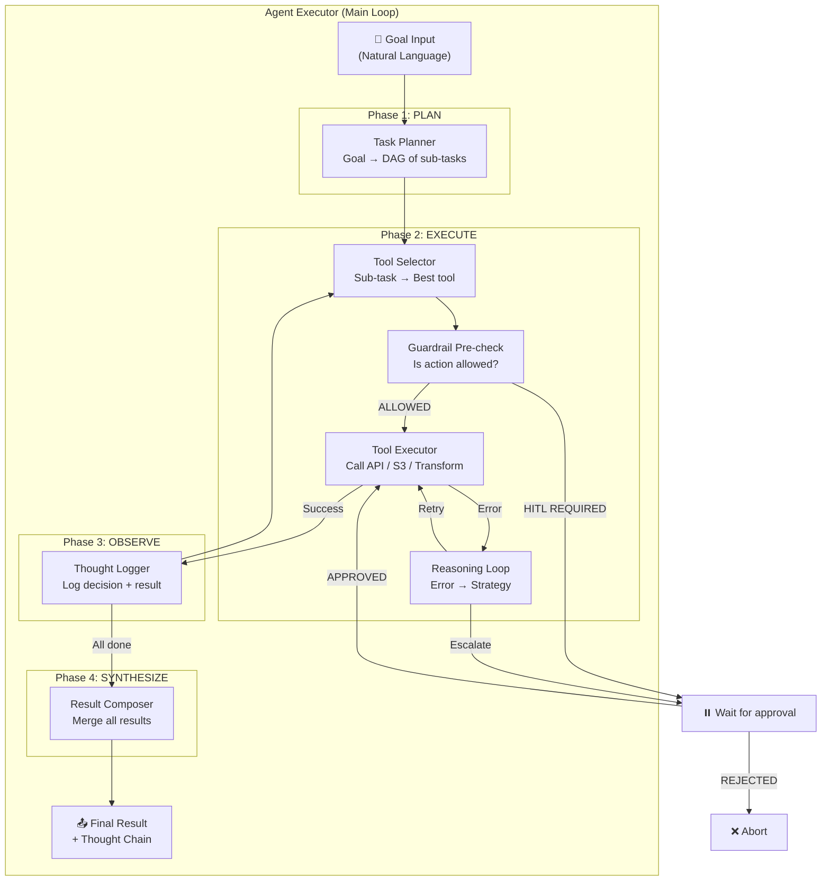
```mermaid
graph TB
    subgraph "Agent Executor (Main Loop)"
        INPUT["🎯 Goal Input<br/>(Natural Language)"]
        
        subgraph "Phase 1: PLAN"
            DECOMPOSE["Task Planner<br/>Goal → DAG of sub-tasks"]
        end

        subgraph "Phase 2: EXECUTE"
            SELECT["Tool Selector<br/>Sub-task → Best tool"]
            GUARDRAIL_CHECK["Guardrail Pre-check<br/>Is action allowed?"]
            CALL["Tool Executor<br/>Call API / S3 / Transform"]
            SELF_CORRECT["Reasoning Loop<br/>Error → Strategy"]
        end

        subgraph "Phase 3: OBSERVE"
            THOUGHT["Thought Logger<br/>Log decision + result"]
        end

        subgraph "Phase 4: SYNTHESIZE"
            COMPOSE["Result Composer<br/>Merge all results"]
        end

        OUTPUT["📤 Final Result<br/>+ Thought Chain"]
    end

    INPUT --> DECOMPOSE
    DECOMPOSE --> SELECT
    SELECT --> GUARDRAIL_CHECK
    GUARDRAIL_CHECK -->|ALLOWED| CALL
    GUARDRAIL_CHECK -->|HITL REQUIRED| HITL_QUEUE["⏸️ Wait for approval"]
    HITL_QUEUE -->|APPROVED| CALL
    HITL_QUEUE -->|REJECTED| ABORT["❌ Abort"]
    CALL -->|Success| THOUGHT
    CALL -->|Error| SELF_CORRECT
    SELF_CORRECT -->|Retry| CALL
    SELF_CORRECT -->|Escalate| HITL_QUEUE
    THOUGHT --> SELECT
    THOUGHT -->|All done| COMPOSE
    COMPOSE --> OUTPUT
```

### 7.2 Tool Registry

All tools available to the agent, loaded at startup:

```json
[
  {
    "id": "plm_get_product",
    "name": "Get PLM Product",
    "system": "PLM",
    "protocol": "REST",
    "method": "GET",
    "endpoint": "/api/v1/products/{id}",
    "params": [{"name": "id", "type": "string", "required": true}],
    "returns": "Product object with SKU, name, description, status",
    "error_codes": [404, 401, 500],
    "avg_latency_ms": 50,
    "data_classification": "confidential"
  },
  {
    "id": "plm_list_products",
    "name": "List PLM Products",
    "system": "PLM",
    "protocol": "REST",
    "method": "GET",
    "endpoint": "/api/v1/products",
    "params": [
      {"name": "page", "type": "int", "required": false, "default": 1},
      {"name": "limit", "type": "int", "required": false, "default": 20},
      {"name": "status", "type": "string", "required": false}
    ],
    "returns": "Paginated list of products",
    "data_classification": "internal"
  },
  {
    "id": "plm_get_bom",
    "name": "Get Product BOM",
    "system": "PLM",
    "protocol": "REST",
    "method": "GET",
    "endpoint": "/api/v1/products/{id}/bom",
    "params": [{"name": "id", "type": "string", "required": true}],
    "returns": "Bill of Materials with components and quantities"
  },
  {
    "id": "pim_create_product",
    "name": "Create PIM Product",
    "system": "PIM",
    "protocol": "REST",
    "method": "POST",
    "endpoint": "/api/v1/products",
    "params": [
      {"name": "identifier", "type": "string", "required": true},
      {"name": "family", "type": "string", "required": true},
      {"name": "values", "type": "object", "required": true}
    ],
    "returns": "Created product",
    "side_effects": ["WRITE"],
    "data_classification": "confidential"
  },
  {
    "id": "pim_update_product",
    "name": "Update PIM Product",
    "system": "PIM",
    "protocol": "REST",
    "method": "PATCH",
    "endpoint": "/api/v1/products/{identifier}",
    "side_effects": ["WRITE"]
  },
  {
    "id": "pim_delete_product",
    "name": "Delete PIM Product",
    "system": "PIM",
    "protocol": "REST",
    "method": "DELETE",
    "endpoint": "/api/v1/products/{identifier}",
    "side_effects": ["DELETE"],
    "guardrail": "HITL_REQUIRED"
  },
  {
    "id": "dam_upload_asset",
    "name": "Upload Asset to DAM",
    "system": "DAM",
    "protocol": "REST",
    "method": "POST",
    "endpoint": "/api/v1/assets",
    "returns": "Asset with auto-generated renditions",
    "side_effects": ["WRITE", "S3_UPLOAD"]
  },
  {
    "id": "dam_get_renditions",
    "name": "Get Asset Renditions",
    "system": "DAM",
    "protocol": "REST",
    "method": "GET",
    "endpoint": "/api/v1/assets/{id}/renditions"
  },
  {
    "id": "s3_download",
    "name": "Download from S3",
    "system": "S3",
    "protocol": "S3",
    "operation": "get_object",
    "params": [
      {"name": "bucket", "type": "string", "required": true},
      {"name": "key", "type": "string", "required": true}
    ]
  },
  {
    "id": "s3_upload",
    "name": "Upload to S3",
    "system": "S3",
    "protocol": "S3",
    "operation": "put_object",
    "side_effects": ["WRITE", "S3_UPLOAD"]
  },
  {
    "id": "s3_copy",
    "name": "Copy between S3 buckets",
    "system": "S3",
    "protocol": "S3",
    "operation": "copy_object",
    "side_effects": ["WRITE"]
  },
  {
    "id": "s3_presigned_url",
    "name": "Generate presigned download URL",
    "system": "S3",
    "protocol": "S3",
    "operation": "generate_presigned_url"
  },
  {
    "id": "transform_fields",
    "name": "Transform data fields",
    "system": "INTERNAL",
    "protocol": "LOCAL",
    "description": "Apply field mapping and transformation rules"
  },
  {
    "id": "security_validate_token",
    "name": "Validate JWT Token",
    "system": "SECURITY",
    "protocol": "REST",
    "method": "POST",
    "endpoint": "/auth/validate"
  },
  {
    "id": "security_check_permission",
    "name": "Check user permission",
    "system": "SECURITY",
    "protocol": "LOCAL",
    "description": "Check if user role allows the requested action"
  }
]
```

### 7.3 Reasoning Loop — Detailed Flow

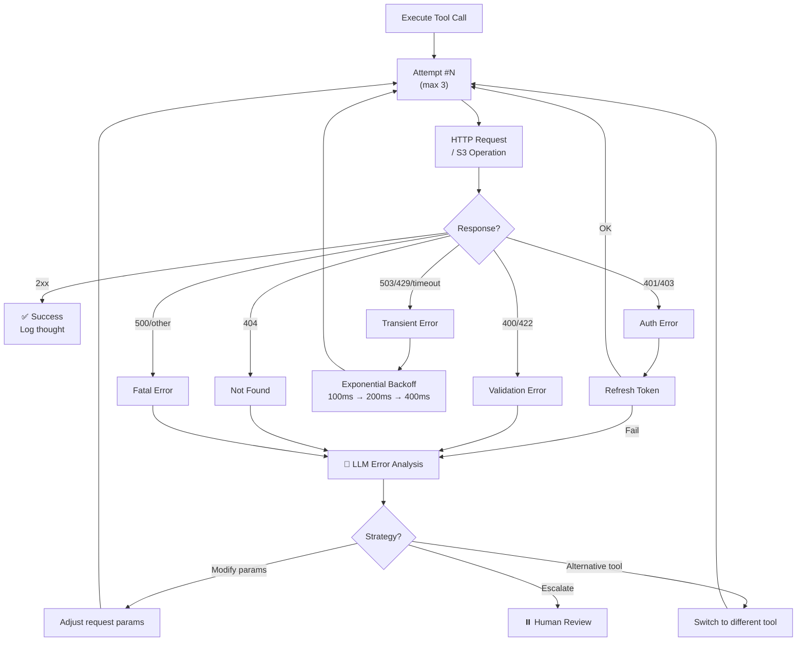
```mermaid
graph TB
    START["Execute Tool Call"] --> ATTEMPT["Attempt #N<br/>(max 3)"]
    ATTEMPT --> HTTP["HTTP Request<br/>/ S3 Operation"]
    
    HTTP --> CODE{Response?}
    CODE -->|2xx| SUCCESS["✅ Success<br/>Log thought"]
    CODE -->|503/429/timeout| TRANSIENT["Transient Error"]
    CODE -->|401/403| AUTH_ERR["Auth Error"]
    CODE -->|400/422| VALIDATION["Validation Error"]
    CODE -->|404| NOT_FOUND["Not Found"]
    CODE -->|500/other| FATAL_ERR["Fatal Error"]

    TRANSIENT --> BACKOFF["Exponential Backoff<br/>100ms → 200ms → 400ms"]
    BACKOFF --> ATTEMPT

    AUTH_ERR --> REFRESH["Refresh Token"]
    REFRESH -->|OK| ATTEMPT
    REFRESH -->|Fail| LLM_ANALYZE

    VALIDATION --> LLM_ANALYZE["🤖 LLM Error Analysis"]
    NOT_FOUND --> LLM_ANALYZE
    FATAL_ERR --> LLM_ANALYZE

    LLM_ANALYZE --> STRATEGY{Strategy?}
    STRATEGY -->|Modify params| MODIFY["Adjust request params"]
    STRATEGY -->|Alternative tool| ALT_TOOL["Switch to different tool"]
    STRATEGY -->|Escalate| HITL["⏸️ Human Review"]
    
    MODIFY --> ATTEMPT
    ALT_TOOL --> ATTEMPT
```

### 7.4 Guardrail Configuration

```yaml
guardrails:
  hard_limits:
    - name: "System Scope"
      description: "Cannot access systems outside tool registry"
      action: BLOCK
    
    - name: "Max Execution Time"
      value: 300  # seconds
      action: ABORT

  soft_limits:
    - name: "Destructive Operations"
      trigger: "DELETE method on any system"
      action: HITL_REQUIRED
    
    - name: "PII Data Access"
      trigger: "Access to fields matching *.email, *.phone, *.ssn"
      required_role: "pii_reader"
      action: HITL_IF_NO_ROLE

    - name: "Bulk Write"
      trigger: "WRITE affecting > 100 records"
      action: HITL_REQUIRED

    - name: "Price Modification"
      trigger: "WRITE to pricing fields with delta > 20%"
      action: HITL_REQUIRED

    - name: "API Budget"
      trigger: "Total API calls > 50 per execution"
      action: PAUSE_NOTIFY

  advisory:
    - name: "Slow Response"
      trigger: "Tool response > 5 seconds"
      action: LOG_WARNING

    - name: "Large Payload"
      trigger: "Response body > 10MB"
      action: LOG_WARNING
```

---

## 8. Security Architecture

### 8.1 Security Layers

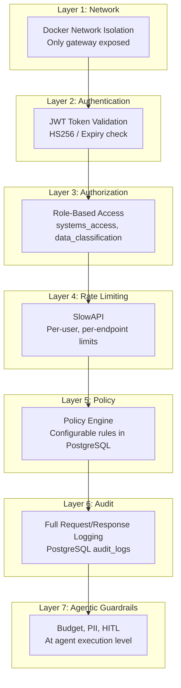
```mermaid
graph TB
    subgraph "Layer 1: Network"
        NET["Docker Network Isolation<br/>Only gateway exposed"]
    end
    subgraph "Layer 2: Authentication"
        JWT["JWT Token Validation<br/>HS256 / Expiry check"]
    end
    subgraph "Layer 3: Authorization"
        RBAC["Role-Based Access<br/>systems_access, data_classification"]
    end
    subgraph "Layer 4: Rate Limiting"
        RATE["SlowAPI<br/>Per-user, per-endpoint limits"]
    end
    subgraph "Layer 5: Policy"
        POL["Policy Engine<br/>Configurable rules in PostgreSQL"]
    end
    subgraph "Layer 6: Audit"
        AUD["Full Request/Response Logging<br/>PostgreSQL audit_logs"]
    end
    subgraph "Layer 7: Agentic Guardrails"
        GUARD2["Budget, PII, HITL<br/>At agent execution level"]
    end

    NET --> JWT --> RBAC --> RATE --> POL --> AUD --> GUARD2
```

### 8.2 Data Classification

| Level | Examples | Access Control |
|---|---|---|
| **Public** | Product name, description | Any authenticated user |
| **Internal** | Category mapping, status | Role: `integration_read` |
| **Confidential** | Pricing, costs, margins | Role: `financial_read` |
| **Restricted (PII)** | Emails, phone numbers | Role: `pii_reader` + HITL |

---

## 9. Asset Management & Storage

### 9.1 Bucket Architecture

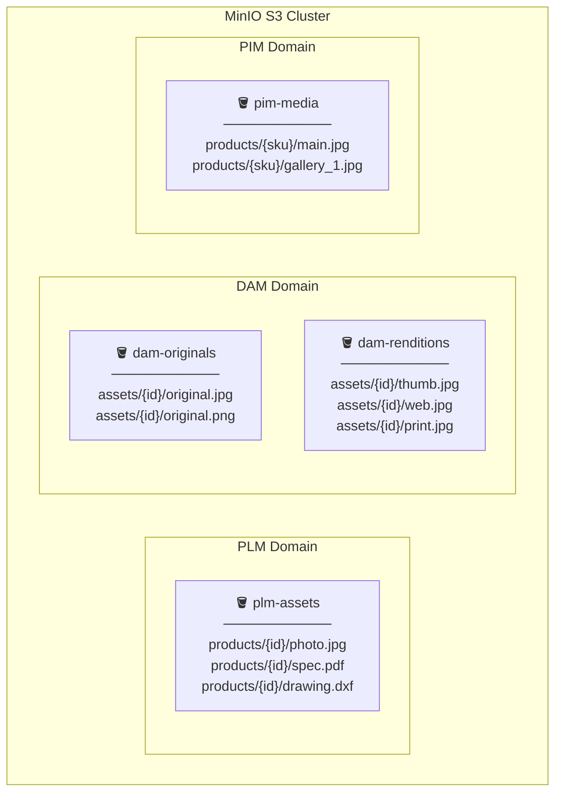
```mermaid
graph TB
    subgraph "MinIO S3 Cluster"
        subgraph "PLM Domain"
            PLM_B["🪣 plm-assets<br/>───────────<br/>products/{id}/photo.jpg<br/>products/{id}/spec.pdf<br/>products/{id}/drawing.dxf"]
        end
        
        subgraph "DAM Domain"
            DAM_O["🪣 dam-originals<br/>───────────<br/>assets/{id}/original.jpg<br/>assets/{id}/original.png"]
            DAM_R["🪣 dam-renditions<br/>───────────<br/>assets/{id}/thumb.jpg<br/>assets/{id}/web.jpg<br/>assets/{id}/print.jpg"]
        end

        subgraph "PIM Domain"
            PIM_B["🪣 pim-media<br/>───────────<br/>products/{sku}/main.jpg<br/>products/{sku}/gallery_1.jpg"]
        end
    end
```

### 9.2 Asset Transfer Flow (Agentic)

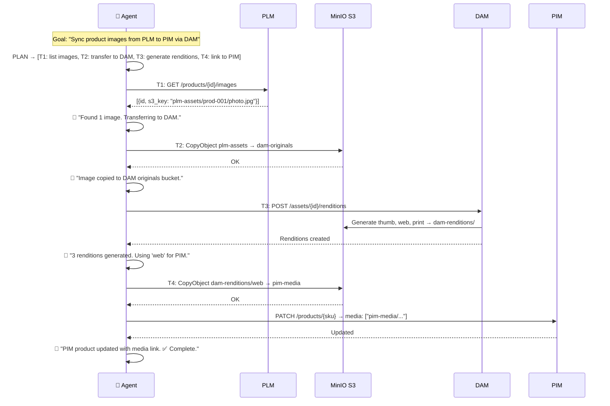
```mermaid
sequenceDiagram
    participant Agent as 🧠 Agent
    participant PLM
    participant S3 as MinIO S3
    participant DAM
    participant PIM

    Note over Agent: Goal: "Sync product images from PLM to PIM via DAM"
    
    Agent->>Agent: PLAN → [T1: list images, T2: transfer to DAM, T3: generate renditions, T4: link to PIM]
    
    Agent->>PLM: T1: GET /products/{id}/images
    PLM-->>Agent: [{id, s3_key: "plm-assets/prod-001/photo.jpg"}]
    Agent->>Agent: 💭 "Found 1 image. Transferring to DAM."
    
    Agent->>S3: T2: CopyObject plm-assets → dam-originals
    S3-->>Agent: OK
    Agent->>Agent: 💭 "Image copied to DAM originals bucket."
    
    Agent->>DAM: T3: POST /assets/{id}/renditions
    DAM->>S3: Generate thumb, web, print → dam-renditions/
    DAM-->>Agent: Renditions created
    Agent->>Agent: 💭 "3 renditions generated. Using 'web' for PIM."
    
    Agent->>S3: T4: CopyObject dam-renditions/web → pim-media
    S3-->>Agent: OK
    Agent->>PIM: PATCH /products/{sku} → media: ["pim-media/..."]
    PIM-->>Agent: Updated
    Agent->>Agent: 💭 "PIM product updated with media link. ✅ Complete."
```

---

## 10. Observability & Monitoring

### 10.1 Logging Strategy

| Layer | Format | Destination |
|---|---|---|
| HTTP Access | JSON (method, path, status, duration) | stdout + PostgreSQL |
| Agent Thoughts | Structured JSON (see ADR-015) | PostgreSQL |
| Application | Structured JSON (level, message, context) | stdout |
| Errors | JSON + stack trace | stdout + PostgreSQL |

### 10.2 Key Metrics (PoC)

| Metric | Source | Purpose |
|---|---|---|
| `agent.execution.duration_ms` | Integration Engine | Execution time per goal |
| `agent.steps.count` | Thought Logger | Complexity per execution |
| `agent.self_corrections` | Reasoning Loop | Resilience indicator |
| `agent.hitl.pending_count` | Guardrails | Approval queue depth |
| `api.request.duration_ms` | Security Middleware | Latency monitoring |
| `api.request.error_rate` | Security Middleware | Error tracking |
| `s3.transfer.bytes` | S3 Transfer | Storage usage |

### 10.3 Thought Process Visualization

The dashboard displays the agent's thought chain as an interactive timeline:

```
┌─ Execution: exec-abc123 ──────────────────────────────────────┐
│ Goal: "Recupera info prodotto PLM-001 per utente U-01"       │
│ Status: ✅ COMPLETED (1.2s)                                   │
│                                                               │
│ ┌─ Step 1 [PLAN] ──────────────────────────── 120ms ────────┐ │
│ │ 💭 Decomposing goal into 5 sub-tasks with 2 parallel      │ │
│ │    groups. Tasks: verify exists → check auth → parallel   │ │
│ │    [check permissions, fetch media] → compose response    │ │
│ └───────────────────────────────────────────────────────────┘ │
│                                                               │
│ ┌─ Step 2 [EXECUTE] plm_get_product ────────── 45ms ────────┐ │
│ │ 💭 Product PLM-001 exists, status: PUBLISHED              │ │
│ │ ✅ Result: {sku: "PLM-001", name: "Smart TV 55", ...}     │ │
│ └───────────────────────────────────────────────────────────┘ │
│                                                               │
│ ┌─ Step 3 [EXECUTE] security_validate_token ── 22ms ─── ⚡ ─┐ │
│ │ 💭 Token valid. User: mario.rossi, roles: [editor]        │ │
│ │ ✅ Authenticated                                          │ │
│ ├─ Step 4 [EXECUTE] security_check_perm ──── 18ms ─── ⚡ ──┤ │
│ │ 💭 Editor can see: name, description, category, images    │ │
│ │    Editor CANNOT see: cost, margin (financial data)        │ │
│ │ ⚠️ Filtering 2 fields per policy P-003                    │ │
│ └───────────────────────────────────────────────────────────┘ │
│                                                               │
│ ┌─ Step 5 [EXECUTE] dam_get_assets ─────────── 80ms ────────┐ │
│ │ 💭 Found 2 renditions for PLM-001: web + thumbnail        │ │
│ │ ✅ Media URLs generated (presigned, 15 min expiry)        │ │
│ └───────────────────────────────────────────────────────────┘ │
│                                                               │
│ ┌─ Step 6 [SYNTHESIZE] ────────────────────── 5ms ──────────┐ │
│ │ 💭 Composing filtered response: 8/10 fields + 2 media     │ │
│ │ ✅ Response ready                                         │ │
│ └───────────────────────────────────────────────────────────┘ │
│                                                               │
│ ⚡ Parallel steps: 3+4 ran together (40ms saved)              │
│ 📊 Total API calls: 4 | Budget used: 8%                      │
└───────────────────────────────────────────────────────────────┘
```

---

## 11. Deployment Architecture

### 11.1 Docker Compose Topology

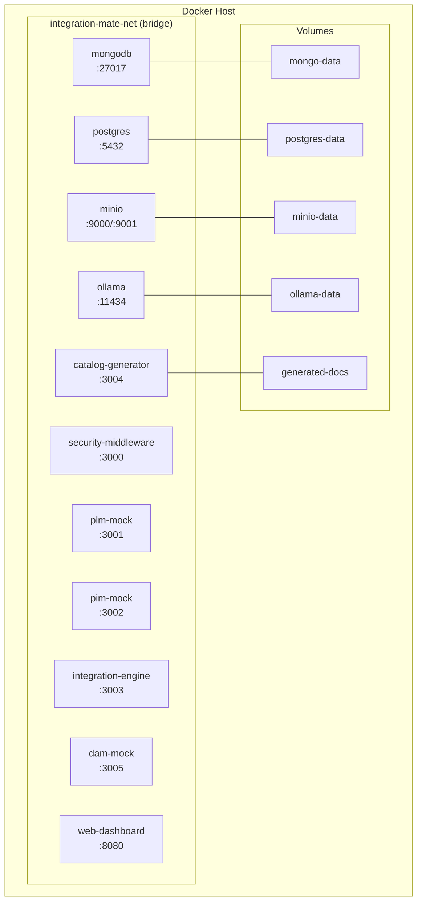
```mermaid
graph TB
    subgraph "Docker Host"
        subgraph "integration-mate-net (bridge)"
            GW["security-middleware<br/>:3000"]
            PLM["plm-mock<br/>:3001"]
            PIM["pim-mock<br/>:3002"]
            ENGINE["integration-engine<br/>:3003"]
            CATGEN["catalog-generator<br/>:3004"]
            DAM["dam-mock<br/>:3005"]
            DASH["web-dashboard<br/>:8080"]
            MONGO["mongodb<br/>:27017"]
            PG["postgres<br/>:5432"]
            MINIO["minio<br/>:9000/:9001"]
            OLLAMA["ollama<br/>:11434"]
        end

        subgraph "Volumes"
            V1["mongo-data"]
            V2["postgres-data"]
            V3["minio-data"]
            V4["ollama-data"]
            V5["generated-docs"]
        end

        MONGO --- V1
        PG --- V2
        MINIO --- V3
        OLLAMA --- V4
        CATGEN --- V5
    end
```

### 11.2 Startup Order

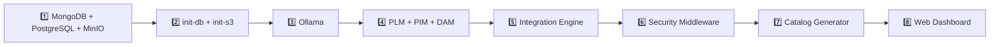
```mermaid
graph LR
    DB["1️⃣ MongoDB + PostgreSQL + MinIO"] --> INIT["2️⃣ init-db + init-s3"]
    INIT --> OLLAMA["3️⃣ Ollama"]
    OLLAMA --> MOCKS["4️⃣ PLM + PIM + DAM"]
    MOCKS --> ENGINE["5️⃣ Integration Engine"]
    ENGINE --> MW["6️⃣ Security Middleware"]
    MW --> GEN["7️⃣ Catalog Generator"]
    GEN --> DASH["8️⃣ Web Dashboard"]
```

### 11.3 Resource Allocation (PoC)

| Service | CPU Limit | Memory Limit |
|---|---|---|
| python services (×6) | 0.5 | 256 MB |
| MongoDB | 1.0 | 512 MB |
| PostgreSQL | 0.5 | 256 MB |
| MinIO | 0.5 | 256 MB |
| Ollama | 2.0 | 4 GB |
| nginx | 0.25 | 64 MB |

---

## 12. API Contracts

### 12.1 Common Response Envelope

All API responses follow this structure:

**Success**:
```json
{
  "status": "success",
  "data": { ... },
  "meta": {
    "page": 1,
    "limit": 20,
    "total": 150,
    "timestamp": "2026-03-04T12:00:00Z"
  }
}
```

**Error (RFC 7807)**:
```json
{
  "type": "https://integration-mate.local/errors/not-found",
  "title": "Product Not Found",
  "status": 404,
  "detail": "Product with ID 'PLM-999' does not exist in PLM",
  "instance": "/api/v1/products/PLM-999",
  "timestamp": "2026-03-04T12:00:00Z",
  "trace_id": "exec-abc123"
}
```

### 12.2 Agent Execution API

**Request**: `POST /api/v1/execute`
```json
{
  "goal": "Sincronizza prodotto PLM-001 su PIM e DAM con immagini",
  "context": {
    "user_token": "eyJhbGciOi...",
    "priority": "normal",
    "dry_run": false
  }
}
```

**Response** (streaming via SSE or final):
```json
{
  "execution_id": "exec-abc123",
  "status": "completed",
  "goal": "Sincronizza prodotto PLM-001 su PIM e DAM con immagini",
  "duration_ms": 1250,
  "steps_executed": 7,
  "api_calls": 4,
  "self_corrections": 0,
  "hitl_approvals": 0,
  "result": {
    "pim_product_created": "SKU-PLM-001",
    "dam_asset_created": "asset-001",
    "renditions_generated": 3,
    "media_linked": true
  },
  "thought_chain_url": "/api/v1/thoughts/exec-abc123"
}
```

---

## 13. Non-Functional Requirements

| Category | Requirement | PoC Target | Production Target |
|---|---|---|---|
| **Performance** | API response time | < 500ms (p95) | < 200ms (p95) |
| **Performance** | Agent execution time | < 30s | < 10s |
| **Availability** | Uptime SLA | N/A (local) | 99.9% |
| **Security** | Authentication | JWT (PoC secret) | OAuth2 + OIDC |
| **Security** | Encryption at rest | None | AES-256 |
| **Security** | Encryption in transit | HTTP (PoC) | TLS 1.3 |
| **Compliance** | Audit retention | 30 days | 7 years |
| **Compliance** | GDPR | PII guardrails | Full DPA compliance |
| **Scalability** | Concurrent agents | 1 | 50+ |
| **Scalability** | Catalog size | 50 integrations | 10,000+ |
| **Observability** | Logging | stdout + PostgreSQL | ELK / Datadog |
| **Observability** | Tracing | Execution ID | OpenTelemetry |
| **CDN** | Asset delivery | MinIO direct | CloudFront / Akamai |

---

## 14. Production Roadmap

### Phase 1 → Phase 2 Migration Path

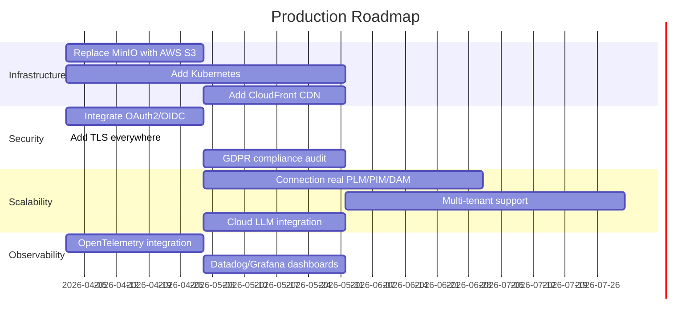
```mermaid
gantt
    title Production Roadmap
    dateFormat  YYYY-MM
    section Infrastructure
    Replace MinIO with AWS S3          :2026-04, 2026-05
    Add Kubernetes                     :2026-04, 2026-06
    Add CloudFront CDN                 :2026-05, 2026-06
    section Security
    Integrate OAuth2/OIDC              :2026-04, 2026-05
    Add TLS everywhere                 :2026-04, 2026-04
    GDPR compliance audit              :2026-05, 2026-06
    section Scalability
    Connection real PLM/PIM/DAM        :2026-05, 2026-07
    Multi-tenant support               :2026-06, 2026-08
    Cloud LLM integration              :2026-05, 2026-06
    section Observability
    OpenTelemetry integration          :2026-04, 2026-05
    Datadog/Grafana dashboards         :2026-05, 2026-06
```

---

## 15. Error Management & Resilience

### 15.1 Error Taxonomy

The system classifies errors across 6 layers, each with distinct handling:

| Layer | Error Types | Severity Range | Owner Service |
|---|---|---|---|
| **Infrastructure** | Network, DB, S3 failures | Medium → Critical | All services |
| **Service** | API 4xx/5xx, gateway, LLM errors | Low → High | Originating service |
| **Business Logic** | Validation, transformation, rules | Low → Medium | Integration Engine |
| **Agentic** | Planning, tool selection, reasoning failures | Medium → High | Agent Executor |
| **Data Consistency** | Partial writes, orphans, stale data | High → Critical | Saga Engine |
| **Systemic** | Cascades, poison messages, resource exhaustion | High → Critical | All services |

### 15.2 Error Propagation & Containment

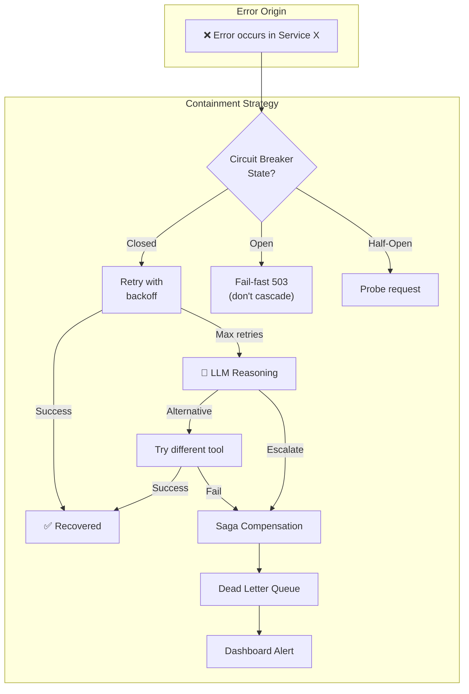
```mermaid
graph TB
    subgraph "Error Origin"
        E["❌ Error occurs in Service X"]
    end

    subgraph "Containment Strategy"
        E --> CB{Circuit Breaker<br/>State?}
        CB -->|Closed| RETRY["Retry with<br/>backoff"]
        CB -->|Open| FAILFAST["Fail-fast 503<br/>(don't cascade)"]
        CB -->|Half-Open| PROBE["Probe request"]

        RETRY -->|Success| OK["✅ Recovered"]
        RETRY -->|Max retries| REASON["🤖 LLM Reasoning"]
        REASON -->|Alternative| ALT["Try different tool"]
        REASON -->|Escalate| SAGA["Saga Compensation"]
        ALT -->|Success| OK
        ALT -->|Fail| SAGA
        SAGA --> DLQ["Dead Letter Queue"]
        DLQ --> ALERT["Dashboard Alert"]
    end
```

**Key principle**: Errors are **contained at the service boundary** and never propagate as unhandled exceptions. Each service returns structured RFC 7807 error responses that the agent can reason about.

### 15.3 Error Impact Matrix per Integration Flow

#### PLM → PIM Product Sync

| Failure Point | Impact | Data Risk | Mitigation | Automatic Recovery? |
|---|---|---|---|---|
| PLM unreachable | PIM data goes stale | Low (read-only) | Circuit breaker, retry when up | ✅ Yes |
| PLM returns partial data | Incomplete product in PIM | Medium | Validate required fields, reject if incomplete | ✅ Yes |
| Transform fails on field | Single field missing | Low | Skip field, log warning, continue | ✅ Yes |
| Transform fails entirely | Product not synced | Medium | DLQ + manual review | ❌ Manual |
| PIM write fails (500) | Data fetched but not written | Low | Retry, idempotent by SKU | ✅ Yes |
| PIM conflict (409) | Duplicate product | Low | Upsert (PATCH instead of POST) | ✅ Yes |
| PIM validation (422) | Bad payload structure | Medium | LLM adapts payload, retry | ✅ Yes (via agent) |

#### PLM → DAM → PIM Media Sync

| Failure Point | Impact | Data Risk | Mitigation | Automatic Recovery? |
|---|---|---|---|---|
| S3 upload fails | Image not stored | High | Retry 3×, then DLQ | ✅ Partial |
| DAM asset creation fails | S3 orphan object | Medium | **Saga compensation**: delete S3 object | ✅ Yes (saga) |
| Rendition generation fails | No thumbnails | Medium | Fallback: use original, retry async | ✅ Yes |
| S3 cross-bucket copy fails | DAM has it, PIM doesn't | Medium | **Saga**: mark product "media_pending" | ✅ Yes (saga) |
| PIM media link fails | Product in PIM without images | Medium | Retry link, compensate if impossible | ✅ Yes |
| **Any step after step 2** | Orphan data across systems | **High** | **Full saga rollback** | ✅ Yes (saga) |

#### Catalog & Document Generation

| Failure Point | Impact | Data Risk | Mitigation | Automatic Recovery? |
|---|---|---|---|---|
| CSV malformed row | Single requirement skipped | Low | Log warning, report skipped rows | ✅ Yes |
| CSV entirely invalid | No requirements loaded | High | Return 400 with details | ✅ Yes (immediate) |
| OpenAPI spec unreachable | Cannot parse API surface | High | Retry, circuit breaker | ✅ Yes |
| LLM timeout | Documents not generated | Medium | Fallback to template, retry later | ✅ Yes (degraded) |
| LLM hallucinated output | Incorrect spec document | Medium | Output validation, re-prompt | ✅ Yes (via re-prompt) |
| MongoDB write fails | Catalog not persisted | High | Retry, circuit breaker | ✅ Yes |

### 15.4 Circuit Breaker Implementation

Each outbound connection (API, DB, S3, LLM) has an independent circuit breaker:

```python
class CircuitBreaker:
    """Per-service circuit breaker with configurable thresholds."""
    
    STATES = ("CLOSED", "OPEN", "HALF_OPEN")
    
    def __init__(self, service: str, failure_threshold: int = 5, 
                 timeout_seconds: int = 30, probe_interval: int = 10):
        self.service = service
        self.failure_threshold = failure_threshold
        self.timeout_seconds = timeout_seconds
        self.state = "CLOSED"
        self.failure_count = 0
        self.last_failure_at = None
    
    async def call(self, func, *args, **kwargs):
        if self.state == "OPEN":
            if time_since(self.last_failure_at) > self.timeout_seconds:
                self.state = "HALF_OPEN"   # Try a probe
            else:
                raise CircuitOpenError(self.service)
        
        try:
            result = await func(*args, **kwargs)
            self._on_success()
            return result
        except Exception as e:
            self._on_failure()
            raise
```

**Dashboard indicator**: Each service shows a real-time circuit state (🟢 Closed, 🟡 Half-Open, 🔴 Open).

### 15.5 Saga Pattern — Compensating Transactions

Multi-step integration flows use the **Saga Pattern** to ensure eventual consistency:

```mermaid
sequenceDiagram
    participant Agent
    participant PLM
    participant S3
    participant DAM
    participant PIM

    Note over Agent: Saga: product_full_sync

    rect rgb(200, 255, 200)
        Agent->>PLM: ① Fetch product data
        PLM-->>Agent: ✅ Product data
    end

    rect rgb(200, 255, 200)
        Agent->>S3: ② Upload image
        S3-->>Agent: ✅ Uploaded
    end

    rect rgb(200, 255, 200)
        Agent->>DAM: ③ Create asset
        DAM-->>Agent: ✅ asset-001
    end

    rect rgb(255, 200, 200)
        Agent->>PIM: ④ Create product ← FAILS!
        PIM-->>Agent: ❌ 422 Error
    end

    Note over Agent: ⚠️ COMPENSATION (reverse order)

    rect rgb(255, 255, 200)
        Agent->>DAM: ↩③ DELETE asset-001
        Agent->>S3: ↩② DELETE image
    end

    Note over Agent: System consistent ✅
```

**Saga registry** (5 predefined sagas):

| Saga | Steps | Auto-compensation |
|---|---|---|
| `product_data_sync` | Fetch → Transform → Create PIM | Delete PIM product |
| `media_full_sync` | Fetch images → S3 → DAM → Renditions → PIM | Full rollback chain |
| `product_full_sync` | Combined data + media | Combined compensation |
| `product_update` | Fetch diff → PATCH PIM | PATCH PIM (revert) |
| `product_delete` | Archive PIM → DAM → S3 | Restore chain |

### 15.6 Dead Letter Queue (DLQ)

Operations that exhaust all retry/reasoning strategies land in MongoDB DLQ collections:

| Queue | Content | Auto-retry | Dashboard View |
|---|---|---|---|
| `dlq_recoverable` | Transient failures, ready for retry | Every 5 min | Counter badge |
| `dlq_manual_review` | Logic failures needing human decision | No | Alert + detail panel |
| `dlq_compensation_failed` | Saga rollbacks that failed | No | **Critical** alert |

### 15.7 Error Response Format (RFC 7807)

All services return structured error responses:

```json
{
  "type": "https://integration-mate.local/errors/saga-partial-failure",
  "title": "Saga Partial Failure — Compensation Applied",
  "status": 500,
  "detail": "Step 4 (PIM create product) failed with 422. Saga 'product_full_sync' compensated steps 3→2 successfully.",
  "instance": "/api/v1/execute/exec-abc123",
  "timestamp": "2026-03-04T12:05:00Z",
  "trace_id": "exec-abc123",
  "extensions": {
    "saga": "product_full_sync",
    "failed_step": 4,
    "compensated_steps": [3, 2],
    "root_cause": "Attribute 'color' does not exist in family 'electronics'",
    "dlq_id": "dlq-xyz789",
    "thought_chain": "/api/v1/thoughts/exec-abc123"
  }
}
```

### 15.8 Dashboard Error Views

```
┌─ Error Management ──────────────────────────────────────────┐
│                                                              │
│  Circuit Breakers                                            │
│  ┌─────────┐ ┌─────────┐ ┌─────────┐ ┌─────────┐          │
│  │ 🟢 PLM  │ │ 🟢 PIM  │ │ 🟡 DAM  │ │ 🟢 S3   │          │
│  │ 0 fails │ │ 0 fails │ │ 3 fails │ │ 0 fails │          │
│  └─────────┘ └─────────┘ └─────────┘ └─────────┘          │
│  ┌─────────┐ ┌──────────┐ ┌──────────┐                     │
│  │ 🟢 Mongo│ │ 🟢 PgSQL │ │ 🟢 Ollama│                     │
│  │ 0 fails │ │ 0 fails  │ │ 0 fails  │                     │
│  └─────────┘ └──────────┘ └──────────┘                     │
│                                                              │
│  DLQ Summary                                                 │
│  ┌──────────────────┬───────┬────────────┐                  │
│  │ Queue            │ Count │ Oldest     │                  │
│  ├──────────────────┼───────┼────────────┤                  │
│  │ 🟡 Recoverable   │   3   │ 12 min ago │                  │
│  │ 🟠 Manual Review  │   1   │ 2 hrs ago  │                  │
│  │ 🔴 Comp. Failed   │   0   │ —          │                  │
│  └──────────────────┴───────┴────────────┘                  │
│                                                              │
│  Recent Errors (click to expand)                             │
│  ├─ 12:05 ⚠️ PIM 422 on SKU-001 → DLQ [view]              │
│  ├─ 11:58 ✅ DAM 503 → self-corrected (retry 2/3)          │
│  └─ 11:45 ✅ S3 timeout → self-corrected (retry 1/3)       │
└──────────────────────────────────────────────────────────────┘
```
