# Architecture Specification
## Functional Integration Mate — PoC

| Metadata | |
|---|---|
| **Project** | Functional Integration Mate |
| **Version** | 5.0.0 |
| **Date** | 2026-03-23 |
| **Previous Versions** | v1.0.0 (2026-03-04), v2.0.0 (2026-03-10), v2.1.0 (2026-03-11), v2.2.0 (2026-03-16), v2.3.0 (2026-03-19), v3.0.0 (2026-03-20), v3.1.0 (2026-03-20), v4.0.0 (2026-03-21) |
| **Classification** | Internal — Confidential |
| **Authors** | Solution Architecture Team |
| **Governance** | Accenture Responsible AI — Human-in-the-Loop required for all AI-generated artifacts |

---

## Table of Contents

1. [Executive Summary](#1-executive-summary)
2. [System Context](#2-system-context)
3. [C4 Model — Level 1: System Context](#3-c4-model--level-1-system-context)
4. [C4 Model — Level 2: Container Diagram](#4-c4-model--level-2-container-diagram)
5. [C4 Model — Level 2 (zoom): Integration Agent Components](#5-c4-model--level-2-zoom-integration-agent-components)
   - [5.1 Backend Module Structure (Phase 1 — ADR-026)](#51-backend-module-structure-phase-1--adr-026)
6. [Component Specification](#6-component-specification)
7. [Agentic RAG & Integration Framework](#7-agentic-rag--integration-framework)
   - [7.7 RAG Retriever Pipeline (Phase 2 — ADR-027..030)](#77-rag-retriever-pipeline-phase-2--adr-027030)
   - [7.8 Advanced RAG Pipeline — Docling + LLaVA + RAPTOR-lite (Phase 4 — ADR-034..035)](#78-advanced-rag-pipeline--docling--llava--raptor-lite-phase-4--adr-034035)
8. [Integration Patterns](#8-integration-patterns)
9. [Data Architecture](#9-data-architecture)
10. [API Surface](#10-api-surface)
11. [Security Architecture](#11-security-architecture)
12. [Asset Management & Storage](#12-asset-management--storage)
13. [Observability & Monitoring](#13-observability--monitoring)
14. [Deployment Architecture](#14-deployment-architecture)
15. [Non-Functional Requirements](#15-non-functional-requirements)
16. [Error Management & Resilience](#16-error-management--resilience)
17. [Production Roadmap](#17-production-roadmap)
18. [ADR Index](#18-adr-index)
19. [Known Limitations & Future Work](#19-known-limitations--future-work)

---

## 1. Executive Summary

### 1.1 Purpose

The **Functional Integration Mate** is an AI-powered platform that automates the analysis, cataloging, and documentation of enterprise system integrations. Given source API specifications (PLM), functional/non-functional requirements (JIRA-style CSV), and target systems (PIM, DAM), it produces:

1. **Integration Catalog** — Structured inventory of all required integrations
2. **Functional Specifications** — LLM-generated business-level documents (template-driven)
3. **Technical Design Documents** — LLM-generated implementation-level blueprints *(planned)*
4. **Agentic Execution Engine** — AI agent that autonomously orchestrates documentation generation with RAG and HITL
5. **Knowledge Base** — Multi-source document library supporting: single file upload (PDF, DOCX, XLSX, PPTX, MD), **batch file upload** (up to 10 files per request), registered HTTP/HTTPS URL links (fetched live at generation time, ADR-024), and automated multi-source ingestion (OpenAPI/Swagger specs, HTML documentation crawl, MCP server introspection) via the dedicated **Ingestion Platform** service (ADR-036)
6. **Ingestion Platform** — Standalone FastAPI service (port 4006) with n8n workflow orchestrator (port 5678): three specialized collectors (OpenAPI, HTML, MCP), source registry, scheduled refresh, ETag caching, hash-based diff detection, and Claude-powered semantic diff summaries (ADR-037). All ingested chunks land in the shared `kb_collection` ChromaDB under distinct `src_*` ID prefix with enriched `source_type` metadata — zero changes required to the RAG retriever
6. **LLM Settings** — Admin-configurable runtime overrides for model parameters (temperature, token limits, timeout, RAG context size), persisted in MongoDB and effective without restart
7. **Admin Tools** — Project Docs browser (curated markdown viewer for ADRs, checklists, guides) and Reset Tools for full system reset including LLM override clearing

The platform focuses strictly on the **Documentation and Cataloging** layer of the integration lifecycle — not on runtime execution (ESB, iPaaS, or middleware role).

### 1.2 Key Differentiators

| Capability | Description |
|---|---|
| **Agentic RAG** | Retrieval-Augmented Generation with approved-document learning loop |
| **LLM-Powered Documentation** | Context-aware docs generated from requirements + past approvals |
| **Human-in-the-Loop** | Mandatory approval gate — no AI output reaches the final store without human review |
| **Template-Driven Output** | External versioned Markdown templates control document structure |
| **Full Observability** | Structured real-time execution logging for every agent step |
| **S3 Asset Pipeline** | Binary asset transfer via object storage with renditions (mock systems) |

### 1.3 Scope — PoC Boundaries

| In Scope | Out of Scope |
|---|---|
| Mocked PLM, PIM, DAM APIs | Real enterprise system connections |
| Local LLM (Ollama — llama3.2:3b / llama3.1:8b) | Cloud LLM APIs (OpenAI) |
| Claude API (Anthropic) for HTML semantic extraction + diff summaries (Ingestion Platform only) | Full Claude API integration in generation path |
| MinIO S3 | AWS S3 / Azure Blob / GCS |
| Docker Compose (single host) | Kubernetes / ECS / Cloud Run |
| Bearer token auth (optional, PoC) | OAuth2 / SAML / OIDC provider |
| Single-user HITL | Multi-tenant approval workflows |
| Functional spec generation | Technical spec generation (stub only) |

---

## 2. System Context

### 2.1 Purpose

The **Functional Integration Mate** is an AI-powered PoC platform designed to automate the initial documentation phases of enterprise integration design. Instead of manually authoring Functional and Technical Specifications from Jira/Excel requirements, Integration Mate ingests raw requirements (CSV), applies an **Agentic RAG** approach to generate high-quality structured Markdown specifications, and enforces a mandatory **Human-in-the-Loop (HITL)** approval gate before any document is persisted.

### 2.2 Primary Use Case

```
Business Analyst or Integration Architect
  → uploads CSV of integration requirements
  → triggers AI agent
  → reviews AI-generated Functional Design document
  → approves or rejects with feedback
  → approved document is stored and feeds the RAG learning loop
```

### 2.3 Stakeholders

| Stakeholder | Role | Interaction |
|---|---|---|
| Integration Architect | Primary user | Uploads requirements, reviews catalog, approves HITL |
| Solution Architect | Reviewer | Reviews generated specifications |
| Developer | Consumer | Implements integrations based on generated technical specs |
| Security Officer | Auditor | Reviews audit trails and execution logs |
| Product Owner | Decision maker | Prioritizes which integrations to implement |

---

## 3. C4 Model — Level 1: System Context

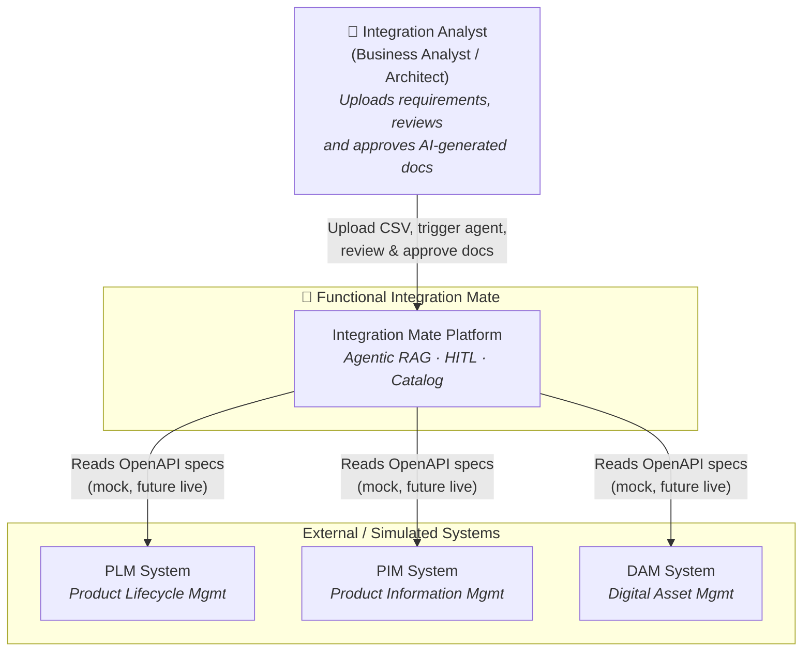
```mermaid
graph TB
    analyst["👤 Integration Analyst<br/>(Business Analyst / Architect)<br/><i>Uploads requirements, reviews<br/>and approves AI-generated docs</i>"]

    subgraph mate["🧠 Functional Integration Mate"]
        core["Integration Mate Platform<br/><i>Agentic RAG · HITL · Catalog</i>"]
    end

    subgraph external["External / Simulated Systems"]
        plm_sys["PLM System<br/><i>Product Lifecycle Mgmt</i>"]
        pim_sys["PIM System<br/><i>Product Information Mgmt</i>"]
        dam_sys["DAM System<br/><i>Digital Asset Mgmt</i>"]
    end

    analyst -- "Upload CSV, trigger agent,<br/>review & approve docs" --> core
    core -- "Reads OpenAPI specs<br/>(mock, future live)" --> plm_sys
    core -- "Reads OpenAPI specs<br/>(mock, future live)" --> pim_sys
    core -- "Reads OpenAPI specs<br/>(mock, future live)" --> dam_sys
```

**System boundaries:**
- The platform is a **PoC** running entirely on a single host via Docker Compose.
- All external systems (PLM, PIM, DAM) are currently simulated by mock FastAPI services.
- The LLM runs **locally** (Ollama) — no data leaves the host.

---

## 4. C4 Model — Level 2: Container Diagram

The platform is composed of **13 Docker containers** grouped in four logical tiers.

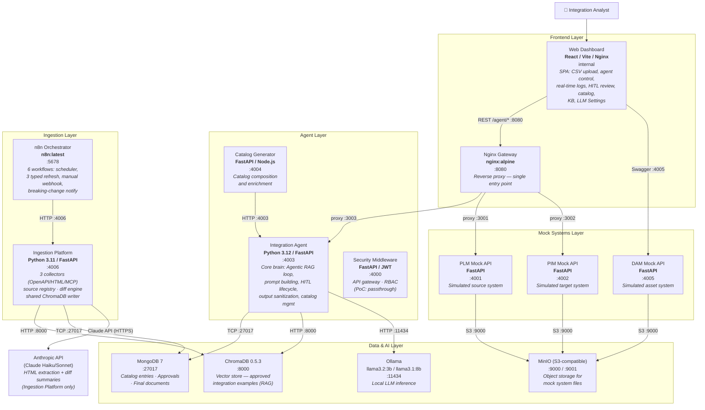
```mermaid
graph TB
    analyst["👤 Integration Analyst"]

    subgraph frontend["Frontend Layer"]
        gateway["Nginx Gateway<br/><b>nginx:alpine</b><br/>:8080<br/><i>Reverse proxy — single entry point</i>"]
        dashboard["Web Dashboard<br/><b>React / Vite / Nginx</b><br/>internal<br/><i>SPA: CSV upload, agent control,<br/>real-time logs, HITL review, catalog,<br/>KB, LLM Settings</i>"]
    end

    subgraph agent_layer["Agent Layer"]
        agent["Integration Agent<br/><b>Python 3.12 / FastAPI</b><br/>:4003<br/><i>Core brain: Agentic RAG loop,<br/>prompt building, HITL lifecycle,<br/>output sanitization, catalog mgmt</i>"]
        catalog_gen["Catalog Generator<br/><b>FastAPI / Node.js</b><br/>:4004<br/><i>Catalog composition<br/>and enrichment</i>"]
        security_mw["Security Middleware<br/><b>FastAPI / JWT</b><br/>:4000<br/><i>API gateway · RBAC<br/>(PoC: passthrough)</i>"]
    end

    subgraph data_layer["Data & AI Layer"]
        mongo["MongoDB 7<br/>:27017<br/><i>Catalog entries · Approvals<br/>· Final documents</i>"]
        chroma["ChromaDB 0.5.3<br/>:8000<br/><i>Vector store — approved<br/>integration examples (RAG)</i>"]
        ollama["Ollama<br/>llama3.2:3b / llama3.1:8b<br/>:11434<br/><i>Local LLM inference</i>"]
        minio["MinIO (S3-compatible)<br/>:9000 / :9001<br/><i>Object storage for<br/>mock system files</i>"]
    end

    subgraph ingestion_layer["Ingestion Layer"]
        ingestion["Ingestion Platform<br/><b>Python 3.11 / FastAPI</b><br/>:4006<br/><i>3 collectors (OpenAPI/HTML/MCP)<br/>source registry · diff engine<br/>shared ChromaDB writer</i>"]
        n8n["n8n Orchestrator<br/><b>n8n:latest</b><br/>:5678<br/><i>6 workflows: scheduler,<br/>3 typed refresh, manual webhook,<br/>breaking-change notify</i>"]
    end

    subgraph mock_layer["Mock Systems Layer"]
        plm["PLM Mock API<br/><b>FastAPI</b><br/>:4001<br/><i>Simulated source system</i>"]
        pim["PIM Mock API<br/><b>FastAPI</b><br/>:4002<br/><i>Simulated target system</i>"]
        dam["DAM Mock API<br/><b>FastAPI</b><br/>:4005<br/><i>Simulated asset system</i>"]
    end

    analyst --> dashboard
    dashboard -- "REST /agent/* :8080" --> gateway
    gateway -- "proxy :3003" --> agent
    agent -- "TCP :27017" --> mongo
    agent -- "HTTP :8000" --> chroma
    agent -- "HTTP :11434" --> ollama
    gateway -- "proxy :3001" --> plm
    gateway -- "proxy :3002" --> pim
    dashboard -- "Swagger :4005" --> dam
    plm -- "S3 :9000" --> minio
    pim -- "S3 :9000" --> minio
    dam -- "S3 :9000" --> minio
    catalog_gen -- "HTTP :4003" --> agent
    n8n -- "HTTP :4006" --> ingestion
    ingestion -- "HTTP :8000" --> chroma
    ingestion -- "TCP :27017" --> mongo
    ingestion -- "Claude API (HTTPS)" --> anthropic["Anthropic API<br/>(Claude Haiku/Sonnet)<br/><i>HTML extraction + diff summaries<br/>(Ingestion Platform only)</i>"]
```

### Container Details

| Container | Image / Stack | Port (ext → int) | Key Responsibility |
|-----------|--------------|-------------------|--------------------|
| `mate-gateway` | Nginx Alpine | `8080 → 80` | Reverse-proxy gateway: routes `/agent/`, `/plm/`, `/pim/` to backends; single public entry point |
| `mate-web-dashboard` | Nginx + React (Vite) | internal `→ 80` | SPA: upload, agent control, logs, HITL, catalog, KB, LLM settings |
| `mate-integration-agent` | Python 3.12 / FastAPI + Motor | `4003 → 3003` | Agentic RAG loop, all business logic, 15 REST endpoints |
| `mate-catalog-generator` | FastAPI | `4004 → 3004` | Catalog composition from agent output |
| `mate-security-middleware` | FastAPI + JWT | `4000 → 3000` | Auth gateway (passthrough in PoC dev mode) |
| `mate-mongodb` | MongoDB 7 | `27017 → 27017` | Persistent store: catalog, approvals, documents |
| `mate-chromadb` | ChromaDB 0.5.3 | `8000 → 8000` | Vector store: RAG retrieval of approved examples |
| `mate-ollama` | Ollama | `11434 → 11434` | Local LLM inference (llama3.2:3b or llama3.1:8b) |
| `mate-minio` | MinIO | `9000/9001` | S3-compatible object storage for mock systems |
| `mate-ingestion-platform` | Python 3.11 / FastAPI | `4006 → 4006` | Multi-source KB ingestion: OpenAPI/HTML/MCP collectors, source registry, diff engine, ChromaDB writer |
| `mate-n8n` | n8n latest | `5678 → 5678` | Workflow orchestrator: 6 workflows (WF-01..06) driving scheduled and manual ingestion |
| `mate-plm-mock` | FastAPI | `4001 → 3001` | Simulated PLM system with OpenAPI spec |
| `mate-pim-mock` | FastAPI | `4002 → 3002` | Simulated PIM system with OpenAPI spec |
| `mate-dam-mock` | FastAPI | `4005 → 3005` | Simulated DAM system with OpenAPI spec |

---

## 5. C4 Model — Level 2 (zoom): Integration Agent Components

The Integration Agent is the core service. Its internal components are:

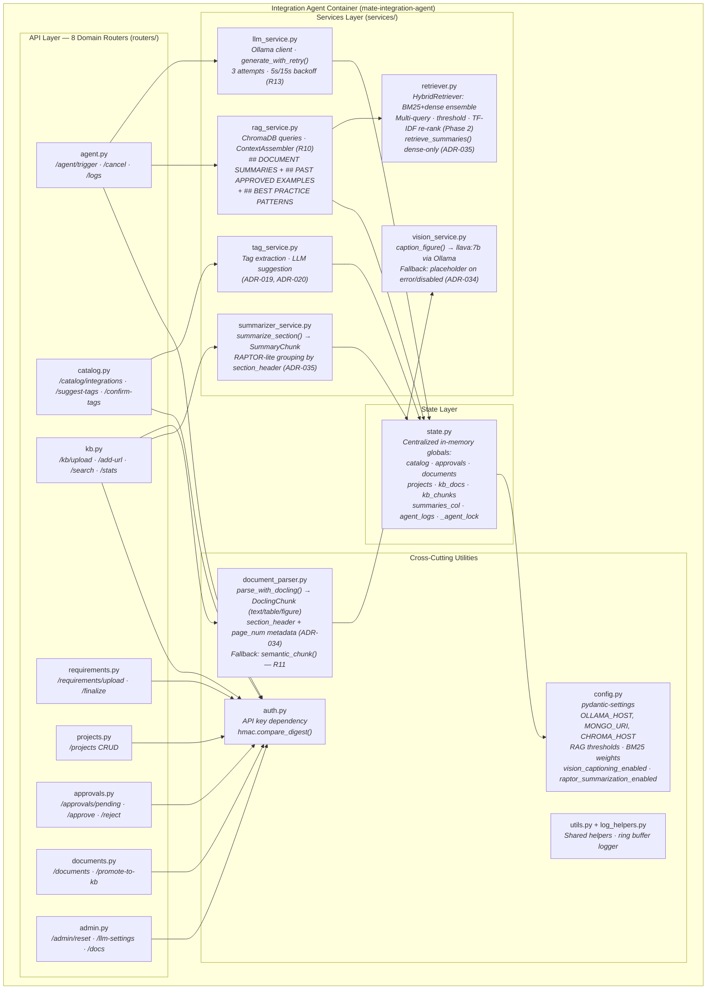
```mermaid
graph TB
    subgraph agent_container["Integration Agent Container (mate-integration-agent)"]

        subgraph api_layer["API Layer — 8 Domain Routers (routers/)"]
            r_agent["agent.py<br/><i>/agent/trigger · /cancel · /logs</i>"]
            r_req["requirements.py<br/><i>/requirements/upload · /finalize</i>"]
            r_proj["projects.py<br/><i>/projects CRUD</i>"]
            r_cat["catalog.py<br/><i>/catalog/integrations · /suggest-tags · /confirm-tags</i>"]
            r_appr["approvals.py<br/><i>/approvals/pending · /approve · /reject</i>"]
            r_docs["documents.py<br/><i>/documents · /promote-to-kb</i>"]
            r_kb["kb.py<br/><i>/kb/upload · /add-url · /search · /stats</i>"]
            r_admin["admin.py<br/><i>/admin/reset · /llm-settings · /docs</i>"]
        end

        subgraph svc_layer["Services Layer (services/)"]
            llm_svc["llm_service.py<br/><i>Ollama client · generate_with_retry()<br/>3 attempts · 5s/15s backoff (R13)</i>"]
            rag_svc["rag_service.py<br/><i>ChromaDB queries · ContextAssembler (R10)<br/>## DOCUMENT SUMMARIES + ## PAST APPROVED EXAMPLES<br/>+ ## BEST PRACTICE PATTERNS</i>"]
            tag_svc["tag_service.py<br/><i>Tag extraction · LLM suggestion<br/>(ADR-019, ADR-020)</i>"]
            retriever["retriever.py<br/><i>HybridRetriever: BM25+dense ensemble<br/>Multi-query · threshold · TF-IDF re-rank (Phase 2)<br/>retrieve_summaries() dense-only (ADR-035)</i>"]
            vision_svc["vision_service.py<br/><i>caption_figure() → llava:7b via Ollama<br/>Fallback: placeholder on error/disabled (ADR-034)</i>"]
            summarizer_svc["summarizer_service.py<br/><i>summarize_section() → SummaryChunk<br/>RAPTOR-lite grouping by section_header (ADR-035)</i>"]
        end

        subgraph state_layer["State Layer"]
            state["state.py<br/><i>Centralized in-memory globals:<br/>catalog · approvals · documents<br/>projects · kb_docs · kb_chunks<br/>summaries_col · agent_logs · _agent_lock</i>"]
        end

        subgraph cross_cut["Cross-Cutting Utilities"]
            auth["auth.py<br/><i>API key dependency<br/>hmac.compare_digest()</i>"]
            config["config.py<br/><i>pydantic-settings<br/>OLLAMA_HOST, MONGO_URI, CHROMA_HOST<br/>RAG thresholds · BM25 weights<br/>vision_captioning_enabled · raptor_summarization_enabled</i>"]
            utils["utils.py + log_helpers.py<br/><i>Shared helpers · ring buffer logger</i>"]
            doc_parser["document_parser.py<br/><i>parse_with_docling() → DoclingChunk (text/table/figure)<br/>section_header + page_num metadata (ADR-034)<br/>Fallback: semantic_chunk() — R11</i>"]
        end

    end

    r_agent --> llm_svc
    r_agent --> rag_svc
    rag_svc --> retriever
    r_cat --> tag_svc
    r_kb --> doc_parser
    r_kb --> summarizer_svc
    doc_parser --> vision_svc
    llm_svc & rag_svc & tag_svc & summarizer_svc --> state
    r_agent & r_req & r_proj & r_cat & r_appr & r_docs & r_kb & r_admin --> auth
    state --> config
```

### Component Responsibilities

| Component | File | Key Behaviour |
|-----------|------|---------------|
| **Agent Router** | `routers/agent.py` | Trigger/cancel/logs; asyncio.Lock concurrency guard |
| **Requirements Router** | `routers/requirements.py` | CSV upload: MIME/size/encoding guards; groups rows by `source|||target` key; finalize creates catalog entries |
| **Projects Router** | `routers/projects.py` | Project CRUD; idempotent POST; prefix uniqueness check |
| **Catalog Router** | `routers/catalog.py` | Integration listing with project metadata; tag suggest/confirm (ADR-019) |
| **Approvals Router** | `routers/approvals.py` | PENDING list; approve → ChromaDB upsert + MongoDB persist; reject with feedback; regenerate REJECTED doc with feedback injected (ADR-032) |
| **Documents Router** | `routers/documents.py` | Final doc listing; promote-to-kb (ADR-023) |
| **KB Router** | `routers/kb.py` | Single file upload via `parse_with_docling()` (ADR-034); **batch upload** `POST /api/v1/kb/batch-upload` (up to 10 files, partial success per file); RAPTOR-lite section summarisation → `summaries_col` (ADR-035); URL registration (ADR-024); tag management; semantic search; stats |
| **Admin Router** | `routers/admin.py` | Reset tools; LLM settings CRUD (persist to MongoDB); project docs browser |
| **LLM Service** | `services/llm_service.py` | `generate_with_retry()` — 3 attempts, 5s/15s exponential backoff (R13); Ollama `/api/generate` |
| **RAG Service** | `services/rag_service.py` | ChromaDB approved_integrations + knowledge_base queries; `ContextAssembler` token-budgeted sections: `## DOCUMENT SUMMARIES` + `## PAST APPROVED EXAMPLES` + `## BEST PRACTICE PATTERNS` (R10 / ADR-035) |
| **Tag Service** | `services/tag_service.py` | Tag extraction from catalog entry; LLM suggestion with dedicated settings (ADR-020) |
| **HybridRetriever** | `services/retriever.py` | Multi-query expansion + BM25+dense ensemble + threshold filter + TF-IDF re-rank (Phase 2 / ADR-027..030); `retrieve_summaries()` dense-only on `summaries_col` (ADR-035) |
| **Vision Service** | `services/vision_service.py` | `caption_figure(image_bytes)` — calls `llava:7b` via Ollama `/api/chat` with base64 image; placeholder on error or when `vision_captioning_enabled=False` (ADR-034) |
| **Summarizer Service** | `services/summarizer_service.py` | `summarize_section(chunks, doc_id, tags)` — RAPTOR-lite: groups by `section_header`, summarises sections ≥ 3 chunks via llama3.1:8b; returns `SummaryChunk\|None` (ADR-035) |
| **Document Parser** | `document_parser.py` | `parse_with_docling()` — layout-aware parsing via IBM Docling: `DoclingChunk` per text/table/figure item with `section_header` + `page_num` (ADR-034); fallback: `semantic_chunk()` via LangChain (R11) |
| **State** | `state.py` | Centralized in-memory globals: all dicts, lock, logs, `kb_chunks` BM25 corpus, `summaries_col` ChromaDB handle |
| **Auth** | `auth.py` | `get_api_key()` FastAPI dependency; `hmac.compare_digest()` constant-time check |
| **Config** | `config.py` | `pydantic-settings` — fails fast on startup if required env vars absent; RAG thresholds, BM25 weights, vision/RAPTOR-lite flags |
| **Output Guard** | `output_guard.py` | Checks `# Integration Functional Design` heading; bleach strip; 50k truncation; `assess_quality()` → `QualityReport` warning-only gate (ADR-031) |
| **Agent Service** | `services/agent_service.py` | `generate_integration_doc()` — full RAG+LLM pipeline with `summary_chunks`; shared by agent flow and regenerate endpoint (ADR-032) |

### 5.1 Backend Module Structure (Phase 1 — ADR-026)

Phase 1 (R15) decomposed the original 2065-line `main.py` monolith into a layered module structure. `main.py` is now ~213 lines (app factory, lifespan, router registration only). All business logic is distributed across the directories below.

```
services/integration-agent/
├── main.py              (~213 lines — app factory + lifespan + router registration)
├── state.py             — centralized in-memory globals (catalog, approvals, documents,
│                          projects, kb_docs, kb_chunks, summaries_col, agent_logs, _agent_lock)
├── auth.py              — API key auth dependency (hmac.compare_digest)
├── config.py            — pydantic-settings (env vars + RAG/BM25/vision/RAPTOR parameters)
├── output_guard.py      — structural guard + bleach sanitization
├── prompt_builder.py    — meta-prompt + template loading; str.replace() injection
├── document_parser.py   — parse_with_docling() → DoclingChunk (text/table/figure) (ADR-034)
│                          Fallback: semantic_chunk() via LangChain (R11)
├── routers/             — 8 domain APIRouter modules (no cross-imports between routers)
│   ├── agent.py         — agentic RAG flow (trigger, cancel, logs)
│   ├── requirements.py  — CSV upload + finalize
│   ├── projects.py      — project CRUD
│   ├── catalog.py       — integration catalog queries + tag suggest/confirm
│   ├── approvals.py     — HITL approve/reject/regenerate (ADR-032)
│   ├── documents.py     — final docs + KB promotion
│   ├── kb.py            — Knowledge Base: Docling upload + RAPTOR-lite summarisation + URLs
│   └── admin.py         — reset tools, LLM settings, project docs browser
└── services/
    ├── llm_service.py       — Ollama client + generate_with_retry() exponential-backoff (R13)
    ├── rag_service.py       — ContextAssembler: DOCUMENT SUMMARIES + PAST APPROVED + BEST PRACTICE (R10/ADR-035)
    ├── tag_service.py       — tag extraction + LLM suggestion (ADR-019, ADR-020)
    ├── retriever.py         — HybridRetriever: BM25+dense + TF-IDF re-rank + retrieve_summaries() (ADR-027..030/ADR-035)
    ├── vision_service.py    — caption_figure(): llava:7b via Ollama, fallback placeholder (ADR-034)
    ├── summarizer_service.py — summarize_section(): RAPTOR-lite SummaryChunk via llama3.1:8b (ADR-035)
    └── agent_service.py     — generate_integration_doc(): RAG + summary_chunks pipeline (ADR-032)
```

**Design constraints (ADR-026):**
- Routers import from `services/` and `state.py` — never from each other.
- `state.py` holds no business logic — pure data container.
- `main.py` contains no business logic — only app wiring.

---

## 6. Component Specification

### 6.1 PLM Mock API (Source System)

**Purpose**: Simulates a Product Lifecycle Management system exposing engineering data.

**Data Model**:
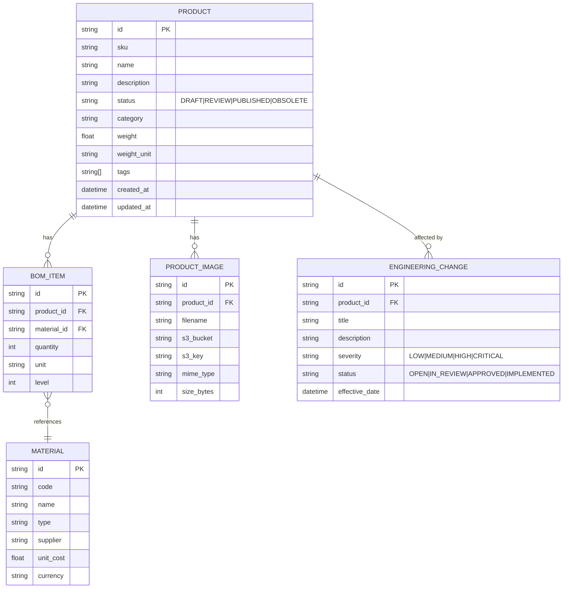
```mermaid
erDiagram
    PRODUCT ||--o{ BOM_ITEM : "has"
    PRODUCT ||--o{ PRODUCT_IMAGE : "has"
    BOM_ITEM }o--|| MATERIAL : "references"
    PRODUCT ||--o{ ENGINEERING_CHANGE : "affected by"

    PRODUCT {
        string id PK
        string sku
        string name
        string description
        string status "DRAFT|REVIEW|PUBLISHED|OBSOLETE"
        string category
        float weight
        string weight_unit
        string[] tags
        datetime created_at
        datetime updated_at
    }
    BOM_ITEM {
        string id PK
        string product_id FK
        string material_id FK
        int quantity
        string unit
        int level
    }
    MATERIAL {
        string id PK
        string code
        string name
        string type
        string supplier
        float unit_cost
        string currency
    }
    ENGINEERING_CHANGE {
        string id PK
        string product_id FK
        string title
        string description
        string severity "LOW|MEDIUM|HIGH|CRITICAL"
        string status "OPEN|IN_REVIEW|APPROVED|IMPLEMENTED"
        datetime effective_date
    }
    PRODUCT_IMAGE {
        string id PK
        string product_id FK
        string filename
        string s3_bucket
        string s3_key
        string mime_type
        int size_bytes
    }
```

**API Endpoints**:

| Method | Path | Description |
|---|---|---|
| GET | `/api/v1/products` | List products (paginated, filterable) |
| GET | `/api/v1/products/{id}` | Get product detail |
| POST | `/api/v1/products` | Create product |
| PATCH | `/api/v1/products/{id}` | Update product |
| GET | `/api/v1/products/{id}/bom` | Get product BOM |
| GET | `/api/v1/products/{id}/images` | Get product images |
| POST | `/api/v1/products/{id}/images` | Upload product image → S3 |
| GET | `/api/v1/materials` | List materials |
| GET | `/api/v1/engineering-changes` | List engineering changes |
| GET | `/health` | Health check |

---

### 6.2 PIM Mock API (Target — Akeneo-style)

**Purpose**: Simulates an Akeneo-compatible Product Information Management system.

**Data Model**:
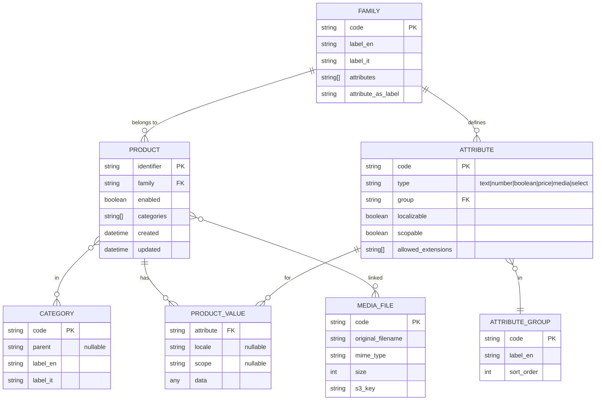
```mermaid
erDiagram
    FAMILY ||--o{ PRODUCT : "belongs to"
    FAMILY ||--o{ ATTRIBUTE : "defines"
    PRODUCT }o--o{ CATEGORY : "in"
    PRODUCT ||--o{ PRODUCT_VALUE : "has"
    ATTRIBUTE ||--o{ PRODUCT_VALUE : "for"
    ATTRIBUTE }o--|| ATTRIBUTE_GROUP : "in"
    PRODUCT }o--o{ MEDIA_FILE : "linked"

    FAMILY {
        string code PK
        string label_en
        string label_it
        string[] attributes
        string attribute_as_label
    }
    PRODUCT {
        string identifier PK
        string family FK
        boolean enabled
        string[] categories
        datetime created
        datetime updated
    }
    PRODUCT_VALUE {
        string attribute FK
        string locale "nullable"
        string scope "nullable"
        any data
    }
    ATTRIBUTE {
        string code PK
        string type "text|number|boolean|price|media|select"
        string group FK
        boolean localizable
        boolean scopable
        string[] allowed_extensions
    }
    ATTRIBUTE_GROUP {
        string code PK
        string label_en
        int sort_order
    }
    CATEGORY {
        string code PK
        string parent "nullable"
        string label_en
        string label_it
    }
    MEDIA_FILE {
        string code PK
        string original_filename
        string mime_type
        int size
        string s3_key
    }
```

**API Endpoints**:

| Method | Path | Description |
|---|---|---|
| GET | `/api/v1/products` | List products (paginated) |
| POST | `/api/v1/products` | Create product |
| GET | `/api/v1/products/{identifier}` | Get product |
| PATCH | `/api/v1/products/{identifier}` | Partial update |
| DELETE | `/api/v1/products/{identifier}` | Delete product |
| GET | `/api/v1/families` | List families |
| POST | `/api/v1/families` | Create family |
| GET | `/api/v1/attributes` | List attributes |
| POST | `/api/v1/attributes` | Create attribute |
| GET | `/api/v1/attribute-groups` | List attribute groups |
| GET | `/api/v1/categories` | List categories (tree) |
| POST | `/api/v1/categories` | Create category |
| GET | `/api/v1/channels` | List channels |
| GET | `/api/v1/locales` | List locales |
| GET | `/api/v1/media-files` | List media |
| POST | `/api/v1/media-files` | Upload media → S3 |
| GET | `/health` | Health check |

---

### 6.3 DAM Mock API (Target — Adobe AEM-style)

**Purpose**: Simulates an Adobe AEM Assets-compatible Digital Asset Management system.

**Data Model**:
```mermaid
erDiagram
    FOLDER ||--o{ ASSET : "contains"
    ASSET ||--o{ RENDITION : "has"
    ASSET ||--|| METADATA : "has"
    COLLECTION }o--o{ ASSET : "includes"

    ASSET {
        string id PK
        string name
        string folder_id FK
        string mime_type
        int size_bytes
        json dimensions "width, height"
        string s3_bucket
        string s3_key
        string status "PROCESSING|ACTIVE|ARCHIVED"
        datetime created_at
        datetime modified_at
    }
    RENDITION {
        string id PK
        string asset_id FK
        string type "thumbnail|web|print|custom"
        int width
        int height
        string format "jpeg|png|webp"
        string s3_bucket
        string s3_key
        int size_bytes
    }
    METADATA {
        string asset_id PK_FK
        string title
        string description
        string[] keywords
        string copyright
        string color_space
        int dpi
        json exif
        json iptc
        json xmp
    }
    FOLDER {
        string id PK
        string name
        string parent_id "nullable"
        string path
        datetime created_at
    }
    COLLECTION {
        string id PK
        string name
        string description
        string[] asset_ids
        datetime created_at
    }
```

**API Endpoints**:

| Method | Path | Description |
|---|---|---|
| GET | `/api/v1/assets` | List assets (paginated, searchable) |
| POST | `/api/v1/assets` | Upload asset → S3 + auto-renditions |
| GET | `/api/v1/assets/{id}` | Get asset detail |
| PUT | `/api/v1/assets/{id}` | Update asset |
| DELETE | `/api/v1/assets/{id}` | Delete asset + renditions |
| GET | `/api/v1/assets/{id}/renditions` | List renditions |
| POST | `/api/v1/assets/{id}/renditions` | Generate custom rendition |
| GET | `/api/v1/assets/{id}/download` | Get presigned S3 URL |
| GET | `/api/v1/folders` | List folders |
| POST | `/api/v1/folders` | Create folder |
| GET | `/api/v1/metadata/{asset_id}` | Get metadata |
| PUT | `/api/v1/metadata/{asset_id}` | Update metadata |
| GET | `/api/v1/collections` | List collections |
| POST | `/api/v1/collections` | Create collection |
| GET | `/api/v1/search` | Full-text + metadata search |
| GET | `/health` | Health check |

**Rendition Pipeline**:
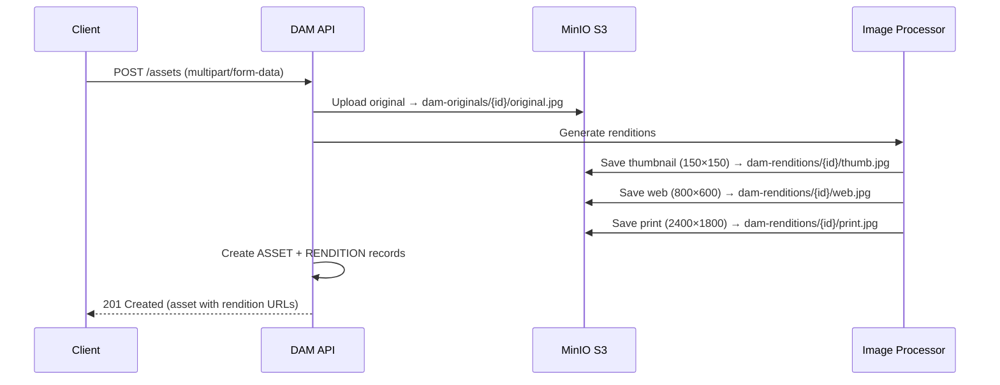
```mermaid
sequenceDiagram
    participant Client
    participant DAM API
    participant S3 as MinIO S3
    participant Pillow as Image Processor

    Client->>DAM API: POST /assets (multipart/form-data)
    DAM API->>S3: Upload original → dam-originals/{id}/original.jpg
    DAM API->>Pillow: Generate renditions
    Pillow->>S3: Save thumbnail (150×150) → dam-renditions/{id}/thumb.jpg
    Pillow->>S3: Save web (800×600) → dam-renditions/{id}/web.jpg
    Pillow->>S3: Save print (2400×1800) → dam-renditions/{id}/print.jpg
    DAM API->>DAM API: Create ASSET + RENDITION records
    DAM API-->>Client: 201 Created (asset with rendition URLs)
```

---

### 6.4 Security Middleware

**Purpose**: API Gateway providing centralized authentication, authorization, rate limiting, and audit logging.

**Component Diagram**:
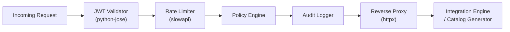
```mermaid
graph LR
    REQ["Incoming Request"] --> AUTH["JWT Validator<br/>(python-jose)"]
    AUTH --> RATE["Rate Limiter<br/>(slowapi)"]
    RATE --> POLICY["Policy Engine"]
    POLICY --> AUDIT["Audit Logger"]
    AUDIT --> PROXY["Reverse Proxy<br/>(httpx)"]
    PROXY --> BACKEND["Integration Engine<br/>/ Catalog Generator"]
```

> **PoC Note**: In the current PoC, the Security Middleware operates in passthrough mode. The full JWT/RBAC pipeline shown above is the production target. The Integration Agent handles its own optional Bearer token auth directly.

**JWT Token Claims Structure** (production target):
```json
{
  "sub": "user-001",
  "name": "Mario Rossi",
  "email": "mario.rossi@company.com",
  "roles": ["integration_admin", "pii_reader"],
  "systems_access": ["PLM", "PIM", "DAM"],
  "data_classification": {
    "pii": true,
    "financial": false,
    "confidential": true
  },
  "budget": {
    "max_api_calls_per_execution": 100,
    "max_records_per_query": 5000
  },
  "iat": 1709553600,
  "exp": 1709640000,
  "iss": "integration-mate-poc"
}
```

**Routing Table**:

| Path Prefix | Target Service |
|---|---|
| `/api/v1/integrations/*` | Integration Engine :3003 |
| `/api/v1/execute/*` | Integration Engine :3003 |
| `/api/v1/thoughts/*` | Integration Engine :3003 |
| `/api/v1/approvals/*` | Integration Engine :3003 |
| `/api/v1/catalog/*` | Catalog Generator :3004 |
| `/api/v1/generate/*` | Catalog Generator :3004 |
| `/auth/token` | Self (generate JWT) |
| `/health` | Self |

---

### 6.5 Catalog Generator

**Purpose**: Parses requirements and API specs, builds integration catalog, generates documents via LLM.

**Pipeline**:
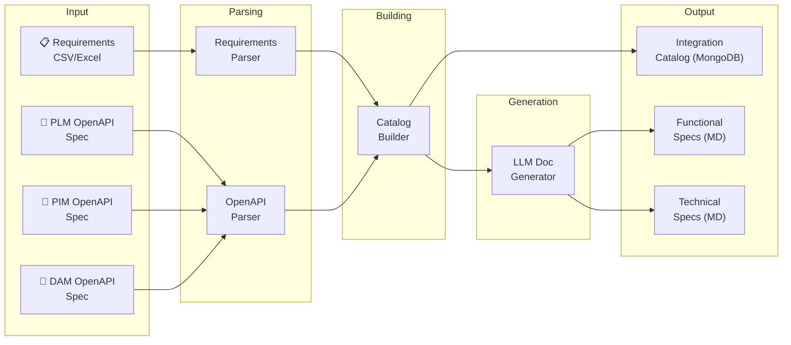
```mermaid
graph LR
    subgraph "Input"
        CSV["📋 Requirements<br/>CSV/Excel"]
        SPEC1["📄 PLM OpenAPI<br/>Spec"]
        SPEC2["📄 PIM OpenAPI<br/>Spec"]
        SPEC3["📄 DAM OpenAPI<br/>Spec"]
    end

    subgraph "Parsing"
        RP["Requirements<br/>Parser"]
        OP["OpenAPI<br/>Parser"]
    end

    subgraph "Building"
        CB["Catalog<br/>Builder"]
    end

    subgraph "Generation"
        LLM["LLM Doc<br/>Generator"]
    end

    subgraph "Output"
        CAT["Integration<br/>Catalog (MongoDB)"]
        FDOC["Functional<br/>Specs (MD)"]
        TDOC["Technical<br/>Specs (MD)"]
    end

    CSV --> RP
    SPEC1 & SPEC2 & SPEC3 --> OP
    RP & OP --> CB
    CB --> CAT
    CB --> LLM
    LLM --> FDOC & TDOC
```

---

### 6.6 Web Dashboard

**Purpose**: Single-page application for browsing the integration catalog, controlling the agent, viewing execution logs, and managing HITL approvals.

**Layout**:
```
┌──────────────────────────────────────────────────────┐
│  🧠 Functional Integration Mate          [user] [⚙️] │
├──────────┬───────────────────────────────────────────┤
│          │                                           │
│  📋 Nav  │         Main Content Area                 │
│          │                                           │
│ Agent    │  ┌─────────────────────────────────────┐  │
│ Workspace│  │  CSV Upload · Agent Control          │  │
│ Catalog  │  │  Real-time Execution Logs            │  │
│ Approvals│  │  HITL Approval Panel                 │  │
│ Docs     │  │  Document Viewer                     │  │
│          │  └─────────────────────────────────────┘  │
│          │                                           │
├──────────┴───────────────────────────────────────────┤
│  Status Bar                                           │
└──────────────────────────────────────────────────────┘
```

**Pages**:

| Page | Features |
|---|---|
| **Agent Workspace** | CSV upload → Project Modal (collect client name, domain, prefix, description, Accenture ref) → finalize creates `{prefix}-{hex}` catalog entries; Start/Stop agent; real-time log terminal |
| **Integration Catalog** | Grid/list of integrations; filter bar (client dropdown, domain text, Accenture ref text); prefix badge on each card; project metadata (client, domain) displayed per entry |
| **Knowledge Base** | Upload file (PDF/DOCX/XLSX/PPTX/MD) or add HTTP/HTTPS URL as reference link; manage tags for RAG filtering; semantic search |
| **Approvals** | Pending HITL approvals with approve/reject, inline markdown editor |
| **Documents** | Browse generated functional + technical specs, download as MD |

**Key Frontend Patterns**:
- Module-level JavaScript state (`_cachedLogs`, `_logsOffset`, `_isAgentRunning`) survives SPA navigation
- `escapeHtml()` applied to all server-sourced innerHTML (ADR-017)
- Content set via `.value` (not `innerHTML`) in textarea editors
- Explicit "Clear Logs" button resets display offset without losing data

---

## 7. Agentic RAG & Integration Framework

### 7.1 Agentic RAG Workflow — End-to-End Flow

The end-to-end flow from CSV upload to approved document:

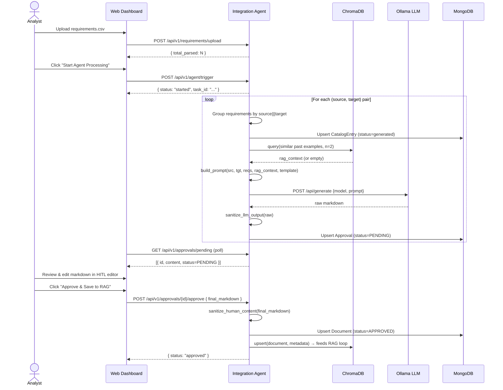
```mermaid
sequenceDiagram
    actor Analyst
    participant Dashboard as Web Dashboard
    participant Agent as Integration Agent
    participant Chroma as ChromaDB
    participant Ollama as Ollama LLM
    participant Mongo as MongoDB

    Analyst->>Dashboard: Upload requirements.csv
    Dashboard->>Agent: POST /api/v1/requirements/upload
    Agent-->>Dashboard: { total_parsed: N }

    Analyst->>Dashboard: Click "Start Agent Processing"
    Dashboard->>Agent: POST /api/v1/agent/trigger
    Agent-->>Dashboard: { status: "started", task_id: "..." }

    loop For each (source, target) pair
        Agent->>Agent: Group requirements by source|||target
        Agent->>Mongo: Upsert CatalogEntry (status=generated)
        Agent->>Chroma: query(similar past examples, n=2)
        Chroma-->>Agent: rag_context (or empty)
        Agent->>Agent: build_prompt(src, tgt, reqs, rag_context, template)
        Agent->>Ollama: POST /api/generate {model, prompt}
        Ollama-->>Agent: raw markdown
        Agent->>Agent: sanitize_llm_output(raw)
        Agent->>Mongo: Upsert Approval (status=PENDING)
    end

    Dashboard->>Agent: GET /api/v1/approvals/pending (poll)
    Agent-->>Dashboard: [{ id, content, status=PENDING }]

    Analyst->>Dashboard: Review & edit markdown in HITL editor
    Analyst->>Dashboard: Click "Approve & Save to RAG"
    Dashboard->>Agent: POST /api/v1/approvals/{id}/approve { final_markdown }
    Agent->>Agent: sanitize_human_content(final_markdown)
    Agent->>Mongo: Upsert Document (status=APPROVED)
    Agent->>Chroma: upsert(document, metadata) → feeds RAG loop
    Agent-->>Dashboard: { status: "approved" }
```

### 7.2 Workflow Steps Summary

| Step | Actor | Action | Guard / Security |
|------|-------|--------|-----------------|
| 1. Upload | Analyst | POST CSV file | MIME check, 1 MB limit, UTF-8 guard |
| 2. Trigger | Analyst | POST /agent/trigger | `asyncio.Lock` prevents concurrent runs |
| 3. Group | Agent | Cluster reqs by source+target | `|||` separator (not hyphen — avoids system name collision) |
| 4. RAG Query | Agent | HybridRetriever — multi-query expansion (4 variants: 2 templates + 2 LLM) + BM25+dense ensemble (weights 0.6/0.4) + threshold filter + TF-IDF cosine re-rank + ContextAssembler (R8–R10) | Falls back to zero-shot if no chunks pass `rag_distance_threshold`; LLM query expansion has fallback to template variants |
| 5. Build Prompt | Agent | Inject meta-prompt + template + RAG | `str.replace()` — no `format()` (prevents KeyError) |
| 6. LLM Call | Agent | POST to Ollama | 600s timeout; async; error caught → log + skip |
| 7. Output Guard | Agent | Structural + XSS check | Must start with `# Integration Functional Design` |
| 7a. Quality Check | Agent | `assess_quality()` evaluates section count, n/a ratio, word count → `QualityReport` logged (warning-only, never rejects) | Advisory gate — low scores signal to reviewers that content may need regeneration |
| 8. HITL Queue | Agent | Store as PENDING | No automatic write to final store without human |
| 9. Human Review | Analyst | Edit + Approve/Reject in UI | `sanitize_human_content()` on submit |
| 10. RAG Learn | Agent | Upsert approved doc → ChromaDB | Feeds future generations with approved patterns |

### Regenerate Flow (R16)

When a reviewer rejects an approval with feedback, `POST /api/v1/approvals/{id}/regenerate` creates a new PENDING approval:

1. Validate approval is REJECTED and has non-empty `feedback`
2. Look up catalog entry and requirements from state
3. Call `generate_integration_doc(entry, requirements, reviewer_feedback=feedback)` — reviewer feedback is prepended to the RAG context block as `## PREVIOUS REJECTION FEEDBACK`
4. Persist new Approval with status PENDING
5. Return `{ new_approval_id, previous_approval_id }`

---

### 7.3 Agent Architecture (Production Target)

The full agentic execution framework planned for production (currently simplified in PoC):

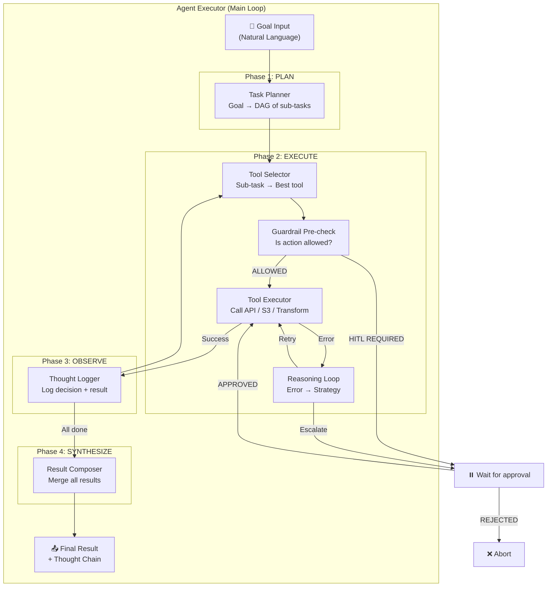
```mermaid
graph TB
    subgraph "Agent Executor (Main Loop)"
        INPUT["🎯 Goal Input<br/>(Natural Language)"]

        subgraph "Phase 1: PLAN"
            DECOMPOSE["Task Planner<br/>Goal → DAG of sub-tasks"]
        end

        subgraph "Phase 2: EXECUTE"
            SELECT["Tool Selector<br/>Sub-task → Best tool"]
            GUARDRAIL_CHECK["Guardrail Pre-check<br/>Is action allowed?"]
            CALL["Tool Executor<br/>Call API / S3 / Transform"]
            SELF_CORRECT["Reasoning Loop<br/>Error → Strategy"]
        end

        subgraph "Phase 3: OBSERVE"
            THOUGHT["Thought Logger<br/>Log decision + result"]
        end

        subgraph "Phase 4: SYNTHESIZE"
            COMPOSE["Result Composer<br/>Merge all results"]
        end

        OUTPUT["📤 Final Result<br/>+ Thought Chain"]
    end

    INPUT --> DECOMPOSE
    DECOMPOSE --> SELECT
    SELECT --> GUARDRAIL_CHECK
    GUARDRAIL_CHECK -->|ALLOWED| CALL
    GUARDRAIL_CHECK -->|HITL REQUIRED| HITL_QUEUE["⏸️ Wait for approval"]
    HITL_QUEUE -->|APPROVED| CALL
    HITL_QUEUE -->|REJECTED| ABORT["❌ Abort"]
    CALL -->|Success| THOUGHT
    CALL -->|Error| SELF_CORRECT
    SELF_CORRECT -->|Retry| CALL
    SELF_CORRECT -->|Escalate| HITL_QUEUE
    THOUGHT --> SELECT
    THOUGHT -->|All done| COMPOSE
    COMPOSE --> OUTPUT
```

### 7.4 Tool Registry (Production Target)

All tools available to the agent, loaded at startup:

| Tool ID | System | Method | Endpoint | Side Effects | Guardrail |
|---|---|---|---|---|---|
| `plm_get_product` | PLM | GET | `/api/v1/products/{id}` | — | — |
| `plm_list_products` | PLM | GET | `/api/v1/products` | — | — |
| `plm_get_bom` | PLM | GET | `/api/v1/products/{id}/bom` | — | — |
| `pim_create_product` | PIM | POST | `/api/v1/products` | WRITE | — |
| `pim_update_product` | PIM | PATCH | `/api/v1/products/{id}` | WRITE | — |
| `pim_delete_product` | PIM | DELETE | `/api/v1/products/{id}` | DELETE | HITL_REQUIRED |
| `dam_upload_asset` | DAM | POST | `/api/v1/assets` | WRITE, S3 | — |
| `dam_get_renditions` | DAM | GET | `/api/v1/assets/{id}/renditions` | — | — |
| `s3_download` | S3 | — | `get_object` | — | — |
| `s3_upload` | S3 | — | `put_object` | WRITE, S3 | — |
| `s3_copy` | S3 | — | `copy_object` | WRITE | — |
| `s3_presigned_url` | S3 | — | `generate_presigned_url` | — | — |
| `transform_fields` | INTERNAL | LOCAL | — | — | — |
| `security_validate_token` | SECURITY | POST | `/auth/validate` | — | — |
| `security_check_permission` | SECURITY | LOCAL | — | — | — |

### 7.5 Reasoning Loop — Self-Correction Flow

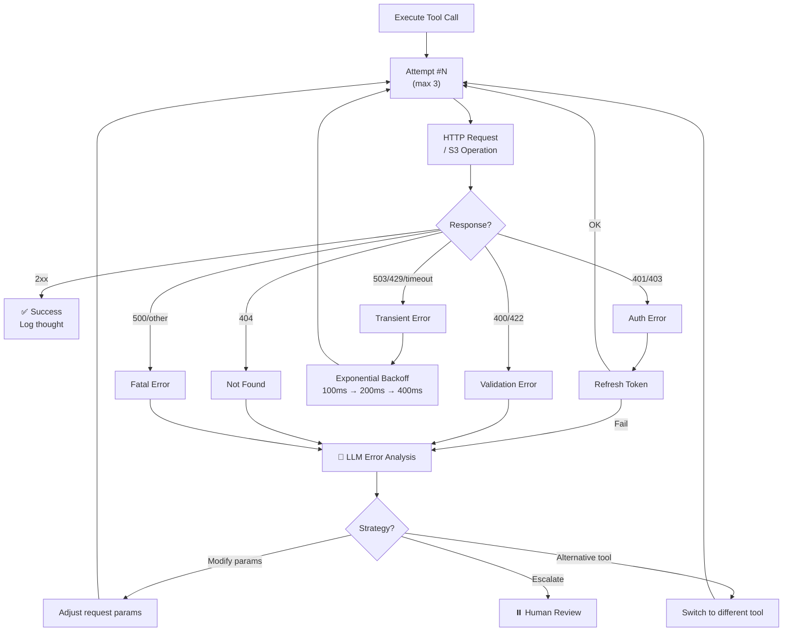
```mermaid
graph TB
    START["Execute Tool Call"] --> ATTEMPT["Attempt #N<br/>(max 3)"]
    ATTEMPT --> HTTP["HTTP Request<br/>/ S3 Operation"]

    HTTP --> CODE{Response?}
    CODE -->|2xx| SUCCESS["✅ Success<br/>Log thought"]
    CODE -->|503/429/timeout| TRANSIENT["Transient Error"]
    CODE -->|401/403| AUTH_ERR["Auth Error"]
    CODE -->|400/422| VALIDATION["Validation Error"]
    CODE -->|404| NOT_FOUND["Not Found"]
    CODE -->|500/other| FATAL_ERR["Fatal Error"]

    TRANSIENT --> BACKOFF["Exponential Backoff<br/>100ms → 200ms → 400ms"]
    BACKOFF --> ATTEMPT

    AUTH_ERR --> REFRESH["Refresh Token"]
    REFRESH -->|OK| ATTEMPT
    REFRESH -->|Fail| LLM_ANALYZE

    VALIDATION --> LLM_ANALYZE["🤖 LLM Error Analysis"]
    NOT_FOUND --> LLM_ANALYZE
    FATAL_ERR --> LLM_ANALYZE

    LLM_ANALYZE --> STRATEGY{Strategy?}
    STRATEGY -->|Modify params| MODIFY["Adjust request params"]
    STRATEGY -->|Alternative tool| ALT_TOOL["Switch to different tool"]
    STRATEGY -->|Escalate| HITL["⏸️ Human Review"]

    MODIFY --> ATTEMPT
    ALT_TOOL --> ATTEMPT
```

### 7.6 Guardrail Configuration

```yaml
guardrails:
  hard_limits:
    - name: "System Scope"
      description: "Cannot access systems outside tool registry"
      action: BLOCK

    - name: "Max Execution Time"
      value: 300  # seconds
      action: ABORT

  soft_limits:
    - name: "Destructive Operations"
      trigger: "DELETE method on any system"
      action: HITL_REQUIRED

    - name: "PII Data Access"
      trigger: "Access to fields matching *.email, *.phone, *.ssn"
      required_role: "pii_reader"
      action: HITL_IF_NO_ROLE

    - name: "Bulk Write"
      trigger: "WRITE affecting > 100 records"
      action: HITL_REQUIRED

    - name: "Price Modification"
      trigger: "WRITE to pricing fields with delta > 20%"
      action: HITL_REQUIRED

    - name: "API Budget"
      trigger: "Total API calls > 50 per execution"
      action: PAUSE_NOTIFY

  advisory:
    - name: "Slow Response"
      trigger: "Tool response > 5 seconds"
      action: LOG_WARNING

    - name: "Large Payload"
      trigger: "Response body > 10MB"
      action: LOG_WARNING
```

### 7.7 RAG Retriever Pipeline (Phase 2 — ADR-027..030)

Phase 2 (R8–R12) replaced the single `collection.query(n_results=2)` call with a multi-stage `HybridRetriever` pipeline implemented in `services/retriever.py`. The pipeline is invoked by `rag_service.py` during every agentic RAG flow.

#### Pipeline Flow

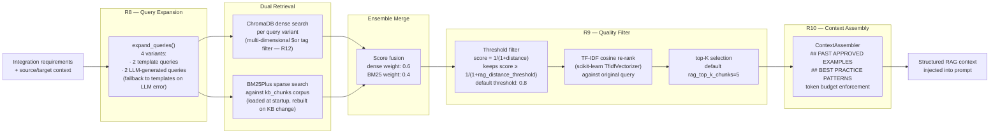
```mermaid
graph LR
    INPUT["Integration requirements\n+ source/target context"]

    subgraph expand["R8 — Query Expansion"]
        QE["expand_queries()\n4 variants:\n· 2 template queries\n· 2 LLM-generated queries\n(fallback to templates on LLM error)"]
    end

    subgraph retrieve["Dual Retrieval"]
        CHROMA["ChromaDB dense search\nper query variant\n(multi-dimensional $or tag filter — R12)"]
        BM25["BM25Plus sparse search\nagainst kb_chunks corpus\n(loaded at startup, rebuilt on KB change)"]
    end

    subgraph merge["Ensemble Merge"]
        ENS["Score fusion\ndense weight: 0.6\nBM25 weight: 0.4"]
    end

    subgraph filter["R9 — Quality Filter"]
        THR["Threshold filter\nscore = 1/(1+distance)\nkeeps score ≥ 1/(1+rag_distance_threshold)\ndefault threshold: 0.8"]
        RERANK["TF-IDF cosine re-rank\n(scikit-learn TfidfVectorizer)\nagainst original query"]
        TOPK["top-K selection\ndefault rag_top_k_chunks=5"]
    end

    subgraph assemble["R10 — Context Assembly"]
        CA["ContextAssembler\n## PAST APPROVED EXAMPLES\n## BEST PRACTICE PATTERNS\ntoken budget enforcement"]
    end

    OUTPUT["Structured RAG context\ninjected into prompt"]

    INPUT --> QE
    QE --> CHROMA & BM25
    CHROMA & BM25 --> ENS
    ENS --> THR --> RERANK --> TOPK --> CA --> OUTPUT
```

#### Stage Descriptions

| Stage | Implementation | Key Parameters |
|-------|---------------|----------------|
| **Query Expansion (R8)** | `expand_queries()` in `retriever.py` — 2 template variants + 2 LLM-generated queries via `llm_service.py`; LLM failure falls back silently to templates | 4 query variants per call |
| **ChromaDB Dense Search** | `collection.query()` per variant against `approved_integrations` + `knowledge_base` collections; `$or` multi-tag filter (R12) | `rag_n_results_per_query=3` per variant |
| **BM25 Sparse Search** | `BM25Plus` (rank-bm25) against `kb_chunks` corpus in `state.py`; corpus rebuilt on every KB upload/delete | Corpus seeded from ChromaDB at container startup |
| **Ensemble Merge** | Reciprocal rank fusion of dense + sparse scores | Dense 0.6 / BM25 0.4 (`rag_bm25_weight`) |
| **Threshold Filter (R9)** | `score = 1 / (1 + chroma_distance)` — drops chunks below minimum quality | `rag_distance_threshold=0.8` |
| **TF-IDF Re-rank** | scikit-learn `TfidfVectorizer` cosine similarity against the original (non-expanded) query | Applied after threshold filter |
| **Top-K Selection** | Returns best-K chunks to ContextAssembler | `rag_top_k_chunks=5` |
| **ContextAssembler (R10)** | Structures chunks into `## PAST APPROVED EXAMPLES` + `## BEST PRACTICE PATTERNS` sections with token budget cap | Configured via `rag_context_size` (LLM settings) |

#### New Config Parameters (Phase 2)

| Parameter | Default | Description |
|-----------|---------|-------------|
| `rag_distance_threshold` | `0.8` | ChromaDB L2 distance ceiling (converted to score internally) |
| `rag_bm25_weight` | `0.4` | BM25 share in ensemble (dense share = 1 − bm25_weight) |
| `rag_n_results_per_query` | `3` | ChromaDB results per expanded query variant |
| `rag_top_k_chunks` | `5` | Maximum chunks passed to ContextAssembler |

#### New Dependencies (Phase 2)

| Package | Version | Purpose |
|---------|---------|---------|
| `langchain-text-splitters` | 0.3.8 | `RecursiveCharacterTextSplitter` for `semantic_chunk()` (R11) |
| `rank-bm25` | 0.2.2 | `BM25Plus` sparse retriever |
| `scikit-learn` | 1.6.1 | `TfidfVectorizer` for cosine re-ranking |

**ADR references:** ADR-027 (multi-query expansion), ADR-028 (BM25+dense hybrid), ADR-029 (threshold filter + re-rank), ADR-030 (ContextAssembler structured sections).

---

### 7.8 Advanced RAG Pipeline — Docling + LLaVA + RAPTOR-lite (Phase 4 — ADR-034..035)

Phase 4 addresses two quality gaps in the Phase 2 pipeline: visual content loss (charts/diagrams discarded) and chunk-level retrieval missing section context.

#### 7.8.1 Docling Layout-Aware Parser + LLaVA Vision (ADR-034)

`document_parser.py` gains `parse_with_docling()` as the primary KB upload path:

| Item type | `chunk_type` | Processing |
|-----------|-------------|------------|
| `TextItem` | `"text"` | Preserved with `section_header` and `page_num` |
| `TableItem` | `"table"` | Exported as markdown table |
| `PictureItem` | `"figure"` | Image bytes → `vision_service.caption_figure()` → LLaVA caption |

`vision_service.caption_figure(image_bytes)` calls `llava:7b` via Ollama `/api/chat` with base64-encoded image. Controlled by `vision_captioning_enabled` (default `True`). Returns `"[FIGURE: no caption available]"` on error or when disabled. Figure captions are included in the BM25 index.

Fallback: if `docling` is not installed, `_docling_fallback()` preserves the legacy `parse_document()` + `semantic_chunk()` path.

#### 7.8.2 RAPTOR-lite Section Summaries (ADR-035)

After Docling parsing, chunks are grouped by `section_header`. Sections with ≥ 3 chunks are summarised by `summarizer_service.summarize_section()` using llama3.1:8b. `SummaryChunk` objects are upserted to `state.summaries_col` (ChromaDB collection `"kb_summaries"`).

At retrieval time, `HybridRetriever.retrieve_summaries()` performs dense-only search on `summaries_col` (no BM25 — summaries benefit more from semantic search than keyword matching). The top-3 results are passed to `ContextAssembler.assemble()` as `summary_chunks` and rendered as the first context section:

```
## DOCUMENT SUMMARIES (overview context):   ← new, 500-char budget
## PAST APPROVED EXAMPLES (unchanged)
## BEST PRACTICE PATTERNS (unchanged)
```

Total context budget raised to **3000 chars** (`ollama_rag_max_chars`).

#### New Config Parameters (Phase 4)

| Parameter | Default | Description |
|-----------|---------|-------------|
| `vision_captioning_enabled` | `True` | Enable LLaVA figure captioning |
| `vision_model_name` | `"llava:7b"` | Ollama model for vision |
| `raptor_summarization_enabled` | `True` | Enable RAPTOR-lite section summaries |
| `rag_summary_max_chars` | `500` | Char budget for DOCUMENT SUMMARIES section |
| `ollama_rag_max_chars` | `3000` | Total RAG context budget (raised from 1500) |

#### New Dependencies (Phase 4)

| Package | Version | Purpose |
|---------|---------|---------|
| `docling` | ≥ 2.0 | Layout-aware PDF/DOCX parsing |
| `numpy` | < 2.0 | Pin for chromadb 0.5.x compatibility (`np.float_` removed in NumPy 2.0) |

**ADR references:** ADR-034 (Docling + LLaVA vision parser), ADR-035 (RAPTOR-lite section summaries).

### 7.9 Two-Phase Document Generation (ADR-038)

Document generation follows a two-phase lifecycle:

**Phase 1 — Functional Design** (existing):
CSV upload → tag confirmation → Agent trigger → LLM+RAG → HITL approve → `status: DONE`

**Phase 2 — Technical Design** (ADR-038):
Functional approval → `technical_status: TECH_PENDING` → user triggers → LLM+RAG (KB-only, functional spec as context) → HITL approve → `technical_status: TECH_DONE`

`technical_status` lifecycle: `None → TECH_PENDING → TECH_GENERATING → TECH_REVIEW → TECH_DONE`

New endpoints:
- `POST /api/v1/agent/trigger-technical/{integration_id}` — start technical generation
- `GET /api/v1/catalog/integrations/{id}/technical-spec` — retrieve approved technical spec

---

## 8. Integration Patterns

### 8.1 Pattern Catalog

| Pattern | Use Case | Implementation |
|---|---|---|
| **Data Sync** | PLM product → PIM product | Agent fetches, transforms, pushes |
| **Media Sync** | PLM images → DAM → PIM | S3 copy + rendition pipeline |
| **Enrichment** | PIM product ← DAM metadata | Agent fetches metadata, enriches product |
| **Validation** | Check product completeness | Agent queries all systems, validates rules |
| **Bidirectional Sync** | Keep PIM ↔ DAM in sync | Agent detects changes, syncs both ways |

### 8.2 Field Mapping Specification

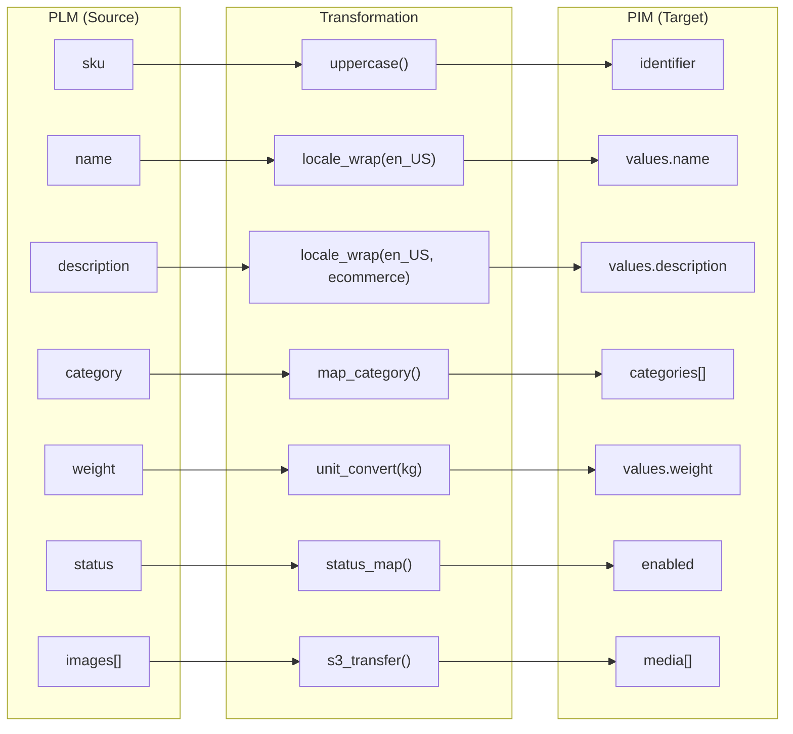
```mermaid
graph LR
    subgraph "PLM (Source)"
        P_SKU["sku"]
        P_NAME["name"]
        P_DESC["description"]
        P_CAT["category"]
        P_WEIGHT["weight"]
        P_STATUS["status"]
        P_IMAGES["images[]"]
    end

    subgraph "Transformation"
        T1["uppercase()"]
        T2["locale_wrap(en_US)"]
        T3["locale_wrap(en_US, ecommerce)"]
        T4["map_category()"]
        T5["unit_convert(kg)"]
        T6["status_map()"]
        T7["s3_transfer()"]
    end

    subgraph "PIM (Target)"
        PI_ID["identifier"]
        PI_NAME["values.name"]
        PI_DESC["values.description"]
        PI_CAT["categories[]"]
        PI_WEIGHT["values.weight"]
        PI_ENABLED["enabled"]
        PI_MEDIA["media[]"]
    end

    P_SKU --> T1 --> PI_ID
    P_NAME --> T2 --> PI_NAME
    P_DESC --> T3 --> PI_DESC
    P_CAT --> T4 --> PI_CAT
    P_WEIGHT --> T5 --> PI_WEIGHT
    P_STATUS --> T6 --> PI_ENABLED
    P_IMAGES --> T7 --> PI_MEDIA
```

### 8.3 Transformation Functions

| Function | Input | Output | Description |
|---|---|---|---|
| `uppercase` | `"abc-123"` | `"ABC-123"` | Convert to uppercase |
| `locale_wrap` | `"text"` | `{"locale":"en_US","data":"text"}` | Wrap in Akeneo locale format |
| `map_category` | `"Electronics/TV"` | `["electronics","television"]` | PLM path → PIM categories |
| `unit_convert` | `{"value":15.5,"unit":"kg"}` | `{"amount":15.5,"unit":"KILOGRAM"}` | Convert to PIM unit format |
| `status_map` | `"PUBLISHED"` | `true` | Map PLM status to PIM enabled flag |
| `s3_transfer` | `"plm-assets/img.jpg"` | `"pim-media/img.jpg"` | Copy between S3 buckets |

---

## 9. Data Architecture

### 9.1 Data Flow Diagram

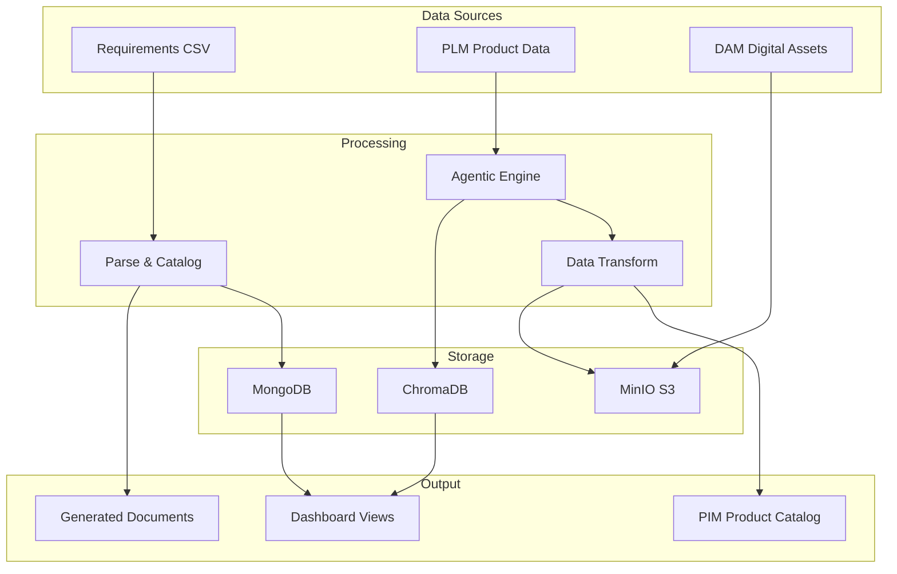
```mermaid
graph TB
    subgraph "Data Sources"
        REQ_CSV["Requirements CSV"]
        PLM_DATA["PLM Product Data"]
        DAM_ASSETS["DAM Digital Assets"]
    end

    subgraph "Processing"
        PARSE["Parse & Catalog"]
        AGENT["Agentic Engine"]
        TRANSFORM["Data Transform"]
    end

    subgraph "Storage"
        MONGO_DB["MongoDB"]
        CHROMA_DB["ChromaDB"]
        S3_STORE["MinIO S3"]
    end

    subgraph "Output"
        PIM_DATA["PIM Product Catalog"]
        DOCS["Generated Documents"]
        DASH["Dashboard Views"]
    end

    REQ_CSV --> PARSE --> MONGO_DB
    PLM_DATA --> AGENT --> TRANSFORM
    DAM_ASSETS --> S3_STORE
    TRANSFORM --> PIM_DATA
    TRANSFORM --> S3_STORE
    AGENT --> CHROMA_DB
    PARSE --> DOCS
    MONGO_DB & CHROMA_DB --> DASH
```

### 9.2 MongoDB Collections (PoC — Current)

```
mongodb://mate-mongodb:27017/integration_mate
  ├── projects              { prefix (PK, ^[A-Z0-9]{1,3}$), client_name, domain,
  │                           description?, accenture_ref?, created_at }  ← ADR-025
  ├── catalog_entries       { id ("{prefix}-{6hex}" e.g. "ACM-4F2A1B"), project_id (FK → prefix),
  │                           name, type, source, target, status, tags[], requirements[] }
  ├── approvals             { id, integration_id, doc_type, content, status, generated_at, feedback? }
  ├── documents             { id, integration_id, doc_type, content, generated_at, kb_status: "staged"|"promoted" }
  ├── kb_documents          { id, filename, file_type, file_size_bytes, tags[], chunk_count,
  │                           content_preview, uploaded_at,
  │                           source_type: "file"|"url",   ← ADR-024
  │                           url: string|null }           ← populated for source_type="url"
  └── llm_settings          { _id: "current", overrides for temperature/max_tokens/timeout/rag_context_size,
                              rag_distance_threshold, rag_bm25_weight,
                              rag_n_results_per_query, rag_top_k_chunks }  ← Phase 2 RAG params (ADR-027..030)
```

**Indexing strategy:**
- `catalog_entries`: unique index on `id`
- `approvals`: unique index on `id` + secondary index on `status` (fast PENDING filter)
- `documents`: unique index on `id`

**Persistence pattern — Write-Through Cache:**
Every mutation writes simultaneously to the in-memory Python dict AND to MongoDB. On container startup, `lifespan()` seeds all three dicts from MongoDB — surviving container restarts without data loss.

### 9.3 ChromaDB Collection

```
approved_integrations collection
  documents: [approved markdown content]
  metadatas: [{ integration_id, type: "functional" }]
  ids:        ["{integration_id}-functional"]
```

Used exclusively for **RAG retrieval**: when a new integration requires documentation, past approved examples are retrieved via semantic similarity search and injected into the LLM prompt as few-shot examples.

### 9.4 In-Memory State

| Variable | Type | Purpose | Persisted? |
|----------|------|---------|------------|
| `parsed_requirements` | `list[Requirement]` | Current CSV upload (pre-finalize) | No (transient) |
| `projects` | `dict[str, Project]` | Client project registry | Yes (MongoDB) |
| `catalog` | `dict[str, CatalogEntry]` | Integration entries | Yes (MongoDB) |
| `documents` | `dict[str, Document]` | Approved final docs | Yes (MongoDB + ChromaDB) |
| `approvals` | `dict[str, Approval]` | HITL queue items | Yes (MongoDB) |
| `kb_docs` | `dict[str, KBDocument]` | Knowledge Base entries | Yes (MongoDB) |
| `kb_chunks` | `dict[str, list[str]]` | BM25 corpus: doc_id → list of text chunks (Phase 2) | No (rebuilt from ChromaDB at startup + on KB change) |
| `agent_logs` | `list[str]` | Real-time execution log | No (last 50 entries) |
| `_agent_lock` | `asyncio.Lock` | Concurrency guard | No |
| `_running_tasks` | `dict[str, asyncio.Task]` | Cancellable tasks | No |

### 9.5 Data Ownership Matrix

| Data Entity | Owner Service | Storage | Retention |
|---|---|---|---|
| Integration Catalog | Integration Agent | MongoDB | Permanent |
| Generated Documents | Integration Agent | MongoDB + ChromaDB | Permanent |
| HITL Approvals | Integration Agent | MongoDB | Permanent |
| Audit Logs | Security Middleware | *PostgreSQL (production)* | 90 days |
| PLM Products (mock) | PLM Mock | In-memory | Session |
| PIM Products (mock) | PIM Mock | In-memory | Session |
| DAM Assets (mock) | DAM Mock | In-memory + S3 | Session |
| Binary Assets | All systems | MinIO S3 | Permanent |

> **PoC Note**: Audit logs and thought logs are planned for PostgreSQL in production. In the current PoC, agent execution is logged to an in-memory ring buffer (last 50 lines) and polled by the dashboard.

---

## 10. API Surface

### 10.1 Integration Agent Endpoints

All endpoints are served by `mate-integration-agent` on port `3003` (internal). Externally, they are reachable via the nginx gateway at `http://host:8080/agent/api/v1/...`.

| Endpoint | Method | Auth | Description |
|----------|--------|------|-------------|
| `/health` | GET | — | Service + ChromaDB + MongoDB health |
| `/api/v1/requirements/upload` | POST | — | Parse CSV; returns `{status:"parsed", total_parsed, preview}`; **no CatalogEntry creation** (ADR-025) |
| `/api/v1/requirements/finalize` | POST | — | Create CatalogEntries with `{prefix}-{6hex}` IDs for current parsed reqs (ADR-025) |
| `/api/v1/requirements` | GET | — | List all parsed requirements |
| `/api/v1/projects` | POST | Token | Create client project (idempotent; 200 if same client, 409 if prefix clash) (ADR-025) |
| `/api/v1/projects` | GET | — | List all client projects (for catalog filter dropdown) (ADR-025) |
| `/api/v1/projects/{prefix}` | GET | — | Get project by prefix; used for real-time uniqueness check in Project Modal (ADR-025) |
| `/api/v1/agent/trigger` | POST | Token | Start agentic RAG flow (async) |
| `/api/v1/agent/cancel` | POST | Token | Cancel running agent task |
| `/api/v1/agent/logs` | GET | — | Stream last 50 log lines |
| `/api/v1/catalog/integrations` | GET | — | List catalog entries; filter params: `?project_id=`, `?domain=`, `?accenture_ref=`; each entry includes `_project` metadata (ADR-025) |
| `/api/v1/catalog/integrations/{id}/functional-spec` | GET | — | Get approved functional spec |
| `/api/v1/catalog/integrations/{id}/technical-spec` | GET | — | *Not yet implemented (501)* |
| `/api/v1/approvals/pending` | GET | — | List PENDING approvals |
| `/api/v1/approvals/{id}/approve` | POST | Token | Approve + persist + feed RAG |
| `/api/v1/approvals/{id}/reject` | POST | Token | Reject with feedback |
| `/api/v1/approvals/{id}/regenerate` | POST | Token | Regenerate REJECTED doc with reviewer feedback injected into prompt (ADR-032) |
| `/api/v1/admin/reset/requirements` | DELETE | Token | Clear parsed reqs + logs |
| `/api/v1/admin/reset/mongodb` | DELETE | Token | Wipe all MongoDB collections |
| `/api/v1/admin/reset/chromadb` | DELETE | Token | Wipe ChromaDB RAG collection |
| `/api/v1/admin/reset/all` | DELETE | Token | Full system reset |
| `/api/v1/admin/llm-settings` | GET | — | Retrieve current effective LLM parameters and design defaults |
| `/api/v1/admin/llm-settings` | PATCH | Token | Update LLM runtime parameters (persisted to MongoDB, applied immediately) |
| `/api/v1/admin/llm-settings/reset` | POST | Token | Reset all LLM parameters to design defaults |
| `/api/v1/admin/docs` | GET | — | Retrieve curated project documentation manifest |
| `/api/v1/admin/docs/{path}` | GET | — | Retrieve markdown content of a specific project document |
| `/api/v1/kb/upload` | POST | Token | Upload + parse + auto-tag a file to the Knowledge Base |
| `/api/v1/kb/add-url` | POST | Token | Register an HTTP/HTTPS URL as a KB reference link (ADR-024) |
| `/api/v1/kb/documents` | GET | — | List all Knowledge Base documents (files + URLs) |
| `/api/v1/kb/documents/{id}` | GET | — | Get a single Knowledge Base document by ID |
| `/api/v1/kb/documents/{id}` | DELETE | Token | Remove a Knowledge Base document (file or URL) |
| `/api/v1/kb/documents/{id}/tags` | PUT | Token | Update tags on a Knowledge Base document |
| `/api/v1/kb/search` | GET | — | Semantic search over Knowledge Base file chunks |
| `/api/v1/kb/stats` | GET | — | Knowledge Base statistics (counts, types, tags) |
| `/api/v1/documents` | GET | — | List all generated and approved documents |
| `/api/v1/documents/{id}/promote-to-kb` | POST | Token | Promote an approved document into the RAG store (ADR-023) |
| `/api/v1/catalog/integrations/{id}/suggest-tags` | GET | — | LLM-suggested tags for an integration (ADR-019) |
| `/api/v1/catalog/integrations/{id}/confirm-tags` | POST | Token | Confirm tags for an integration (ADR-019) |

**Auth model:** Optional Bearer token. If `API_KEY` env var is set, mutating endpoints (`trigger`, `cancel`, `approve`, `reject`, `reset/*`) require `Authorization: Bearer <key>` with `hmac.compare_digest()` constant-time comparison. If unset, endpoints log a warning and allow through (dev/PoC mode).

### 10.2 Common Response Envelope

All API responses follow this structure:

**Success**:
```json
{
  "status": "success",
  "data": { "..." },
  "meta": {
    "page": 1,
    "limit": 20,
    "total": 150,
    "timestamp": "2026-03-04T12:00:00Z"
  }
}
```

**Error (RFC 7807)**:
```json
{
  "type": "https://integration-mate.local/errors/not-found",
  "title": "Product Not Found",
  "status": 404,
  "detail": "Product with ID 'PLM-999' does not exist in PLM",
  "instance": "/api/v1/products/PLM-999",
  "timestamp": "2026-03-04T12:00:00Z",
  "trace_id": "exec-abc123"
}
```

### 10.3 Agent Execution API (Production Target)

**Request**: `POST /api/v1/execute`
```json
{
  "goal": "Sincronizza prodotto PLM-001 su PIM e DAM con immagini",
  "context": {
    "user_token": "eyJhbGciOi...",
    "priority": "normal",
    "dry_run": false
  }
}
```

**Response** (streaming via SSE or final):
```json
{
  "execution_id": "exec-abc123",
  "status": "completed",
  "goal": "Sincronizza prodotto PLM-001 su PIM e DAM con immagini",
  "duration_ms": 1250,
  "steps_executed": 7,
  "api_calls": 4,
  "self_corrections": 0,
  "hitl_approvals": 0,
  "result": {
    "pim_product_created": "SKU-PLM-001",
    "dam_asset_created": "asset-001",
    "renditions_generated": 3,
    "media_linked": true
  },
  "thought_chain_url": "/api/v1/thoughts/exec-abc123"
}
```

---

## 11. Security Architecture

### 11.1 Security Layers

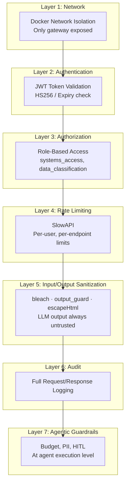
```mermaid
graph TB
    subgraph "Layer 1: Network"
        NET["Docker Network Isolation<br/>Only gateway exposed"]
    end
    subgraph "Layer 2: Authentication"
        JWT["JWT Token Validation<br/>HS256 / Expiry check"]
    end
    subgraph "Layer 3: Authorization"
        RBAC["Role-Based Access<br/>systems_access, data_classification"]
    end
    subgraph "Layer 4: Rate Limiting"
        RATE["SlowAPI<br/>Per-user, per-endpoint limits"]
    end
    subgraph "Layer 5: Input/Output Sanitization"
        SAN["bleach · output_guard · escapeHtml<br/>LLM output always untrusted"]
    end
    subgraph "Layer 6: Audit"
        AUD["Full Request/Response Logging"]
    end
    subgraph "Layer 7: Agentic Guardrails"
        GUARD2["Budget, PII, HITL<br/>At agent execution level"]
    end

    NET --> JWT --> RBAC --> RATE --> SAN --> AUD --> GUARD2
```

### 11.2 Security Controls (OWASP ASVS Aligned)

| Layer | Control | Implementation | OWASP |
|-------|---------|----------------|-------|
| API Auth | Bearer token (optional) | `hmac.compare_digest()` — constant-time | A07 |
| CORS | Allowlist from env var | No `*` with credentials | A05 |
| Input | CSV guards | MIME type, 1 MB size, UTF-8 encoding | A03 |
| Input | Request bodies | Pydantic `Field(min_length, max_length)` | A03 |
| LLM Output | Structural guard | Must start `# Integration Functional Design` | A03 |
| LLM Output | HTML sanitization | `bleach.clean(strip=True, tags=allowlist)` | A03 |
| LLM Output | Truncation | Max 50,000 characters | A03 |
| Frontend | XSS prevention | `escapeHtml()` on all server-sourced innerHTML | A03 |
| Frontend | Textarea injection | Content set via `.value`, not `innerHTML` | A03 |
| Secrets | No hardcoded values | `pydantic-settings` from env vars / `.env` | A02 |
| Prompt | Injection prevention | `str.replace()` — not `str.format()` | A03 |
| KB URL fetch | SSRF prevention | Block private/loopback IP ranges; `http/https` scheme only | A10 |
| KB URL content | XSS via fetched HTML | `bleach.clean(tags=[], strip=True)` before prompt injection | A03 |

### 11.3 Data Classification

| Level | Examples | Access Control |
|---|---|---|
| **Public** | Product name, description | Any authenticated user |
| **Internal** | Category mapping, status | Role: `integration_read` |
| **Confidential** | Pricing, costs, margins | Role: `financial_read` |
| **Restricted (PII)** | Emails, phone numbers | Role: `pii_reader` + HITL |

### 11.4 Responsible AI Controls (Accenture Standard)

- **Human-in-the-Loop gate**: No AI-generated document reaches the final store without human approval.
- **LLM output is always treated as untrusted input** (structural guard + bleach sanitization).
- **All AI usage is transparent and logged** (agent_logs ring buffer, pollable via REST API).
- **No autonomous actions**: Every LLM-generated artifact requires explicit human approval.

---

## 12. Asset Management & Storage

### 12.1 Bucket Architecture

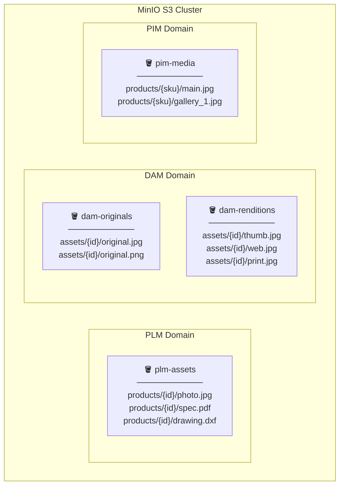
```mermaid
graph TB
    subgraph "MinIO S3 Cluster"
        subgraph "PLM Domain"
            PLM_B["🪣 plm-assets<br/>───────────<br/>products/{id}/photo.jpg<br/>products/{id}/spec.pdf<br/>products/{id}/drawing.dxf"]
        end

        subgraph "DAM Domain"
            DAM_O["🪣 dam-originals<br/>───────────<br/>assets/{id}/original.jpg<br/>assets/{id}/original.png"]
            DAM_R["🪣 dam-renditions<br/>───────────<br/>assets/{id}/thumb.jpg<br/>assets/{id}/web.jpg<br/>assets/{id}/print.jpg"]
        end

        subgraph "PIM Domain"
            PIM_B["🪣 pim-media<br/>───────────<br/>products/{sku}/main.jpg<br/>products/{sku}/gallery_1.jpg"]
        end
    end
```

### 12.2 Asset Transfer Flow (Agentic)

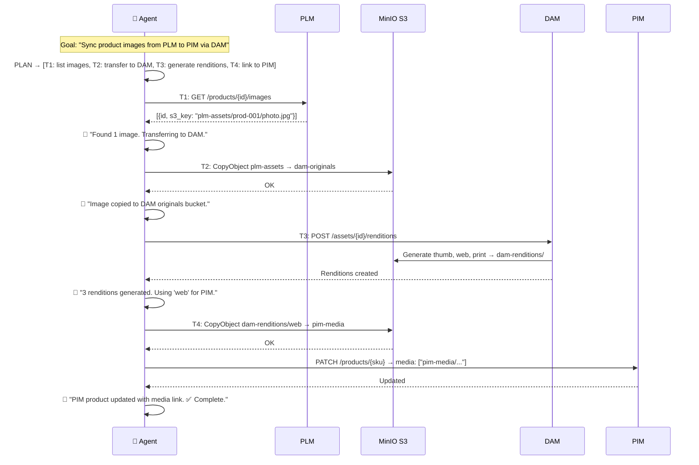
```mermaid
sequenceDiagram
    participant Agent as 🧠 Agent
    participant PLM
    participant S3 as MinIO S3
    participant DAM
    participant PIM

    Note over Agent: Goal: "Sync product images from PLM to PIM via DAM"

    Agent->>Agent: PLAN → [T1: list images, T2: transfer to DAM, T3: generate renditions, T4: link to PIM]

    Agent->>PLM: T1: GET /products/{id}/images
    PLM-->>Agent: [{id, s3_key: "plm-assets/prod-001/photo.jpg"}]
    Agent->>Agent: 💭 "Found 1 image. Transferring to DAM."

    Agent->>S3: T2: CopyObject plm-assets → dam-originals
    S3-->>Agent: OK
    Agent->>Agent: 💭 "Image copied to DAM originals bucket."

    Agent->>DAM: T3: POST /assets/{id}/renditions
    DAM->>S3: Generate thumb, web, print → dam-renditions/
    DAM-->>Agent: Renditions created
    Agent->>Agent: 💭 "3 renditions generated. Using 'web' for PIM."

    Agent->>S3: T4: CopyObject dam-renditions/web → pim-media
    S3-->>Agent: OK
    Agent->>PIM: PATCH /products/{sku} → media: ["pim-media/..."]
    PIM-->>Agent: Updated
    Agent->>Agent: 💭 "PIM product updated with media link. ✅ Complete."
```

---

## 13. Observability & Monitoring

### 13.1 Logging Strategy

| Layer | Format | Destination (PoC) | Destination (Production) |
|---|---|---|---|
| HTTP Access | JSON (method, path, status, duration) | stdout | ELK / Datadog |
| Agent Execution | Structured text (timestamp, level, message) | In-memory ring buffer (50 lines) | PostgreSQL + ELK |
| Application | Structured JSON (level, message, context) | stdout | ELK / Datadog |
| Errors | JSON + stack trace | stdout | ELK + PagerDuty |

### 13.2 Key Metrics

| Metric | Source | Purpose |
|---|---|---|
| `agent.execution.duration_ms` | Integration Agent | Execution time per (source, target) pair |
| `agent.prompt_chars` | Prompt Builder | Prompt size (detect template injection failures) |
| `agent.llm.total_duration_ns` | Ollama response | LLM inference time |
| `agent.llm.eval_count` | Ollama response | Tokens generated |
| `agent.rag.results_count` | ChromaDB query | RAG context richness (0 = zero-shot) |
| `agent.hitl.pending_count` | Approvals collection | Approval queue depth |
| `api.request.duration_ms` | Security Middleware | Latency monitoring |
| `api.request.error_rate` | Security Middleware | Error tracking |
| `s3.transfer.bytes` | S3 Transfer | Storage usage |

### 13.3 Thought Process Visualization (Production Target)

The dashboard will display the agent's thought chain as an interactive timeline:

```
┌─ Execution: exec-abc123 ──────────────────────────────────────┐
│ Goal: "Recupera info prodotto PLM-001 per utente U-01"       │
│ Status: ✅ COMPLETED (1.2s)                                   │
│                                                               │
│ ┌─ Step 1 [PLAN] ──────────────────────────── 120ms ────────┐ │
│ │ 💭 Decomposing goal into 5 sub-tasks with 2 parallel      │ │
│ │    groups. Tasks: verify exists → check auth → parallel   │ │
│ │    [check permissions, fetch media] → compose response    │ │
│ └───────────────────────────────────────────────────────────┘ │
│                                                               │
│ ┌─ Step 2 [EXECUTE] plm_get_product ────────── 45ms ────────┐ │
│ │ 💭 Product PLM-001 exists, status: PUBLISHED              │ │
│ │ ✅ Result: {sku: "PLM-001", name: "Smart TV 55", ...}     │ │
│ └───────────────────────────────────────────────────────────┘ │
│                                                               │
│ ┌─ Step 3 [EXECUTE] security_validate_token ── 22ms ─── ⚡ ─┐ │
│ │ 💭 Token valid. User: mario.rossi, roles: [editor]        │ │
│ │ ✅ Authenticated                                          │ │
│ ├─ Step 4 [EXECUTE] security_check_perm ──── 18ms ─── ⚡ ──┤ │
│ │ 💭 Editor can see: name, description, category, images    │ │
│ │    Editor CANNOT see: cost, margin (financial data)        │ │
│ │ ⚠️ Filtering 2 fields per policy P-003                    │ │
│ └───────────────────────────────────────────────────────────┘ │
│                                                               │
│ ┌─ Step 5 [EXECUTE] dam_get_assets ─────────── 80ms ────────┐ │
│ │ 💭 Found 2 renditions for PLM-001: web + thumbnail        │ │
│ │ ✅ Media URLs generated (presigned, 15 min expiry)        │ │
│ └───────────────────────────────────────────────────────────┘ │
│                                                               │
│ ┌─ Step 6 [SYNTHESIZE] ────────────────────── 5ms ──────────┐ │
│ │ 💭 Composing filtered response: 8/10 fields + 2 media     │ │
│ │ ✅ Response ready                                         │ │
│ └───────────────────────────────────────────────────────────┘ │
│                                                               │
│ ⚡ Parallel steps: 3+4 ran together (40ms saved)              │
│ 📊 Total API calls: 4 | Budget used: 8%                      │
└───────────────────────────────────────────────────────────────┘
```

---

## 14. Deployment Architecture

### 14.1 Docker Compose Topology

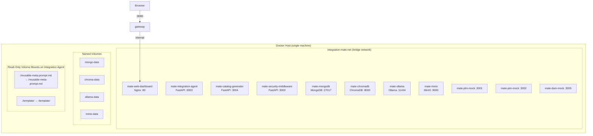
```mermaid
graph TB
    subgraph host["Docker Host (single machine)"]
        subgraph net["integration-mate-net (bridge network)"]
            dashboard["mate-web-dashboard<br/>Nginx :80"]
            agent["mate-integration-agent<br/>FastAPI :3003"]
            catalog["mate-catalog-generator<br/>FastAPI :3004"]
            security["mate-security-middleware<br/>FastAPI :3000"]
            mongo["mate-mongodb<br/>MongoDB :27017"]
            chroma["mate-chromadb<br/>ChromaDB :8000"]
            ollama["mate-ollama<br/>Ollama :11434"]
            minio["mate-minio<br/>MinIO :9000"]
            plm["mate-plm-mock :3001"]
            pim["mate-pim-mock :3002"]
            dam["mate-dam-mock :3005"]
        end

        subgraph vols["Named Volumes"]
            mongo_vol["mongo-data"]
            chroma_vol["chroma-data"]
            ollama_vol["ollama-data"]
            minio_vol["minio-data"]
        end

        subgraph mounts["Read-Only Volume Mounts on Integration Agent"]
            prompt_mount["./reusable-meta-prompt.md → /reusable-meta-prompt.md"]
            template_mount["./template/ → /template/"]
        end
    end

    user["Browser"] -- ":8080" --> gateway
    gateway -- "internal" --> dashboard
```

### 14.2 Port Mapping (host → container)

| Host Port | Container | Service |
|-----------|-----------|---------|
| 8080 | 80 | Gateway (nginx reverse proxy) |
| — (internal) | 80 | Web Dashboard |
| 4000 | 3000 | Security Middleware |
| 4001 | 3001 | PLM Mock |
| 4002 | 3002 | PIM Mock |
| 4003 | 3003 | Integration Agent |
| 4004 | 3004 | Catalog Generator |
| 4005 | 3005 | DAM Mock |
| 8000 | 8000 | ChromaDB |
| 9000/9001 | 9000/9001 | MinIO |
| 11434 | 11434 | Ollama |
| 27017 | 27017 | MongoDB |

### 14.3 Startup Order

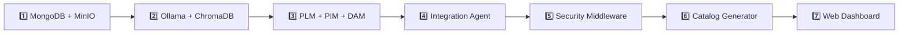
```mermaid
graph LR
    DB["1️⃣ MongoDB + MinIO"] --> OLLAMA["2️⃣ Ollama + ChromaDB"]
    OLLAMA --> MOCKS["3️⃣ PLM + PIM + DAM"]
    MOCKS --> ENGINE["4️⃣ Integration Agent"]
    ENGINE --> MW["5️⃣ Security Middleware"]
    MW --> GEN["6️⃣ Catalog Generator"]
    GEN --> DASH["7️⃣ Web Dashboard"]
```

### 14.4 Resource Allocation (PoC)

| Service | CPU Limit | Memory Limit |
|---|---|---|
| Python services (×6) | 0.5 | 256 MB |
| MongoDB | 1.0 | 512 MB |
| MinIO | 0.5 | 256 MB |
| Ollama | 4.0 | 8 GB |
| Nginx | 0.25 | 64 MB |

### 14.5 Volume Mounts

**Notable deployment detail:** `reusable-meta-prompt.md` and `template/` live at the project root, outside the Docker build context of the integration-agent service. They are exposed inside the container via read-only volume mounts at `/reusable-meta-prompt.md` and `/template/` respectively — matching the path resolution of `Path(__file__).parent.parent.parent` from within `/app/`.

---

## 15. Non-Functional Requirements

| Category | Requirement | PoC Target | Production Target |
|---|---|---|---|
| **Performance** | API response time | < 500ms (p95) | < 200ms (p95) |
| **Performance** | Agent execution time (per pair) | < 600s (CPU) | < 10s (GPU) |
| **Availability** | Uptime SLA | N/A (local) | 99.9% |
| **Security** | Authentication | Bearer token (optional) | OAuth2 + OIDC |
| **Security** | Encryption at rest | None | AES-256 |
| **Security** | Encryption in transit | HTTP (PoC) | TLS 1.3 |
| **Compliance** | Audit retention | In-memory (session) | 7 years (PostgreSQL) |
| **Compliance** | GDPR | PII guardrails | Full DPA compliance |
| **Scalability** | Concurrent agents | 1 (asyncio.Lock) | 50+ |
| **Scalability** | Catalog size | 50 integrations | 10,000+ |
| **Observability** | Logging | stdout + ring buffer | ELK / Datadog |
| **Observability** | Tracing | Entry ID (`{PREFIX}-{6hex}` e.g. `ACM-4F2A1B`) | OpenTelemetry |
| **CDN** | Asset delivery | MinIO direct | CloudFront / Akamai |

---

## 16. Error Management & Resilience

### 16.1 Error Taxonomy

The system classifies errors across 6 layers, each with distinct handling:

| Layer | Error Types | Severity Range | Owner Service |
|---|---|---|---|
| **Infrastructure** | Network, DB, S3 failures | Medium → Critical | All services |
| **Service** | API 4xx/5xx, gateway, LLM errors | Low → High | Originating service |
| **Business Logic** | Validation, transformation, rules | Low → Medium | Integration Agent |
| **Agentic** | Planning, tool selection, reasoning failures | Medium → High | Agent Executor |
| **Data Consistency** | Partial writes, orphans, stale data | High → Critical | Saga Engine |
| **Systemic** | Cascades, poison messages, resource exhaustion | High → Critical | All services |

### 16.2 Error Propagation & Containment

```mermaid
graph TB
    subgraph "Error Origin"
        E["❌ Error occurs in Service X"]
    end

    subgraph "Containment Strategy"
        E --> CB{Circuit Breaker<br/>State?}
        CB -->|Closed| RETRY["Retry with<br/>backoff"]
        CB -->|Open| FAILFAST["Fail-fast 503<br/>(don't cascade)"]
        CB -->|Half-Open| PROBE["Probe request"]

        RETRY -->|Success| OK["✅ Recovered"]
        RETRY -->|Max retries| REASON["🤖 LLM Reasoning"]
        REASON -->|Alternative| ALT["Try different tool"]
        REASON -->|Escalate| SAGA["Saga Compensation"]
        ALT -->|Success| OK
        ALT -->|Fail| SAGA
        SAGA --> DLQ["Dead Letter Queue"]
        DLQ --> ALERT["Dashboard Alert"]
    end
```

**Key principle**: Errors are **contained at the service boundary** and never propagate as unhandled exceptions. Each service returns structured RFC 7807 error responses that the agent can reason about.

### 16.3 Error Impact Matrix

#### PLM → PIM Product Sync

| Failure Point | Impact | Data Risk | Mitigation | Auto Recovery? |
|---|---|---|---|---|
| PLM unreachable | PIM data goes stale | Low (read-only) | Circuit breaker, retry when up | ✅ Yes |
| PLM returns partial data | Incomplete product in PIM | Medium | Validate required fields, reject if incomplete | ✅ Yes |
| Transform fails on field | Single field missing | Low | Skip field, log warning, continue | ✅ Yes |
| Transform fails entirely | Product not synced | Medium | DLQ + manual review | ❌ Manual |
| PIM write fails (500) | Data fetched but not written | Low | Retry, idempotent by SKU | ✅ Yes |
| PIM conflict (409) | Duplicate product | Low | Upsert (PATCH instead of POST) | ✅ Yes |
| PIM validation (422) | Bad payload structure | Medium | LLM adapts payload, retry | ✅ Yes (via agent) |

#### PLM → DAM → PIM Media Sync

| Failure Point | Impact | Data Risk | Mitigation | Auto Recovery? |
|---|---|---|---|---|
| S3 upload fails | Image not stored | High | Retry 3×, then DLQ | ✅ Partial |
| DAM asset creation fails | S3 orphan object | Medium | **Saga compensation**: delete S3 object | ✅ Yes (saga) |
| Rendition generation fails | No thumbnails | Medium | Fallback: use original, retry async | ✅ Yes |
| S3 cross-bucket copy fails | DAM has it, PIM doesn't | Medium | **Saga**: mark product "media_pending" | ✅ Yes (saga) |
| PIM media link fails | Product without images | Medium | Retry link, compensate if impossible | ✅ Yes |
| **Any step after step 2** | Orphan data across systems | **High** | **Full saga rollback** | ✅ Yes (saga) |

#### Catalog & Document Generation

| Failure Point | Impact | Data Risk | Mitigation | Auto Recovery? |
|---|---|---|---|---|
| CSV malformed row | Single requirement skipped | Low | Log warning, report skipped rows | ✅ Yes |
| CSV entirely invalid | No requirements loaded | High | Return 400 with details | ✅ Yes (immediate) |
| LLM timeout | Documents not generated | Medium | Fallback to template, retry later | ✅ Yes (degraded) |
| LLM hallucinated output | Incorrect spec document | Medium | Output validation + HITL review | ✅ Yes (via HITL) |
| MongoDB write fails | Catalog not persisted | High | Retry, circuit breaker | ✅ Yes |

### 16.4 Saga Pattern — Compensating Transactions

Multi-step integration flows use the **Saga Pattern** to ensure eventual consistency:

```mermaid
sequenceDiagram
    participant Agent
    participant PLM
    participant S3
    participant DAM
    participant PIM

    Note over Agent: Saga: product_full_sync

    rect rgb(200, 255, 200)
        Agent->>PLM: ① Fetch product data
        PLM-->>Agent: ✅ Product data
    end

    rect rgb(200, 255, 200)
        Agent->>S3: ② Upload image
        S3-->>Agent: ✅ Uploaded
    end

    rect rgb(200, 255, 200)
        Agent->>DAM: ③ Create asset
        DAM-->>Agent: ✅ asset-001
    end

    rect rgb(255, 200, 200)
        Agent->>PIM: ④ Create product ← FAILS!
        PIM-->>Agent: ❌ 422 Error
    end

    Note over Agent: ⚠️ COMPENSATION (reverse order)

    rect rgb(255, 255, 200)
        Agent->>DAM: ↩③ DELETE asset-001
        Agent->>S3: ↩② DELETE image
    end

    Note over Agent: System consistent ✅
```

**Saga registry** (5 predefined sagas):

| Saga | Steps | Auto-compensation |
|---|---|---|
| `product_data_sync` | Fetch → Transform → Create PIM | Delete PIM product |
| `media_full_sync` | Fetch images → S3 → DAM → Renditions → PIM | Full rollback chain |
| `product_full_sync` | Combined data + media | Combined compensation |
| `product_update` | Fetch diff → PATCH PIM | PATCH PIM (revert) |
| `product_delete` | Archive PIM → DAM → S3 | Restore chain |

### 16.5 Dead Letter Queue (DLQ) — Production Target

Operations that exhaust all retry/reasoning strategies land in DLQ collections:

| Queue | Content | Auto-retry | Dashboard View |
|---|---|---|---|
| `dlq_recoverable` | Transient failures, ready for retry | Every 5 min | Counter badge |
| `dlq_manual_review` | Logic failures needing human decision | No | Alert + detail panel |
| `dlq_compensation_failed` | Saga rollbacks that failed | No | **Critical** alert |

---

## 17. Production Roadmap

### Phase 1 → Phase 2 Migration Path

```mermaid
gantt
    title Production Roadmap
    dateFormat  YYYY-MM
    section Infrastructure
    Replace MinIO with AWS S3          :2026-04, 2026-05
    Add Kubernetes                     :2026-04, 2026-06
    Add CloudFront CDN                 :2026-05, 2026-06
    section Security
    Integrate OAuth2/OIDC              :2026-04, 2026-05
    Add TLS everywhere                 :2026-04, 2026-04
    GDPR compliance audit              :2026-05, 2026-06
    section Scalability
    Connection real PLM/PIM/DAM        :2026-05, 2026-07
    Multi-tenant support               :2026-06, 2026-08
    Cloud LLM integration              :2026-05, 2026-06
    section Observability
    OpenTelemetry integration          :2026-04, 2026-05
    Datadog/Grafana dashboards         :2026-05, 2026-06
```

---

## 18. ADR Index

| ADR | Decision | Status | Notes |
|-----|----------|--------|-------|
| ADR-001–011 | Early foundational decisions (tooling, patterns) | Accepted | |
| ADR-012 | Async LLM client via `httpx.AsyncClient` | Accepted | |
| ADR-013 | MongoDB persistence + Motor async driver | Accepted | |
| ADR-014 | External prompt template (`reusable-meta-prompt.md`) | Accepted | |
| ADR-015 | LLM output guard (structural + bleach) | Accepted | |
| ADR-016 | Secret management via Pydantic Settings | Accepted | |
| ADR-017 | Frontend XSS mitigation (`escapeHtml()`) | Accepted | |
| ADR-018 | CORS standardization (env-var allowlist) | Accepted | |
| ADR-019 | RAG Tag Filtering | Accepted | Filter ChromaDB queries by confirmed integration tags to improve context relevance |
| ADR-020 | Tag LLM Tuning | Accepted | Dedicated lightweight LLM settings for tag suggestion (20-token cap, 15s timeout, temperature=0) |
| ADR-021 | Best Practice Knowledge Base | Accepted | Multi-format document ingestion pipeline (PyMuPDF, python-docx, openpyxl, python-pptx) with ChromaDB knowledge_base collection |
| ADR-022 | Nginx Reverse-Proxy Gateway | Accepted | Single nginx entry point on port 8080; routes `/agent/`, `/plm/`, `/pim/` to backends; security headers |
| ADR-023 | Document Lifecycle: Staged Promotion | Accepted | Decouples HITL approval from ChromaDB RAG promotion; explicit `promote-to-kb` action |
| ADR-024 | KB URL Links: Live Fetch | Accepted | HTTP/HTTPS URL entries in KB fetched live at generation time; SSRF guard on private IP ranges |
| ADR-025 | Project Metadata & Upload Modal | Accepted | `projects` MongoDB collection; upload split into parse-only + finalize; `{prefix}-{hex}` catalog IDs; Project Modal with debounce uniqueness check; Catalog filter bar |
| ADR-026 | Backend Decomposition (R15) | Accepted | 2065-line `main.py` monolith → layered architecture: `routers/` (8 modules), `services/` (4 modules), `state.py`, `auth.py`, `utils.py`, `log_helpers.py`; `main.py` reduced to ~213 lines |
| ADR-027 | Multi-Query Expansion for RAG (R8) | Accepted | 4 query variants (2 templates + 2 LLM-generated) per retrieval call; LLM failure falls back to templates |
| ADR-028 | BM25+Dense Hybrid Retrieval (R8/R12) | Accepted | BM25Plus sparse + ChromaDB dense ensemble (0.6/0.4); `kb_chunks` corpus in `state.py`; multi-dimensional `$or` tag filter |
| ADR-029 | Retrieval Threshold Filter & TF-IDF Re-rank (R9) | Accepted | Score threshold `1/(1+distance)` drops low-quality chunks; TF-IDF cosine re-rank (scikit-learn) before top-K selection |
| ADR-030 | ContextAssembler Structured Sections (R10) | Accepted | RAG context split into `## PAST APPROVED EXAMPLES` + `## BEST PRACTICE PATTERNS` with token budget enforcement |
| ADR-031 | Output Quality Checker | Accepted | `assess_quality()` warning-only gate |
| ADR-032 | Feedback Loop Regenerate | Accepted | HITL rejection feedback loop |
| ADR-033 | TanStack Query Frontend | Accepted | React Query server-state pilot |
| ADR-034 | Docling + LLaVA Vision Parser | Accepted | Layout-aware PDF/DOCX parsing via IBM Docling; `DoclingChunk` with `chunk_type` (text/table/figure), `section_header`, `page_num`; figure captioning via `llava:7b` (local Ollama) |
| ADR-035 | RAPTOR-lite Section Summaries | Accepted | Section-header grouping of `DoclingChunk`s; sections ≥ 3 chunks summarised via llama3.1:8b; `SummaryChunk` stored in `kb_summaries` ChromaDB collection; dense-only retrieval injected as `## DOCUMENT SUMMARIES` first section |
| ADR-036 | Ingestion Platform Architecture | Accepted | New `services/ingestion-platform/` (port 4006) with 3 collectors (OpenAPI, HTML, MCP), source registry, diff engine, n8n (port 5678) orchestrator; shared `kb_collection` ChromaDB with `src_*` chunk IDs; 3 new MongoDB collections (`sources`, `source_runs`, `source_snapshots`) |
| ADR-037 | Claude API Semantic Extraction | Accepted | Claude Haiku for HTML relevance filter and diff summaries; Claude Sonnet for schema-constrained capability extraction and cross-page reconciliation; `ClaudeService` wrapper with graceful degradation when key absent; confidence < 0.7 → `low_confidence=True` metadata (not discarded) |
| **Phase 4 — UI Polish & Observability** | | | |
| R4 | KnowledgeBasePage & RequirementsPage Sub-component Decomposition | Implemented | `KnowledgeBasePage.jsx` split into `kb/` sub-components (`kbHelpers.js`, `TagEditModal`, `PreviewModal`, `SearchPanel`, `UnifiedDocumentsPanel`, `AddUrlForm`); `TagConfirmPanel` extracted from `RequirementsPage.jsx` into `requirements/` |
| R6 | Global Toast Notification System (sonner) | Implemented | `sonner` installed; `<Toaster>` added to `App.jsx`; `AddUrlForm` uses `toast.error()`/`toast.success()` replacing local error-state prop callbacks |
| R7 | UI Localization — Italian → English | Implemented | All remaining Italian strings in `UnifiedDocumentsPanel.jsx` and `ProjectModal.jsx` translated to English |
| R18 | Real-Time Agent Progress Tracking | Implemented | `state.agent_progress` dict added to backend; `/agent/logs` response includes `"progress"` key (0–100); `useAgentLogs.js` exposes `progress`; `AgentWorkspacePage.jsx` renders real step progress bar |
| R19-MVP | Append-Only MongoDB Audit Event Log | Implemented | `services/event_logger.py` created; `db.events_col` MongoDB collection with 90-day TTL index; audit events (`catalog_entry_created`, `document_approved`, `document_promoted`, `kb_document_uploaded`, `kb_document_deleted`) recorded in `catalog.py`, `approvals.py`, `documents.py` |
| **Phase 5 — Ingestion Platform** | | | |
| Batch KB Upload | `POST /api/v1/kb/batch-upload` — up to 10 files, partial success, per-file result array | n/a |
| OpenAPI Collector | Fetcher (ETag) + parser (JSON/YAML) + normalizer + chunker + differ (SHA-256 + operation_id sets) | Full `runs` router for polling; HTML collector Playwright requires Chromium in image |
| MCP Collector | Python `mcp` SDK SSE transport; tools/resources/prompts → `CanonicalCapability` | Test against live MCP servers |
| HTML Collector | Playwright crawler + BS4 cleaner + Claude Haiku filter + Claude Sonnet extraction | Full Playwright headless testing in CI |
| n8n Workflows | 6 JSON skeletons (WF-01..06) for import into n8n UI | Deploy n8n container and activate workflows |

---

## 19. Known Limitations & Future Work

| Item | Current State | Planned |
|------|--------------|---------|
| Technical spec generation | Endpoint returns 501 stub | Implement `template/technical/` flow |
| Security middleware | Passthrough in PoC | Full JWT/RBAC integration |
| OpenAPI spec reading | Ingestion Platform OpenAPI collector (ETag caching, hash diff, breaking change detection) | Live spec ingestion for data mapping via Ingestion Platform source registry |
| Model quality | llama3.2:3b (fast, PoC) | Configurable via `OLLAMA_MODEL` env var |
| RAG grading | HybridRetriever: multi-query + BM25+dense ensemble + TF-IDF re-rank (Phase 2) | Per-session relevance feedback; learned re-ranking |
| Embedding model | Default ChromaDB embeddings | Switch to `nomic-embed-text` for richer semantics |
| Audit logging | MongoDB append-only `events` collection with 90-day TTL (R19-MVP) | PostgreSQL with 7-year retention; structured query API |
| Thought chain UI | Basic log terminal | Interactive timeline visualization |
| Multi-agent | Single sequential agent | Parallel agent execution with DAG planning |
| Real-time updates | REST polling (2s interval) | WebSocket / SSE for dashboard updates |
| Circuit breakers | Basic error catch + log | Per-service circuit breakers with dashboard indicators |
| Saga compensation | Not implemented | Full saga rollback for multi-system operations |
