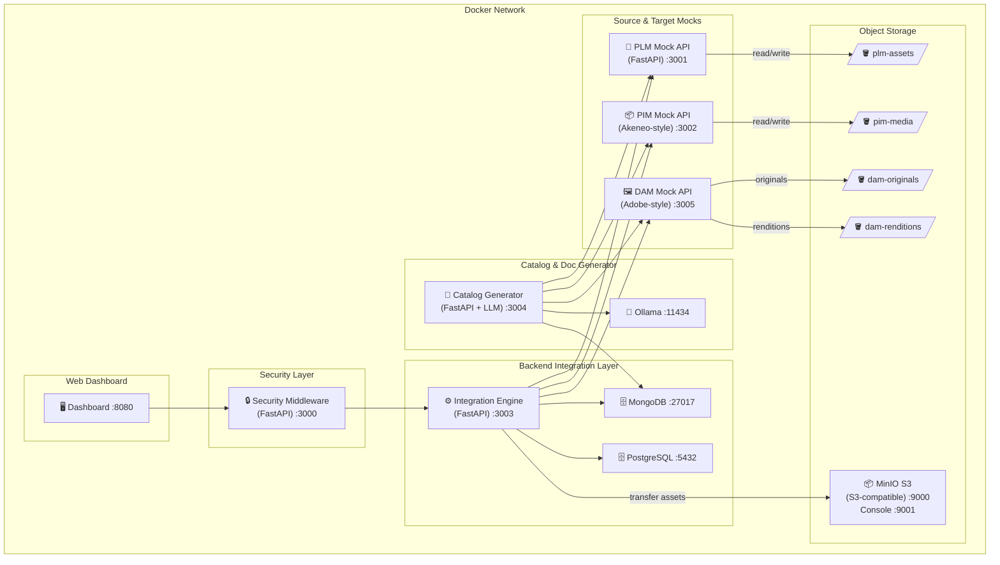
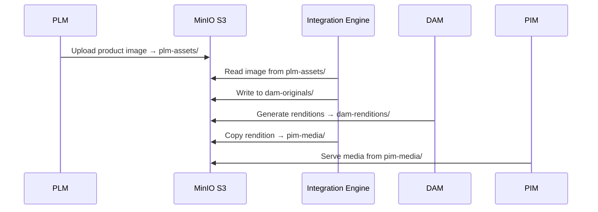

# Functional Integration Mate PoC — Implementation Plan (v3)

PoC tool: da **API specs** (PLM OpenAPI) + **requisiti JIRA** (CSV) → **catalogo integrazioni** + **documenti funzionali/tecnici via LLM**, con security middleware, integration layer, e **S3 storage** per asset binari.

## Architecture Overview



## Asset Flow via S3



---

## Changes from v2

| Area | v2 | v3 |
|---|---|---|
| Asset storage | None | **MinIO S3** — 4 buckets per sistema |
| Asset transfer | Direct API | **S3 presigned URLs + bucket transfer** |
| Containers | 10 | **11** (+ MinIO) |

---

## Proposed Changes

### 1. Project Structure

```
my-functional-integration-mate-poc/
├── docker-compose.yml
├── .env
├── README.md
├── docs/
│   ├── architecture-diagram.md
│   ├── architecture-decisions.md
│   └── generated/
├── data/
│   ├── sample-requirements.csv
│   └── sample-images/            ← sample product images for S3
├── services/
│   ├── plm-mock-api/
│   │   ├── main.py, models.py, routes/, s3_client.py
│   │   ├── requirements.txt, Dockerfile
│   ├── pim-mock-api/
│   │   ├── main.py, models.py, routes/, s3_client.py
│   │   ├── requirements.txt, Dockerfile
│   ├── dam-mock-api/
│   │   ├── main.py, models.py, routes/, s3_client.py, renditions.py
│   │   ├── requirements.txt, Dockerfile
│   ├── security-middleware/
│   │   ├── main.py, auth.py, policies.py, rate_limiter.py
│   │   ├── requirements.txt, Dockerfile
│   ├── integration-engine/
│   │   ├── main.py, routes/, models/, services/
│   │   │   └── services/: orchestrator.py, transformer.py, s3_transfer.py
│   │   ├── requirements.txt, Dockerfile
│   ├── catalog-generator/
│   │   ├── main.py, parsers/, generators/
│   │   ├── requirements.txt, Dockerfile
│   └── web-dashboard/
│       ├── index.html, css/, js/, Dockerfile (nginx)
└── scripts/
    ├── init-db.sql
    └── init-s3.sh               ← creates buckets on startup
```

---

### 2. MinIO S3 — Object Storage

- **4 buckets** auto-creati all'avvio via `scripts/init-s3.sh`:
  - `plm-assets` — immagini prodotto dal PLM
  - `pim-media` — media per il catalogo PIM
  - `dam-originals` — originali high-res nel DAM
  - `dam-renditions` — renditions generate (thumb, web, print)
- Console admin su `:9001` (user: `minioadmin`)
- Tutti i servizi usano `boto3` per interagire con S3

### 3. Mock APIs (aggiornato)

Ogni mock ha un modulo `s3_client.py` con funzioni:
- `upload_asset(bucket, key, file)` → carica su MinIO
- `get_presigned_url(bucket, key)` → URL temporaneo per download
- `list_assets(bucket, prefix)` → lista oggetti

**DAM** ha in più `renditions.py`:
- `generate_renditions(original_key)` → crea thumb (150px), web (800px), print (2400px) via Pillow

### 4-7. Resto invariato da v2

Security middleware, integration engine, catalog generator, web dashboard come da plan v2 con l'aggiunta di `s3_transfer.py` nel integration engine per gestire il trasferimento asset cross-bucket.

---

## Port Map (11 container)

| Service | Port | Notes |
|---|---|---|
| Security Middleware | 3000 | Gateway / JWT / Rate limit |
| PLM Mock API | 3001 | Source system |
| PIM Mock API | 3002 | Target PIM (Akeneo) |
| Integration Engine | 3003 | Backend + BL |
| Catalog Generator | 3004 | Parser + LLM doc gen |
| DAM Mock API | 3005 | Target DAM (Adobe) |
| Web Dashboard | 8080 | Static nginx |
| MongoDB | 27017 | Catalog store |
| PostgreSQL | 5432 | Audit / logs |
| MinIO S3 API | 9000 | S3-compatible API |
| MinIO Console | 9001 | Web admin UI |
| Ollama | 11434 | LLM engine |

---

## Verification Plan

1. `docker-compose up -d --build` → all 11 services healthy
2. MinIO Console `:9001` — 4 buckets created
3. PLM upload image → appears in `plm-assets` bucket
4. Integration engine transfers image PLM→DAM→PIM via S3
5. Swagger UIs: `:3001/docs`, `:3002/docs`, `:3005/docs`
6. E2E: requirements CSV → catalog → LLM docs generated
7. Dashboard `:8080` — catalog + docs browsable
