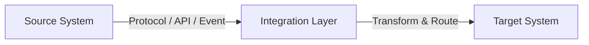
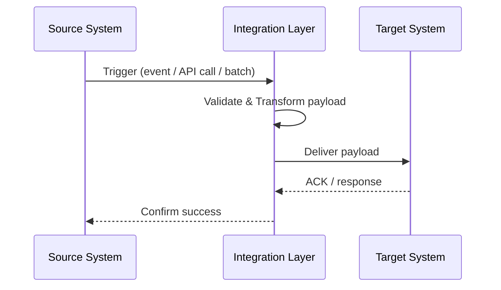

\# Integration Design

\## 1. Overview

\### 1.1 Purpose

Describe the purpose of this integration and the business capability or product it supports.

\### 1.2 Business Value

Explain the value delivered by the integration (outcomes, KPIs, user impact).

\### 1.3 Intended Audience

List all figures that should review or approave this interface specificiation

\### 1.4 Reference Documents

List all documents that was used or shoudl be used to validate this interface specification (ie ADR, API specs, Architecture diagrams, etc..)

\---

\## 2. Scope \& Context

\### 2.1 In-Scope

List systems, processes, and data flows included.

\### 2.2 Out-of-Scope

Explicitly list exclusions.

\### 2.3 Assumptions \& Constraints

\- Business assumptions

\- Regulatory constraints

\- Technical constraints

\---

\## 3. Actors \& Systems

Include component that will be used (API, Bucket, Queue, DB, proxy component, etc..) and their activities

| System | Role | Description |

|------|-----|-------------|

| Source System | Producer | |

| Target System | Consumer | |

| Middleware / Platform | Broker | |

\---

\## 4. Business Process Across Systems

\### 4.1 End-to-End Flow

High-level description of the cross-system process.

\### 4.2 Functional Scenarios

| ID | Scenario | Trigger | Expected Outcome |

|----|----------|---------|------------------|

\## 5. Interfaces Overview

| Interface ID | Type | Protocol | Direction |

|--------------|------|----------|-----------|

\### 5.1 Triggering Events

\- Event / Action

\- Frequency

\- Source of truth

\### 5.2 Happy Path

Step-by-step description of the nominal flow.

\### 5.3 Alternate / Exception Paths

Describe key alternative scenarios.

\---

\## 6. High-Level Architecture

\### 6.1 Integration Pattern

List used Integration Pattern (Sync, Async, Batch, Files, etc..)

\### 6.2 Architecture Diagram

Generate a Mermaid flowchart showing the high-level component interactions. Replace the placeholder nodes with the actual systems and middleware involved.

\## 7. Detailed Flow

\### 7.1 Sequence Diagram

Generate a Mermaid sequence diagram showing the step-by-step interaction between systems. Replace participant names and steps with the actual integration flow.

\### 7.2 Component Responsibilities

| Component | Responsibility |

|----------|----------------|

\---

\## 8. Message Structure & Contracts

\### 8.1 Payload Definition

\- Schema reference

\- Mandatory vs optional fields

\### 8.2 Versioning Strategy

\- Backward compatibility rules

\- Deprecation approach

\---

\## 9. Data Objects (Functional View)

\### 9.1 Business Entities

| Entity | Description | System of Record |

|-------|------------|------------------|

\### 9.2 CRUD Responsibility

Clarify ownership and lifecycle per system.

\---

\## 10. Data Mapping & Transformation

| Source Field | Target Field | Transformation |

|-------------|--------------|----------------|

\---

\## 11. Error Scenarios (Functional)

| Error Type | Description | Expected Handling |

|-----------|------------|-------------------|

\### 11.1 Technical Errors

\- Network

\- Timeout

\- Schema validation

\### 11.2 Retry & Reprocessing

\- Retry policy

\- Dead-letter / quarantine

\### 11.3 Observability

\- Logs

\- Metrics

\- Alerts

\---

\## 12. Security

\### 12.1 Authentication & Authorization

\- OAuth / mTLS / API keys

\- Roles & scopes

\### 12.2 Data Protection

\- Encryption in transit

\- Encryption at rest

\- Secrets management

\---

\## 13. Other Non-Functional Considerations (Functional View)

\- Expected volumes

\- SLA / business criticality

\- Data classification (Public / Internal / Confidential)

| NFR | Target |

|----|--------|

| Performance | |

| Availability | |

| Scalability | |

| Resilience | |

\---

\## 14. Testing Strategy

\### 14.1 Test Levels

\- Unit

\- Integration

\- Contract

\- End-to-End

\### 14.2 Test Data & Environments

Describe test dependencies.

\---

\## 15. Operational Considerations

\### 15.1 Deployment

\- CI/CD pipeline reference

\- Rollback strategy

\### 15.2 Runbook Reference

Link to operational runbook.

\---

\## 16. Dependencies, Risks \& Open Points

\### 16.1 Dependencies

\- External teams

\- Third-party systems

\### 16.2 Risks

| Risk | Impact | Mitigation |

|------|--------|-----------|

\### 16.3 Open Points

List unresolved items.

